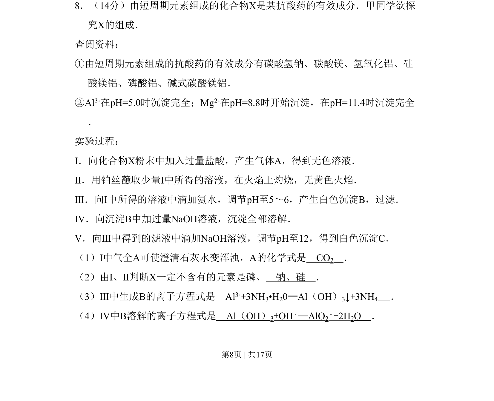
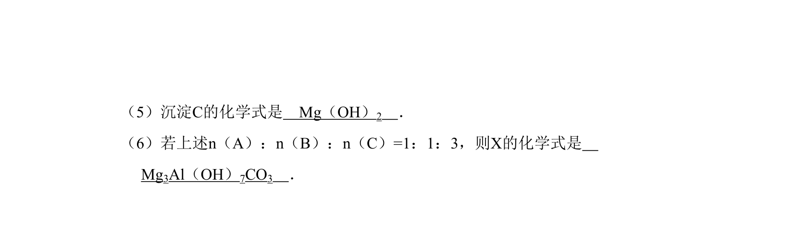
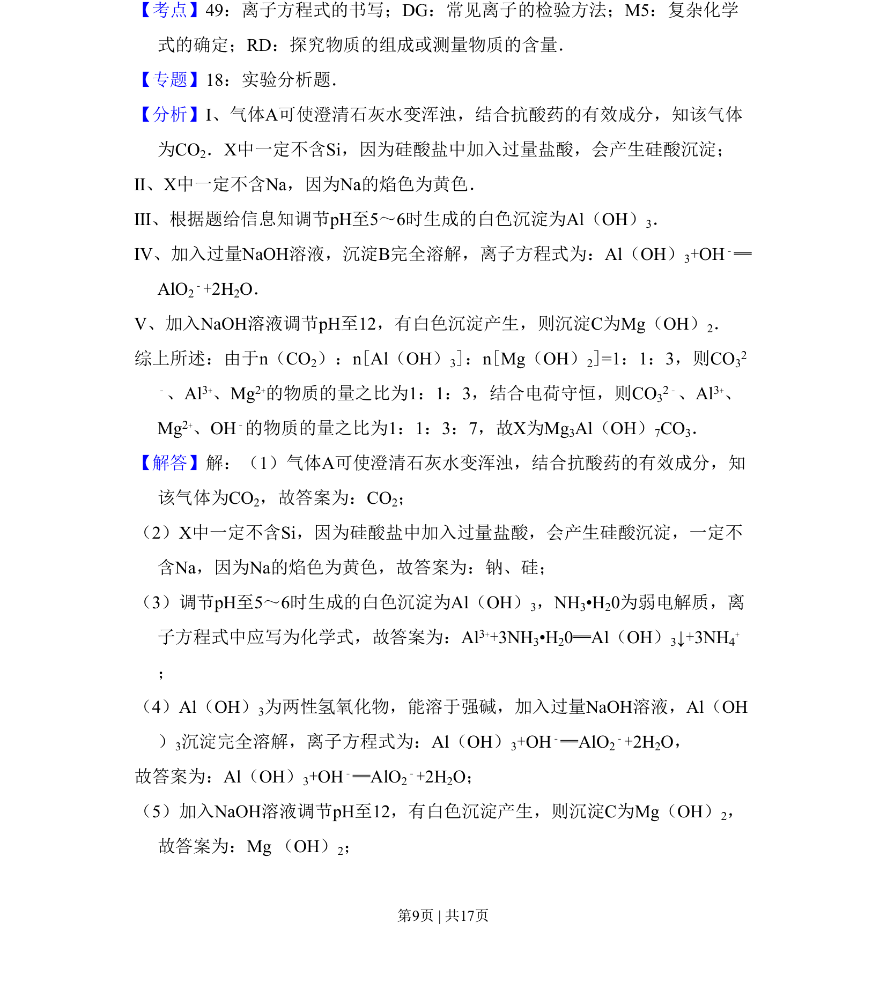
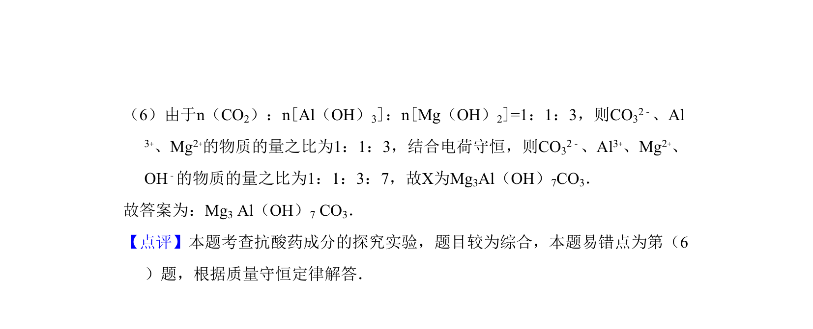

## 题面

## 摘要

探究抗酸药X成分，通过性质实验推断元素组成并书写离子方程式。

## 关联考点

- [[597-元素推断|元素推断]]
- [[169-离子反应|离子反应]]
- [[205-焰色反应|焰色反应]]
- [[179-两性氢氧化物|两性氢氧化物]]

## 答案与解析

> 📄 原 PDF 第 8 页：`素材/真题/北京/2008-2024·（北京）化学高考真题/2010年高考化学试卷（北京）（解析卷）.pdf`

<!-- 题干文本-start -->
## 题干文本
8．（14分）由短周期元素组成的化合物X是某抗酸药的有效成分．甲同学欲探
究X的组成．
查阅资料：
①由短周期元素组成的抗酸药的有效成分有碳酸氢钠、碳酸镁、氢氧化铝、硅
酸镁铝、磷酸铝、碱式碳酸镁铝．
②Al3+在pH=5.0时沉淀完全；Mg2+在pH=8.8时开始沉淀，在pH=11.4时沉淀完全
．
实验过程：
I．向化合物X粉末中加入过量盐酸，产生气体A，得到无色溶液．
Ⅱ．用铂丝蘸取少量I中所得的溶液，在火焰上灼烧，无黄色火焰．
Ⅲ．向I中所得的溶液中滴加氨水，调节pH至5～6，产生白色沉淀B，过滤．
Ⅳ．向沉淀B中加过量NaOH溶液，沉淀全部溶解．
Ⅴ．向Ⅲ中得到的滤液中滴加NaOH溶液，调节pH至12，得到白色沉淀C．
（1）I中气全A可使澄清石灰水变浑浊，A的化学式是　CO2　．
（2）由I、Ⅱ判断X一定不含有的元素是磷、　钠、硅　．
（3）Ⅲ中生成B的离子方程式是　Al3++3NH3•H20═Al（OH）3↓+3NH4
+　．
（4）Ⅳ中B溶解的离子方程式是　Al（OH）3+OH﹣═AlO2
﹣+2H2O　．
<!-- 题干文本-end -->

<!-- 解析文本-start -->
## 解析文本

<!-- 解析文本-end -->
