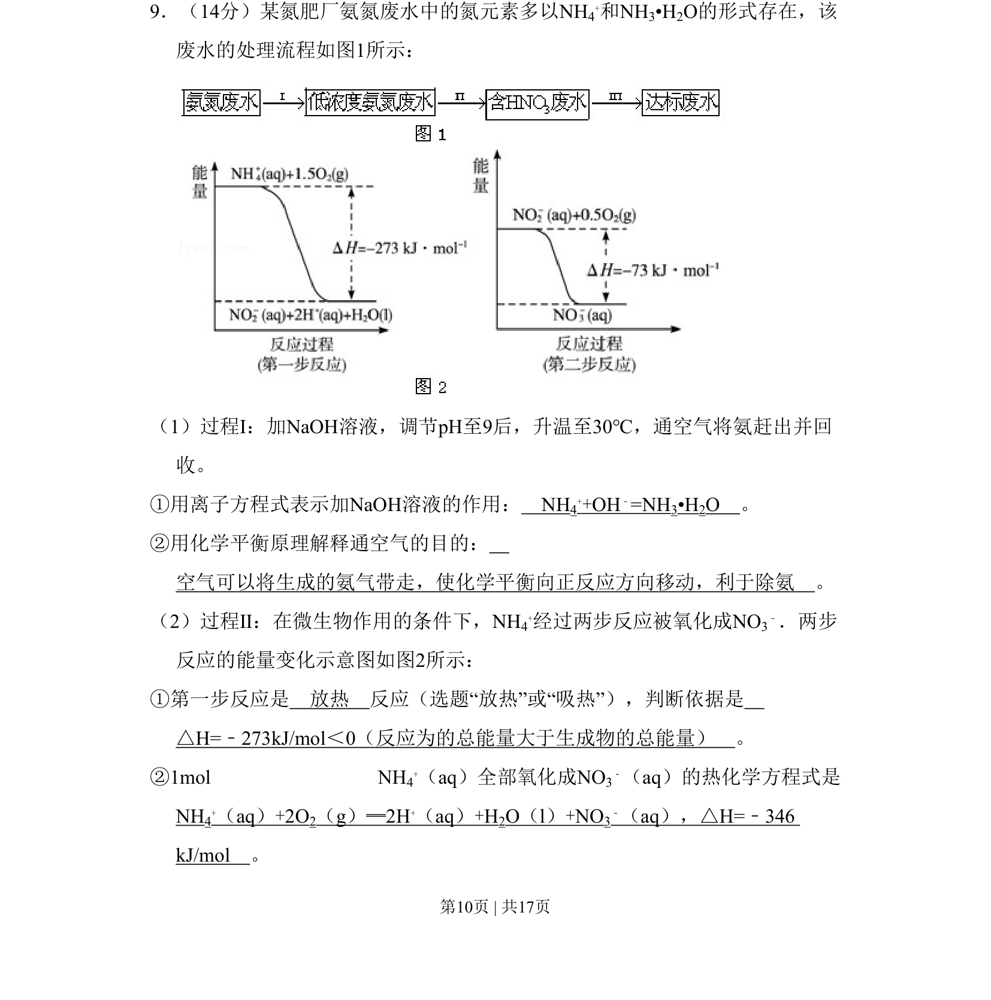
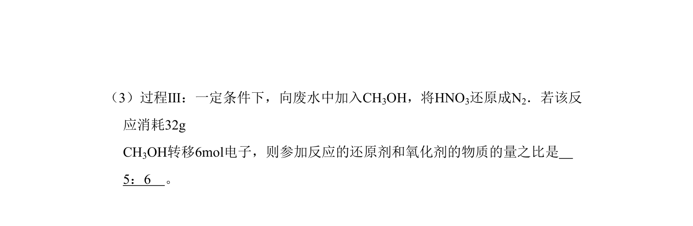
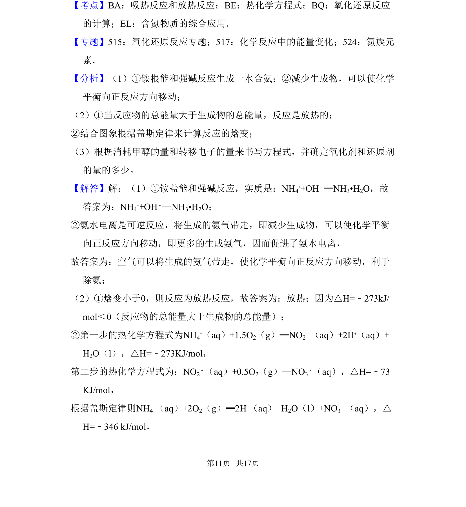
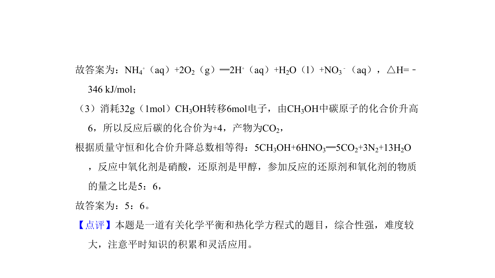

## 题面

## 摘要

含氮废水处理流程分析，涵盖离子反应、平衡移动及热化学方程式书写。

## 关联考点

- [[170-离子方程式|离子方程式]]
- [[620-化学平衡移动|化学平衡移动]]
- [[288-反应热|反应热]]
- [[309-热化学方程式|热化学方程式]]

## 答案与解析

> 📄 原 PDF 第 10 页：`素材/真题/北京/2008-2024·（北京）化学高考真题/2010年高考化学试卷（北京）（解析卷）.pdf`
