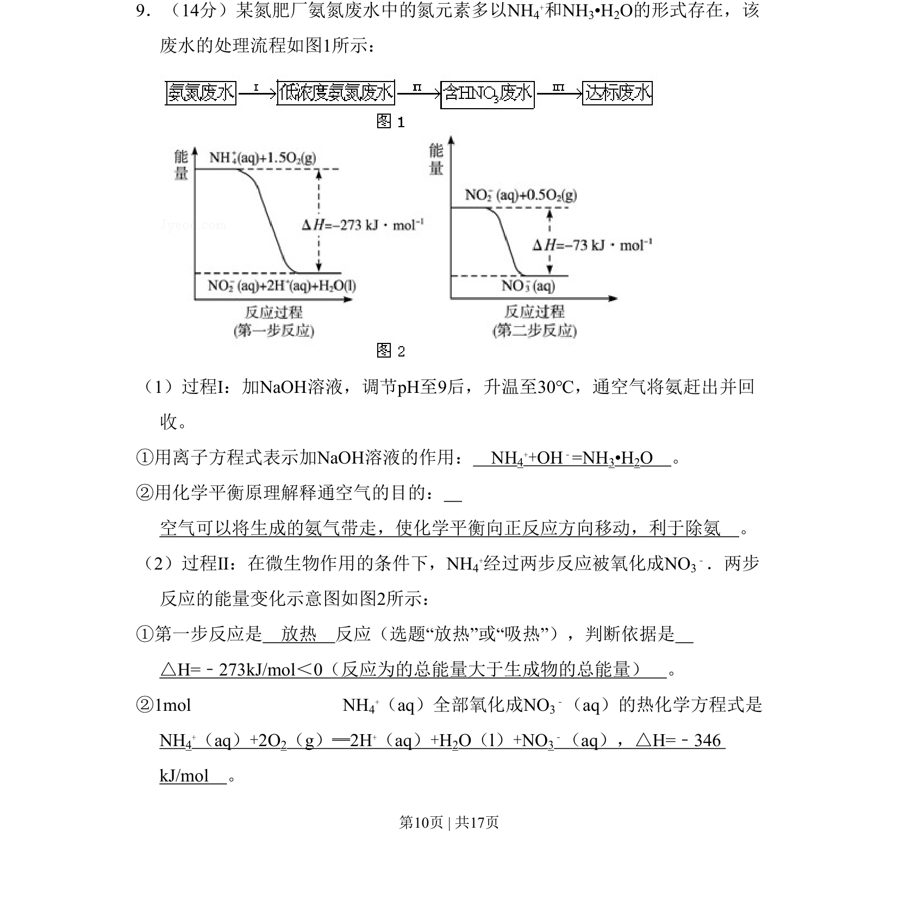
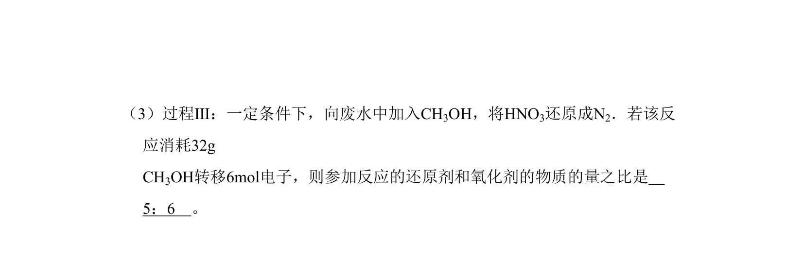
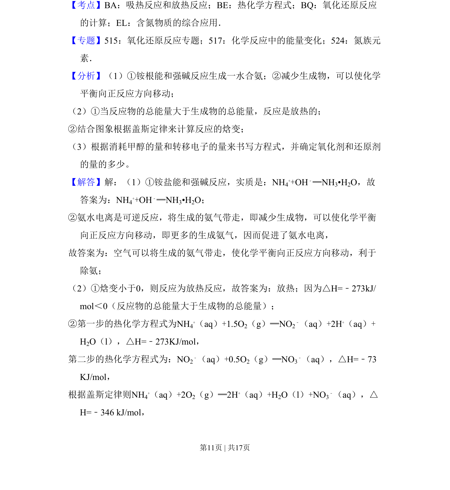
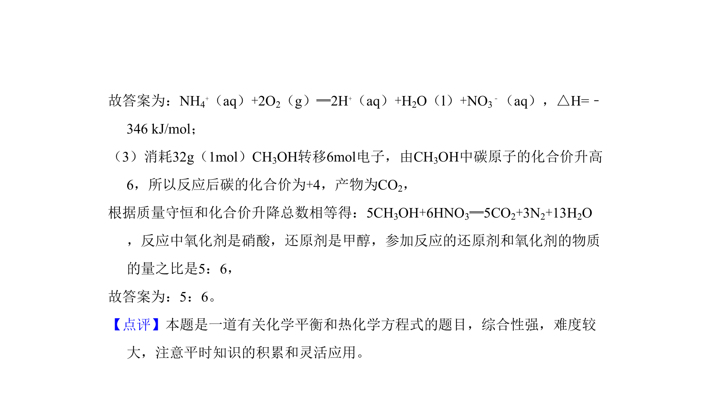

## 题面

## 摘要

含氮废水处理流程分析，涵盖离子反应、平衡移动及热化学方程式书写。

## 关联考点

- [[170-离子方程式|离子方程式]]
- [[620-化学平衡移动|化学平衡移动]]
- [[288-反应热|反应热]]
- [[309-热化学方程式|热化学方程式]]

## 答案与解析

> 📄 原 PDF 第 10 页：`素材/真题/北京/2008-2024·（北京）化学高考真题/2010年高考化学试卷（北京）（解析卷）.pdf`

<!-- 题干文本-start -->
## 题干文本
9．（14分）某氮肥厂氨氮废水中的氮元素多以NH4
+和NH3•H2O的形式存在，该
废水的处理流程如图1所示：
（1）过程Ⅰ：加NaOH溶液，调节pH至9后，升温至30℃，通空气将氨赶出并回
收。
①用离子方程式表示加NaOH溶液的作用：　NH4
++OH﹣=NH3•H2O　。
②用化学平衡原理解释通空气的目的：　
空气可以将生成的氨气带走，使化学平衡向正反应方向移动，利于除氨　。
（2）过程Ⅱ：在微生物作用的条件下，NH4
+经过两步反应被氧化成NO3
﹣．两步
反应的能量变化示意图如图2所示：
①第一步反应是　放热　反应（选题“放热”或“吸热”），判断依据是　
△H=﹣273kJ/mol＜0（反应为的总能量大于生成物的总能量）　。
②1mol NH 4
+（aq）全部氧化成NO3
﹣（aq）的热化学方程式是　
NH4
+（aq）+2O2（g）═2H+（aq）+H2O（l）+NO3
﹣（aq），△H=﹣346 
kJ/mol　。
<!-- 题干文本-end -->

<!-- 解析文本-start -->
## 解析文本

<!-- 解析文本-end -->
