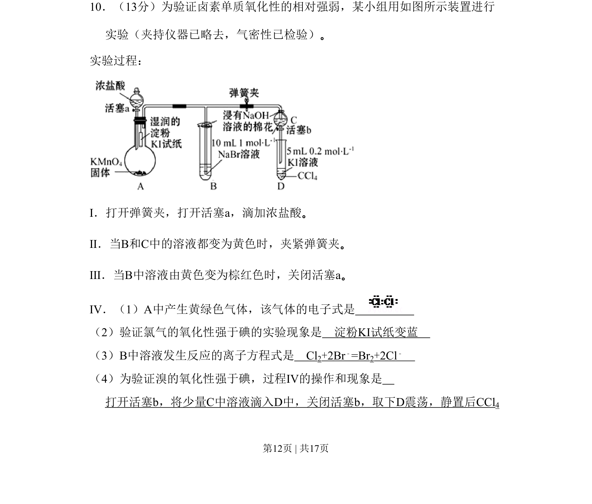
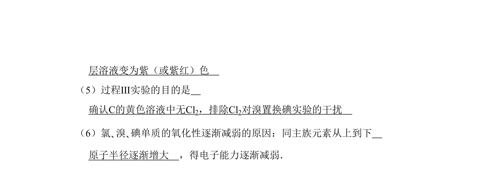
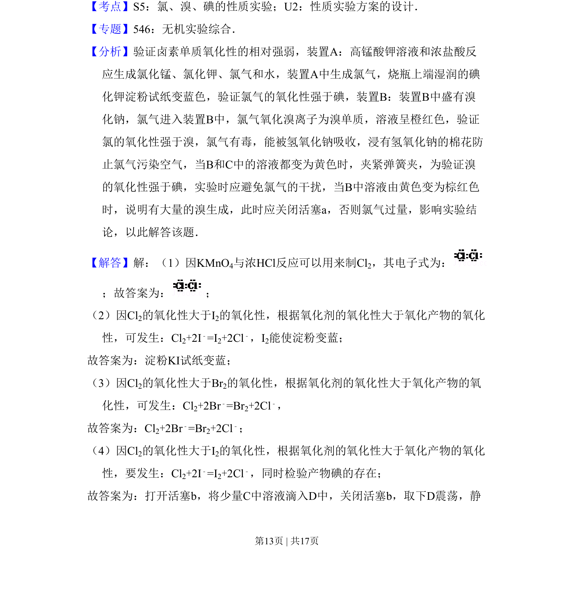
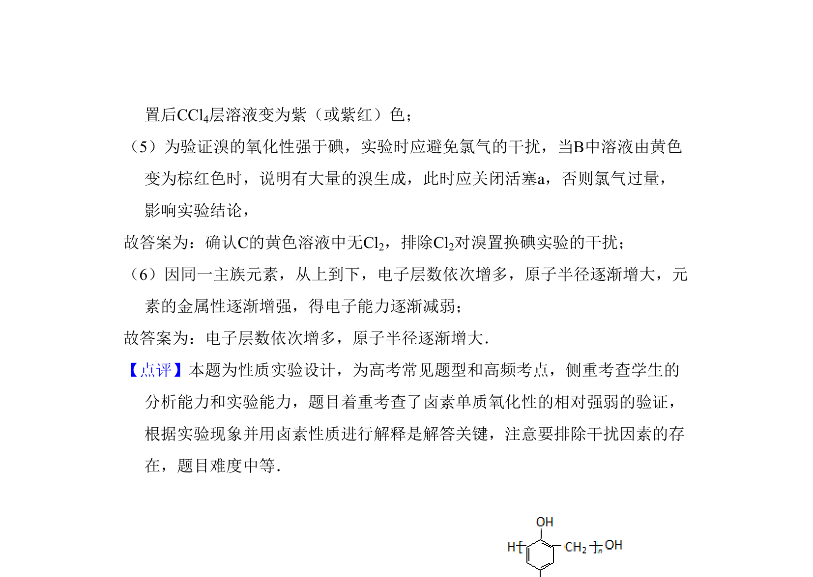

## 题面

## 摘要

利用实验装置验证卤素单质氧化性相对强弱，涉及实验操作、现象分析及方程式书写。

## 关联考点

- [[卤素单质氧化性]]
- [[实验设计与评价]]
- [[806-离子方程式书写|离子方程式书写]]
- [[266-电子式|电子式]]

## 答案与解析

> 📄 原 PDF 第 12 页：`素材/真题/北京/2008-2024·（北京）化学高考真题/2010年高考化学试卷（北京）（解析卷）.pdf`
