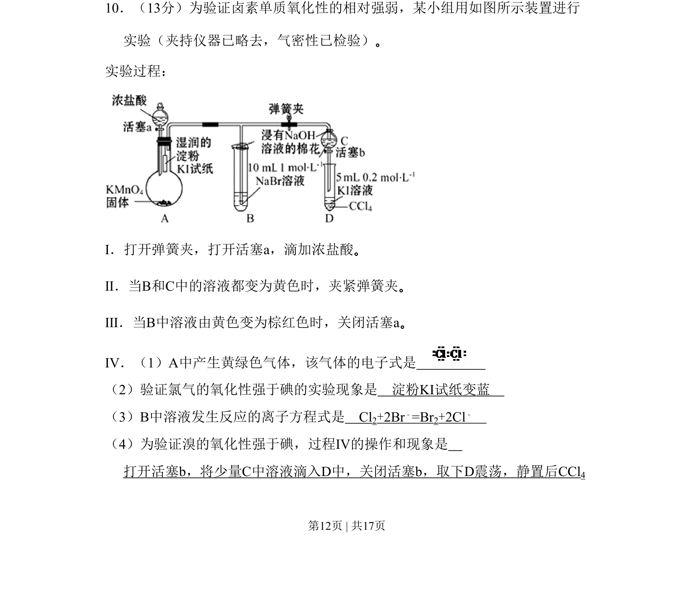
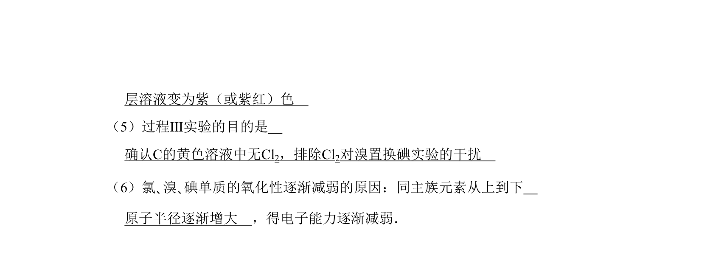
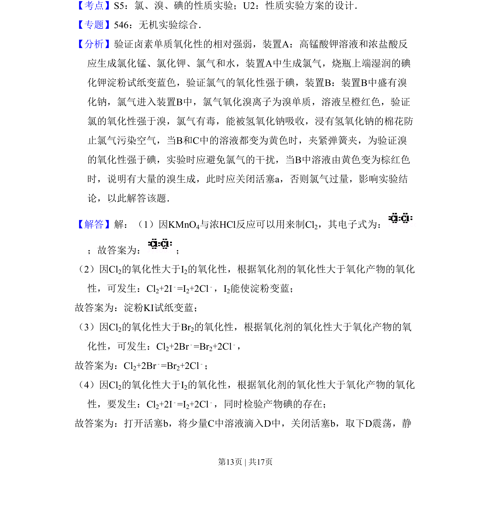
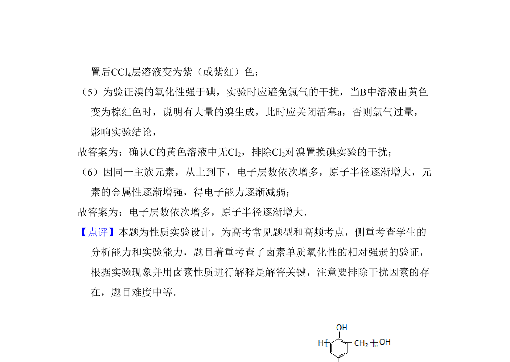

## 题面

## 摘要

利用实验装置验证卤素单质氧化性相对强弱，涉及实验操作、现象分析及方程式书写。

## 关联考点

- [[卤素单质氧化性]]
- [[实验设计与评价]]
- [[807-离子方程式的书写|离子方程式书写]]
- [[266-电子式|电子式]]

## 答案与解析

> 📄 原 PDF 第 12 页：`素材/真题/北京/2008-2024·（北京）化学高考真题/2010年高考化学试卷（北京）（解析卷）.pdf`

<!-- 题干文本-start -->
## 题干文本
10．（13分）为验证卤素单质氧化性的相对强弱，某小组用如图所示装置进行
实验（夹持仪器已略去，气密性已检验）｡
实验过程：
Ⅰ．打开弹簧夹，打开活塞a，滴加浓盐酸｡
Ⅱ．当B和C中的溶液都变为黄色时，夹紧弹簧夹｡
Ⅲ．当B中溶液由黄色变为棕红色时，关闭活塞a｡
Ⅳ．（1）A中产生黄绿色气体，该气体的电子式是　 　
（2）验证氯气的氧化性强于碘的实验现象是　淀粉KI试纸变蓝　
（3）B中溶液发生反应的离子方程式是　Cl2+2Br﹣=Br2+2Cl﹣　
（4）为验证溴的氧化性强于碘，过程Ⅳ的操作和现象是　
打开活塞b，将少量C中溶液滴入D中，关闭活塞b，取下D震荡，静置后CCl4
<!-- 题干文本-end -->

<!-- 解析文本-start -->
## 解析文本

<!-- 解析文本-end -->
