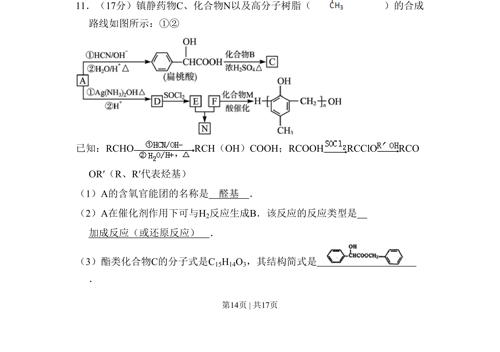
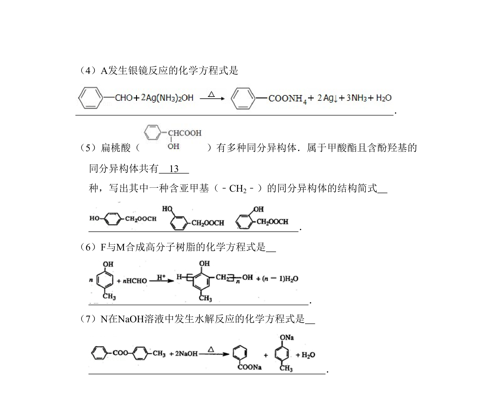
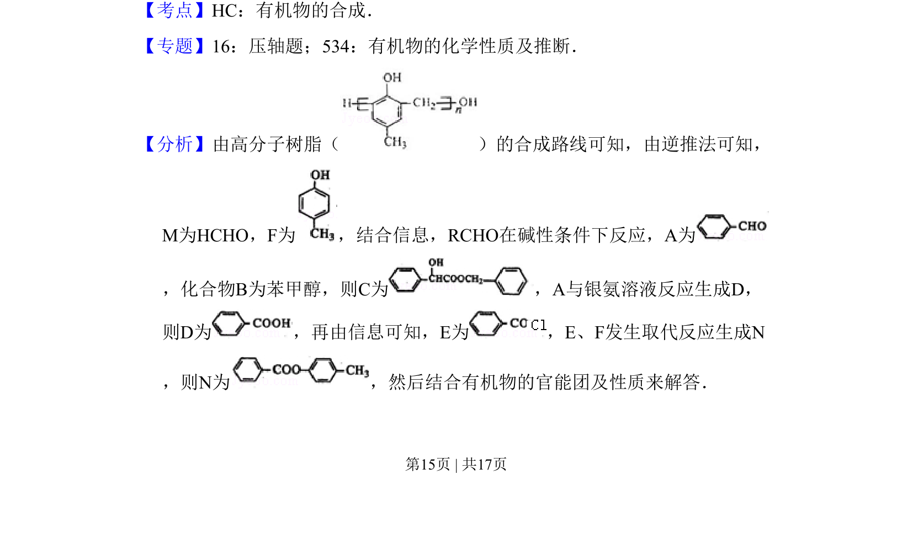
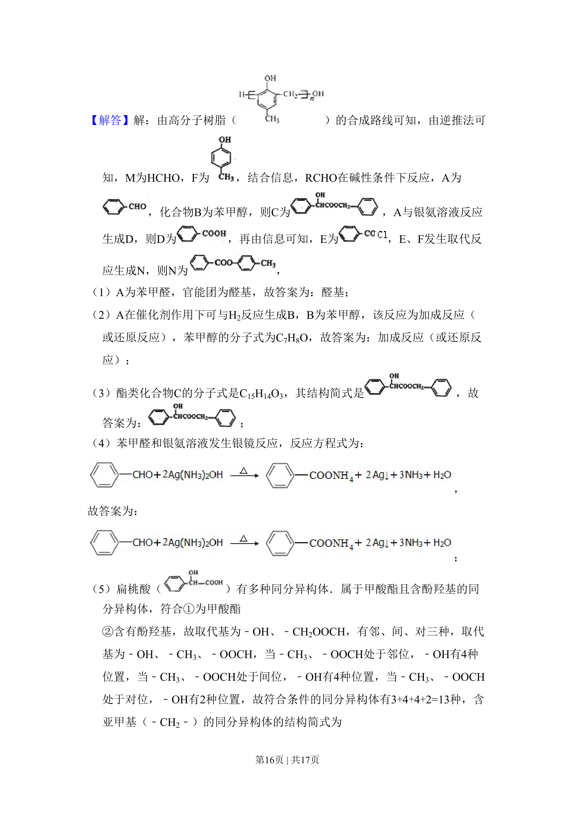
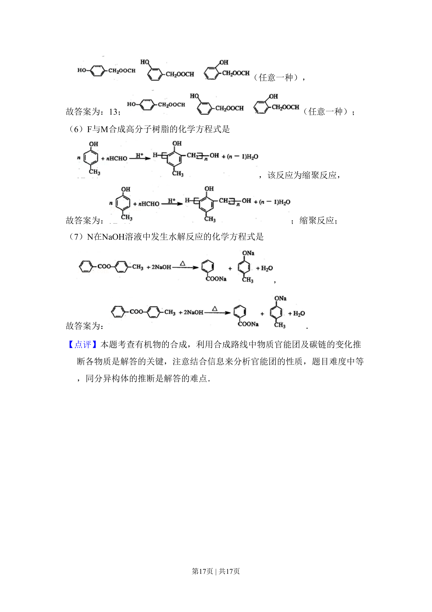

## 题面

## 摘要

有机合成路线推断，涉及官能团识别、反应类型判断及酯类化合物结构简式的书写。

## 关联考点

- [[448-官能团|官能团]]
- [[646-反应类型|反应类型]]
- [[816-结构推断|结构推断]]
- [[271-化学合成|有机合成]]

## 答案与解析

> 📄 原 PDF 第 14 页：`素材/真题/北京/2008-2024·（北京）化学高考真题/2010年高考化学试卷（北京）（解析卷）.pdf`
