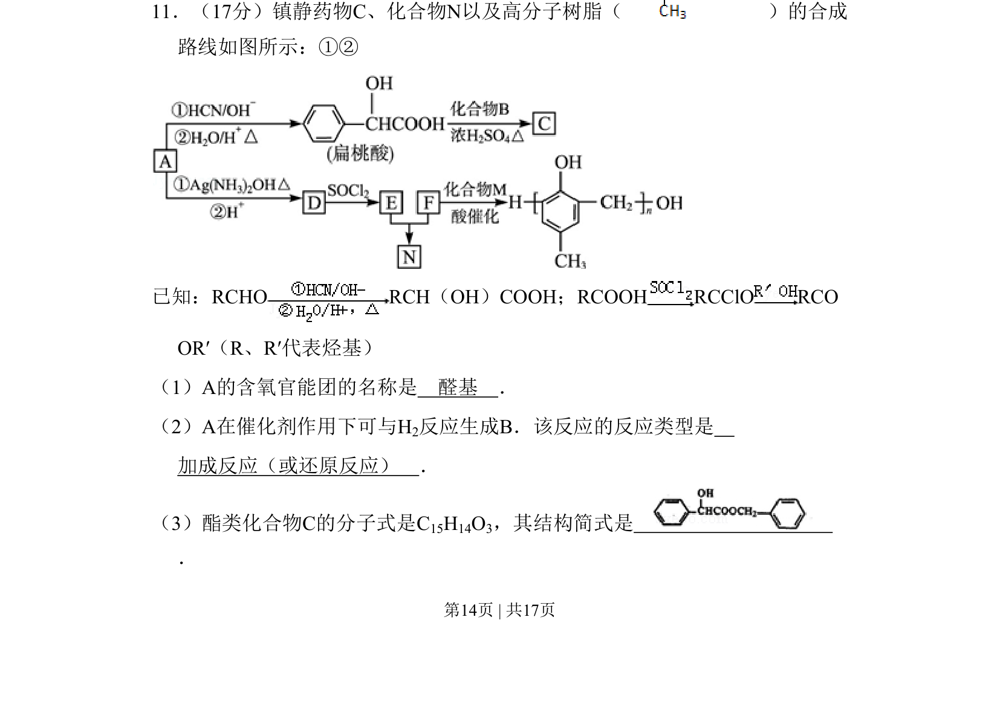
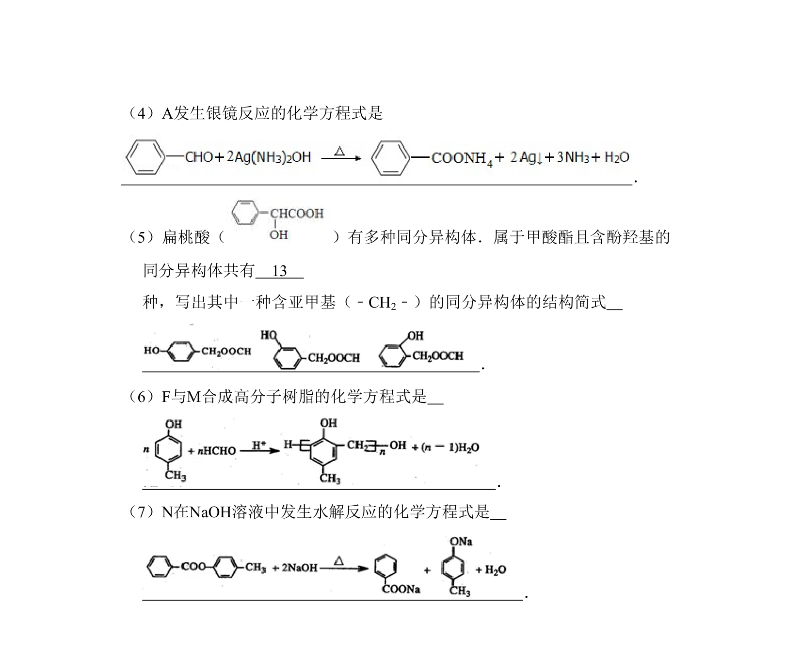
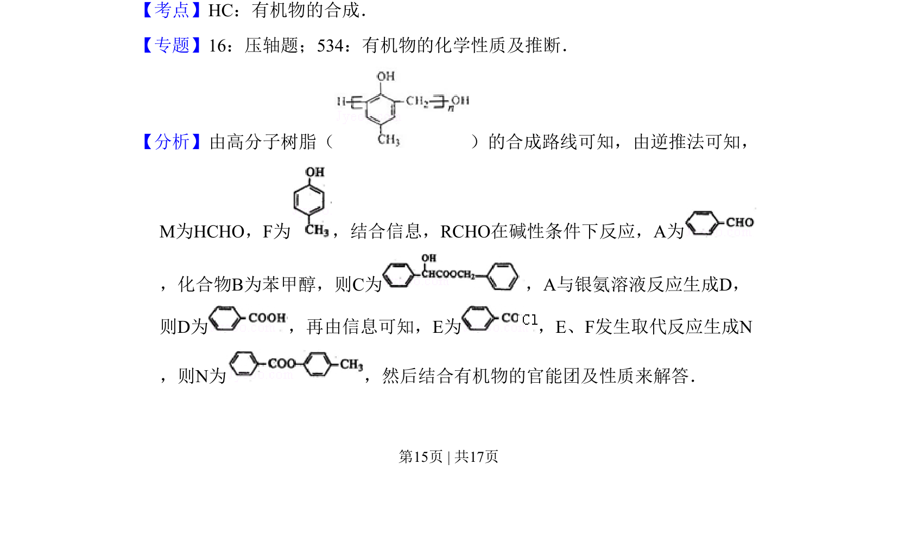
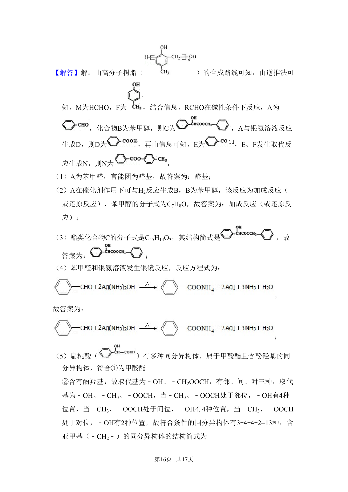
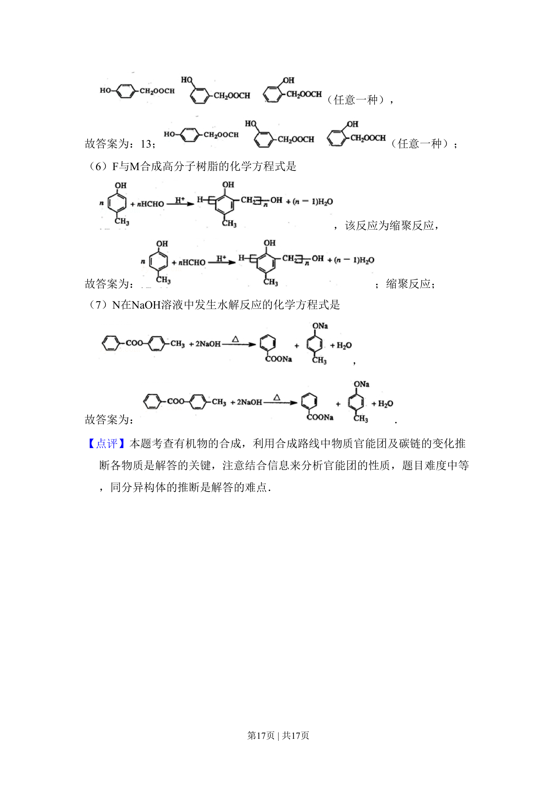

## 题面

## 摘要

有机合成路线推断，涉及官能团识别、反应类型判断及酯类化合物结构简式的书写。

## 关联考点

- [[448-官能团|官能团]]
- [[646-反应类型|反应类型]]
- [[816-结构推断|结构推断]]
- [[271-化学合成|有机合成]]

## 答案与解析

> 📄 原 PDF 第 14 页：`素材/真题/北京/2008-2024·（北京）化学高考真题/2010年高考化学试卷（北京）（解析卷）.pdf`

<!-- 题干文本-start -->
## 题干文本
11．（17分）镇静药物C、化合物N以及高分子树脂（ ）的合成
路线如图所示：①②
已知：RCHO RCH（OH）COOH；RCOOH RCClO RCO
OR′（R、R′代表烃基）
（1）A的含氧官能团的名称是　醛基　．
（2）A在催化剂作用下可与H2反应生成B．该反应的反应类型是　
加成反应（或还原反应）　．
（3）酯类化合物C的分子式是C15H14O3，其结构简式是　 　
．
<!-- 题干文本-end -->

<!-- 解析文本-start -->
## 解析文本

<!-- 解析文本-end -->
