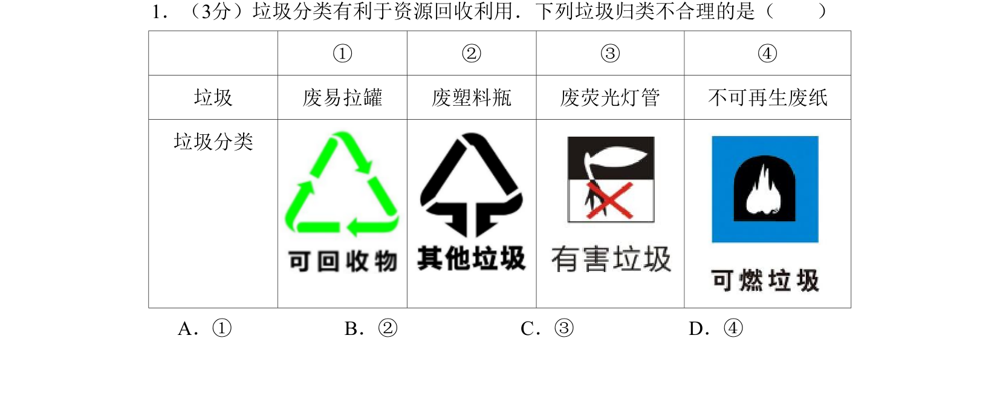
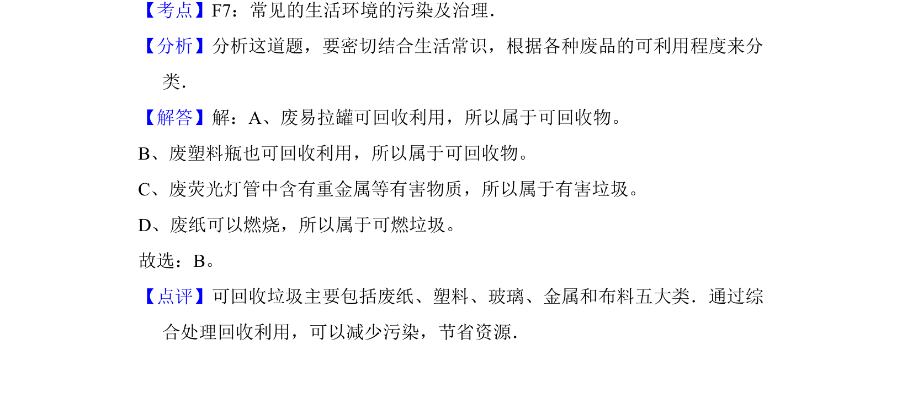

## 题面

## 摘要

考查常见垃圾的分类与回收利用，结合生活常识判断垃圾归类是否合理。

## 关联考点

- [[常见的生活环境的污染及治理]]
- [[可回收物]]
- [[有害垃圾]]
- [[可燃垃圾]]

## 答案与解析

> 📄 原 PDF 第 1 页：`素材/真题/北京/2008-2024·（北京）化学高考真题/2011年高考化学试卷（北京）（解析卷）.pdf`

<!-- 题干文本-start -->
## 题干文本
1．（3分）垃圾分类有利于资源回收利用．下列垃圾归类不合理的是（　　）
① ② ③ ④
垃圾 废易拉罐 废塑料瓶 废荧光灯管 不可再生废纸
垃圾分类
A．①B．②C．③D．④
<!-- 题干文本-end -->

<!-- 解析文本-start -->
## 解析文本
【考点】F7：常见的生活环境的污染及治理．菁优网版权所有
【分析】分析这道题，要密切结合生活常识，根据各种废品的可利用程度来分
类．
【解答】解：A、废易拉罐可回收利用，所以属于可回收物。
B、废塑料瓶也可回收利用，所以属于可回收物。
C、废荧光灯管中含有重金属等有害物质，所以属于有害垃圾。
D、废纸可以燃烧，所以属于可燃垃圾。
故选：B。
【点评】可回收垃圾主要包括废纸、塑料、玻璃、金属和布料五大类．通过综
合处理回收利用，可以减少污染，节省资源．
<!-- 解析文本-end -->
