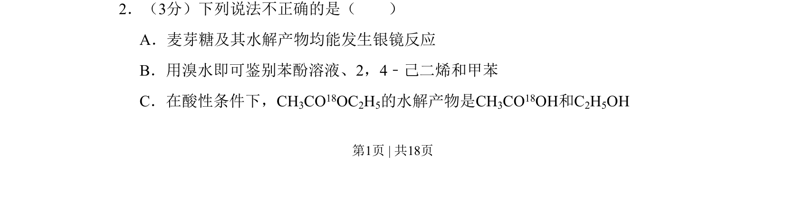
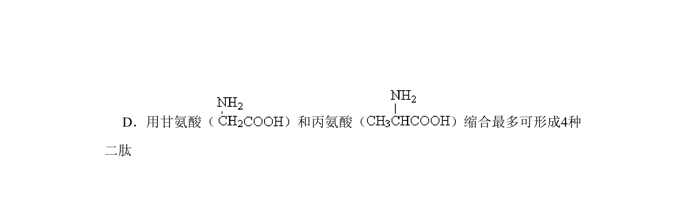
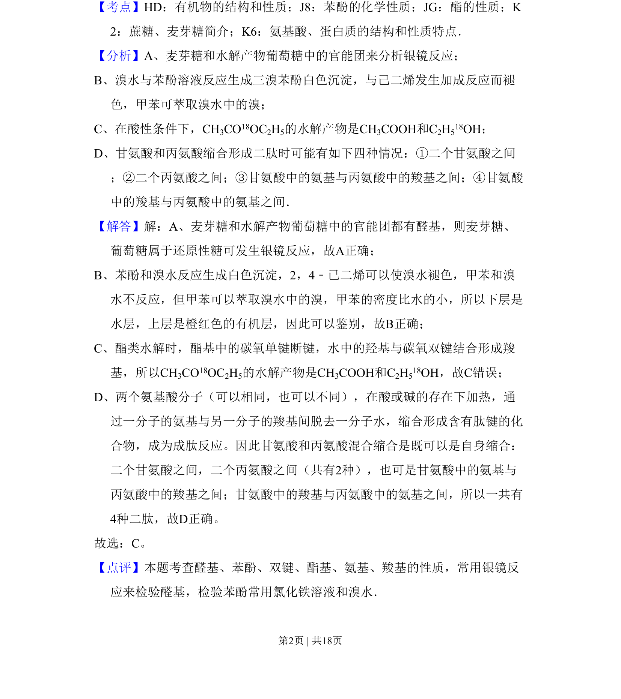

## 题面

## 摘要

本题考查有机化学基础知识，涉及糖类银镜反应、有机鉴别及酯水解机理。

## 关联考点

- [[480-银镜反应|银镜反应]]
- [[苯酚与溴水反应]]
- [[二烯烃加成]]
- [[酯水解机理]]

## 答案与解析

> 📄 原 PDF 第 1 页：`素材/真题/北京/2008-2024·（北京）化学高考真题/2011年高考化学试卷（北京）（解析卷）.pdf`
