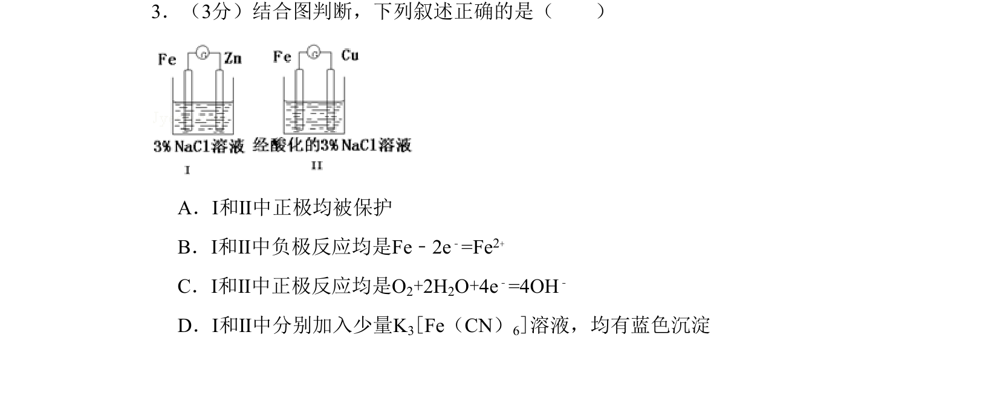
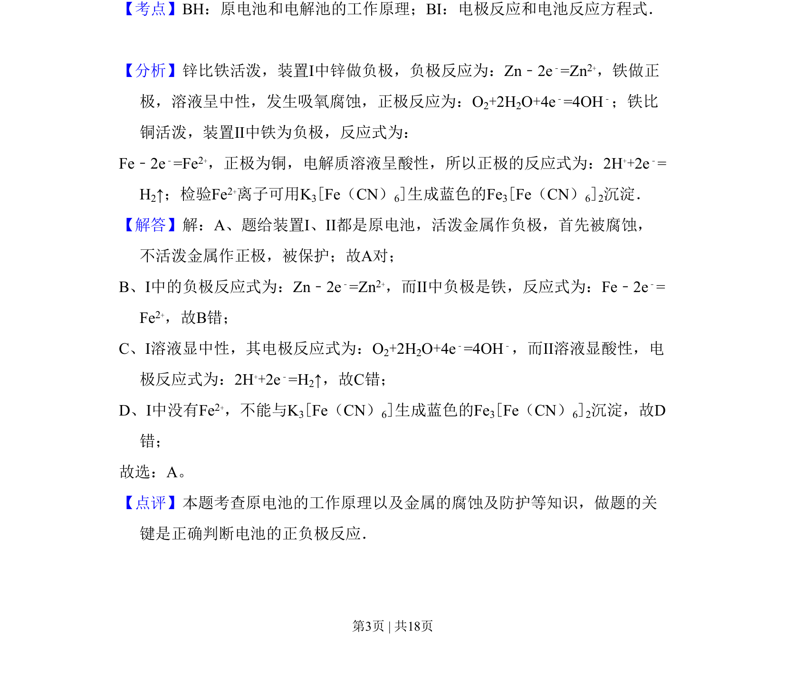

## 题面

## 摘要

通过两个原电池装置考查电极判断、电极反应及金属腐蚀防护。

## 关联考点

- [[642-原电池工作原理|原电池工作原理]]
- [[793-电极反应|电极反应]]
- [[963-金属的腐蚀与防护|金属的腐蚀与防护]]
- [[亚铁离子检验]]

## 答案与解析

> 📄 原 PDF 第 3 页：`素材/真题/北京/2008-2024·（北京）化学高考真题/2011年高考化学试卷（北京）（解析卷）.pdf`
