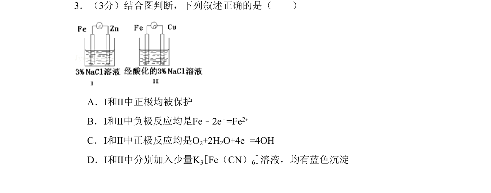
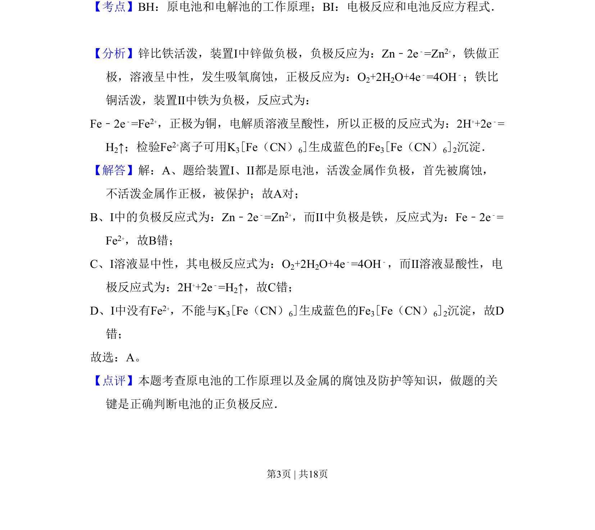

## 题面

## 摘要

通过两个原电池装置考查电极判断、电极反应及金属腐蚀防护。

## 关联考点

- [[642-原电池工作原理|原电池工作原理]]
- [[793-电极反应|电极反应]]
- [[963-金属的腐蚀与防护|金属的腐蚀与防护]]
- [[971-亚铁离子检验|亚铁离子检验]]

## 答案与解析

> 📄 原 PDF 第 3 页：`素材/真题/北京/2008-2024·（北京）化学高考真题/2011年高考化学试卷（北京）（解析卷）.pdf`

<!-- 题干文本-start -->
## 题干文本
3．（3分）结合图判断，下列叙述正确的是（　　）
A．Ⅰ和Ⅱ中正极均被保护
B．Ⅰ和Ⅱ中负极反应均是Fe﹣2e﹣=Fe2+
C．Ⅰ和Ⅱ中正极反应均是O2+2H2O+4e﹣=4OH﹣
D．Ⅰ和Ⅱ中分别加入少量K3[Fe（CN）6]溶液，均有蓝色沉淀
<!-- 题干文本-end -->

<!-- 解析文本-start -->
## 解析文本
【考点】BH：原电池和电解池的工作原理；BI：电极反应和电池反应方程式．菁优网版权
所有
【分析】锌比铁活泼，装置Ⅰ中锌做负极，负极反应为：Zn﹣2e﹣=Zn2+，铁做正
极，溶液呈中性，发生吸氧腐蚀，正极反应为：O2+2H2O+4e﹣=4OH﹣；铁比
铜活泼，装置Ⅱ中铁为负极，反应式为：
Fe﹣2e﹣=Fe2+，正极为铜，电解质溶液呈酸性，所以正极的反应式为：2H++2e﹣=
H2↑；检验Fe2+离子可用K3[Fe（CN）6]生成蓝色的Fe3[Fe（CN）6]2沉淀．
【解答】解：A、题给装置I、II都是原电池，活泼金属作负极，首先被腐蚀，
不活泼金属作正极，被保护；故A对；
B、I中的负极反应式为：Zn﹣2e﹣=Zn2+，而II中负极是铁，反应式为：Fe﹣2e﹣=
Fe2+，故B错；
C、I溶液显中性，其电极反应式为：O2+2H2O+4e﹣=4OH﹣，而II溶液显酸性，电
极反应式为：2H++2e﹣=H2↑，故C错；
D、I中没有Fe2+，不能与K3[Fe（CN）6]生成蓝色的Fe3[Fe（CN）6]2沉淀，故D
错；
故选：A。
【点评】本题考查原电池的工作原理以及金属的腐蚀及防护等知识，做题的关
键是正确判断电池的正负极反应．
<!-- 解析文本-end -->
