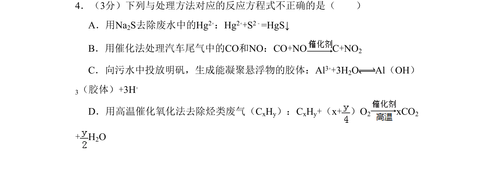
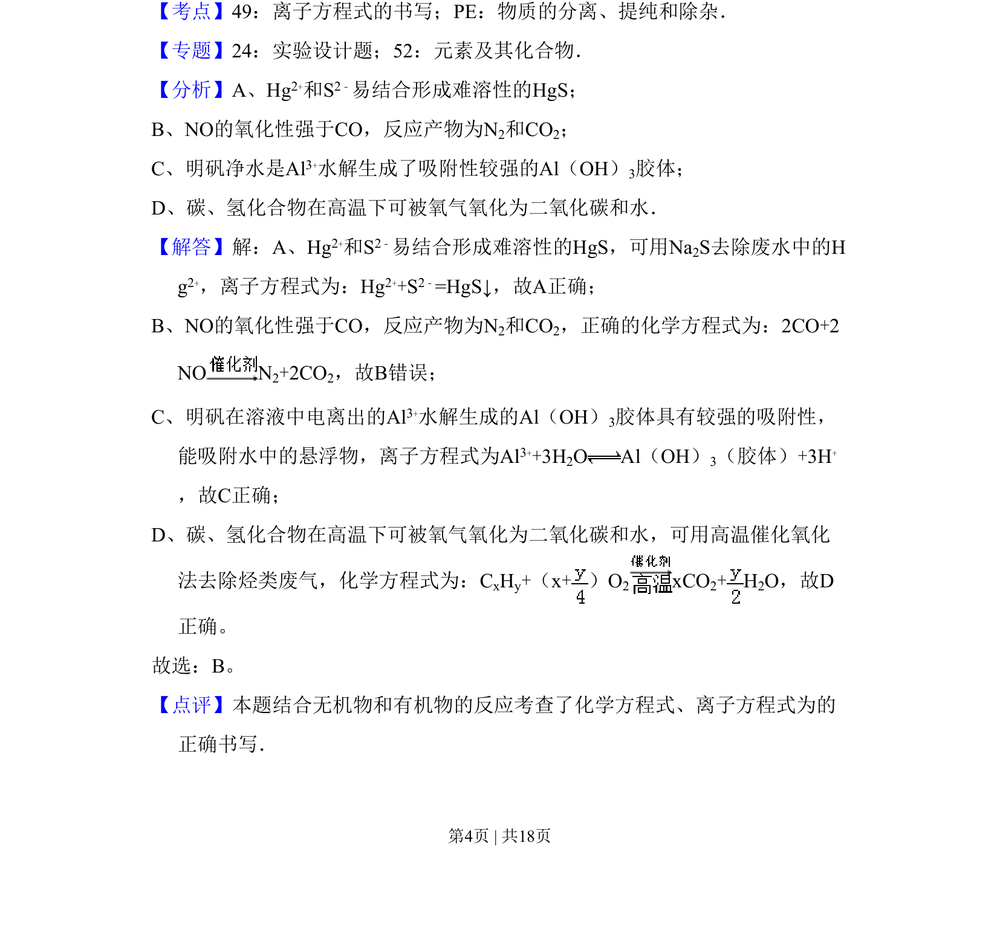

## 题面

## 摘要

考查化学方程式及离子方程式正误判断，涉及沉淀法、催化处理尾气、明矾净水和烃类氧化。

## 关联考点

- [[807-离子方程式的书写|离子方程式的书写]]
- [[物质的分离提纯和除杂]]
- [[172-胶体|胶体]]
- [[162-氧化还原反应|氧化还原反应]]

## 答案与解析

> 📄 原 PDF 第 4 页：`素材/真题/北京/2008-2024·（北京）化学高考真题/2011年高考化学试卷（北京）（解析卷）.pdf`
