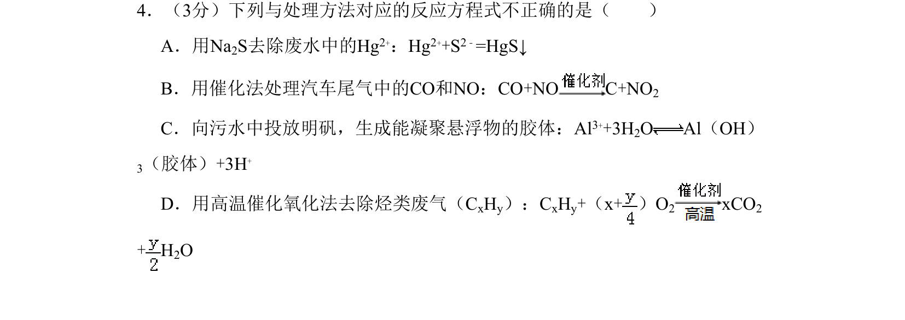
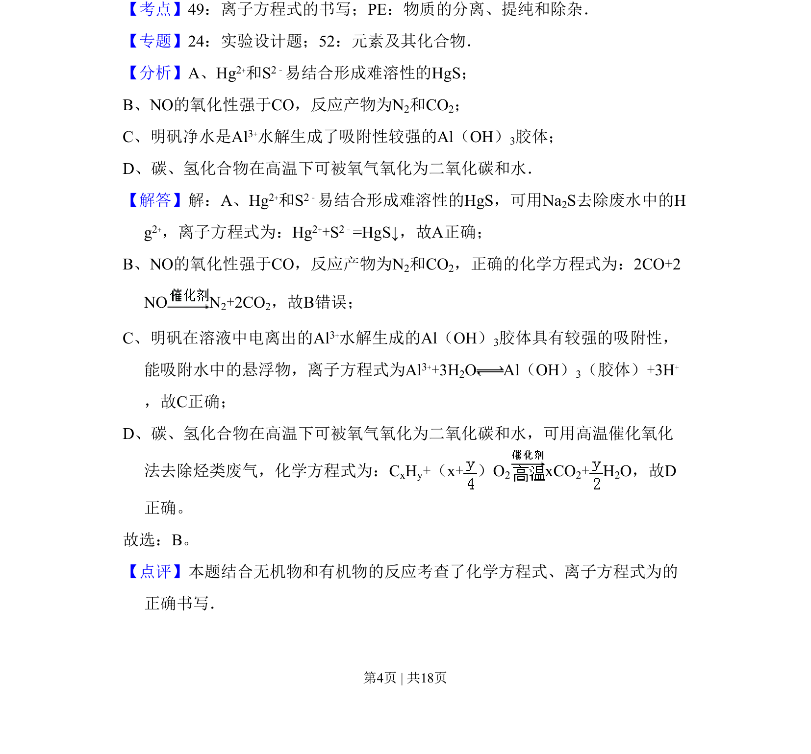

## 题面

## 摘要

考查化学方程式及离子方程式正误判断，涉及沉淀法、催化处理尾气、明矾净水和烃类氧化。

## 关联考点

- [[807-离子方程式的书写|离子方程式的书写]]
- [[物质的分离提纯和除杂]]
- [[172-胶体|胶体]]
- [[162-氧化还原反应|氧化还原反应]]

## 答案与解析

> 📄 原 PDF 第 4 页：`素材/真题/北京/2008-2024·（北京）化学高考真题/2011年高考化学试卷（北京）（解析卷）.pdf`

<!-- 题干文本-start -->
## 题干文本
4．（3分）下列与处理方法对应的反应方程式不正确的是（　　）
A．用Na2S去除废水中的Hg2+：Hg2++S2﹣=HgS↓
B．用催化法处理汽车尾气中的CO和NO：CO+NO C+NO 2
C．向污水中投放明矾，生成能凝聚悬浮物的胶体：Al3++3H2O Al（OH）
3（胶体）+3H+
D．用高温催化氧化法去除烃类废气（CxHy）：CxHy+（x+）O 2 xCO2
+H 2O
<!-- 题干文本-end -->

<!-- 解析文本-start -->
## 解析文本
【考点】49：离子方程式的书写；PE：物质的分离、提纯和除杂．菁优网版权所有
【专题】24：实验设计题；52：元素及其化合物．
【分析】A、Hg2+和S2﹣易结合形成难溶性的HgS；
B、NO的氧化性强于CO，反应产物为N2和CO2；
C、明矾净水是Al3+水解生成了吸附性较强的Al（OH）3胶体；
D、碳、氢化合物在高温下可被氧气氧化为二氧化碳和水．
【解答】解：A、Hg2+和S2﹣易结合形成难溶性的HgS，可用Na2S去除废水中的H
g2+，离子方程式为：Hg2++S2﹣=HgS↓，故A正确；
B、NO的氧化性强于CO，反应产物为N2和CO2，正确的化学方程式为：2CO+2
NO N 2+2CO2，故B错误；
C、明矾在溶液中电离出的Al3+水解生成的Al（OH）3胶体具有较强的吸附性，
能吸附水中的悬浮物，离子方程式为Al3++3H2O Al（OH） 3（胶体）+3H+
，故C正确；
D、碳、氢化合物在高温下可被氧气氧化为二氧化碳和水，可用高温催化氧化
法去除烃类废气，化学方程式为：CxHy+（x+）O 2 xCO2+H 2O，故D
正确。
故选：B。
【点评】本题结合无机物和有机物的反应考查了化学方程式、离子方程式为的
正确书写．
<!-- 解析文本-end -->
