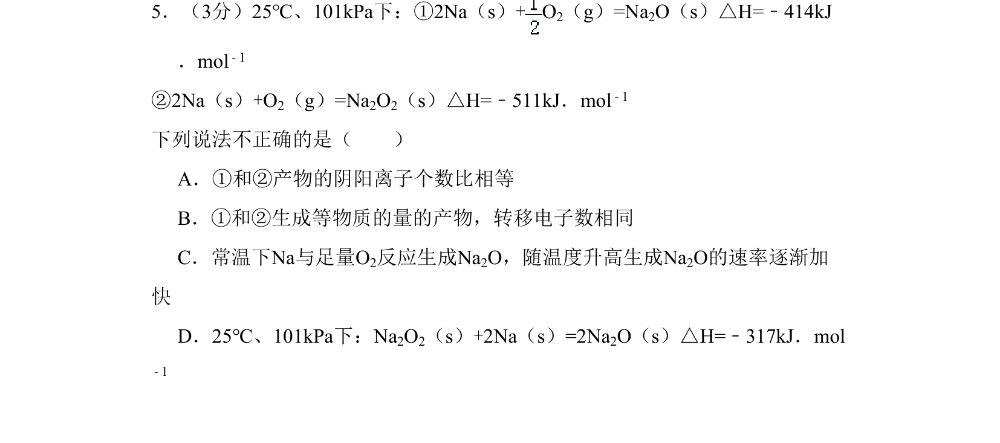
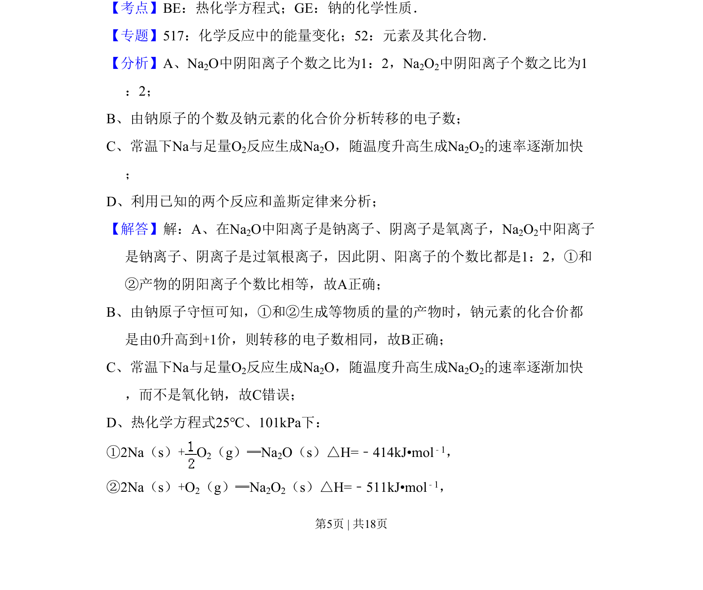
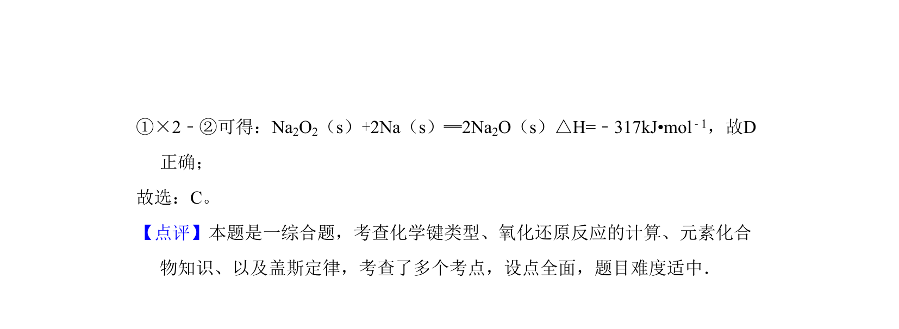

## 题面

## 摘要

比较钠的两种氧化物结构、电子转移及热化学方程式应用，结合盖斯定律计算反应热

## 关联考点

- [[212-钠的化学性质|钠的化学性质]]
- [[309-热化学方程式|热化学方程式]]
- [[311-盖斯定律|盖斯定律]]
- [[165-电子转移|电子转移]]

## 答案与解析

> 📄 原 PDF 第 5 页：`素材/真题/北京/2008-2024·（北京）化学高考真题/2011年高考化学试卷（北京）（解析卷）.pdf`
