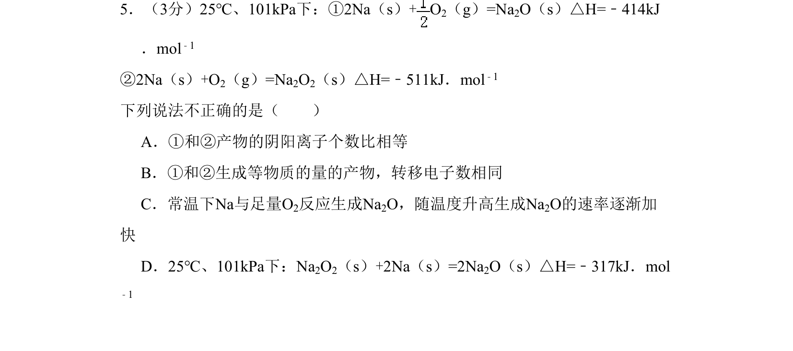
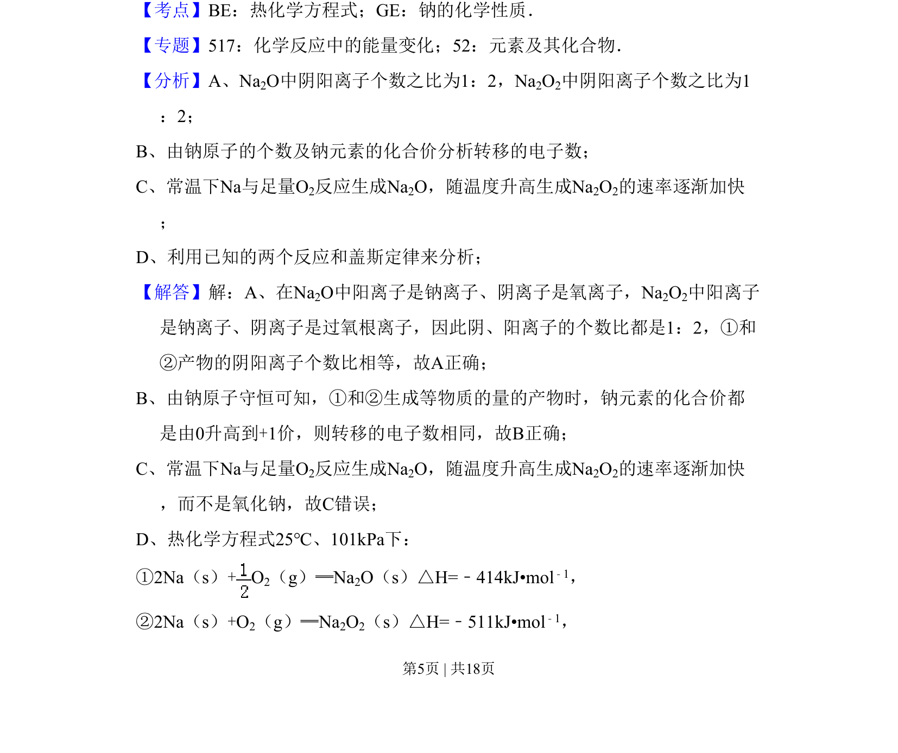
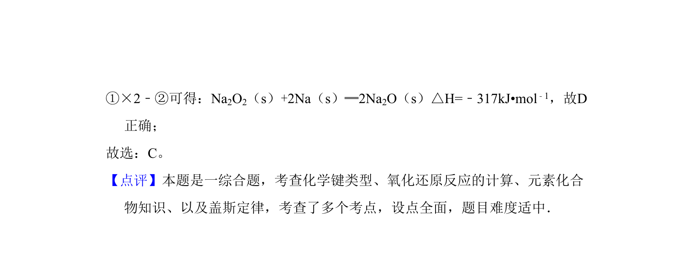

## 题面

## 摘要

比较钠的两种氧化物结构、电子转移及热化学方程式应用，结合盖斯定律计算反应热

## 关联考点

- [[212-钠的化学性质|钠的化学性质]]
- [[309-热化学方程式|热化学方程式]]
- [[311-盖斯定律|盖斯定律]]
- [[165-电子转移|电子转移]]

## 答案与解析

> 📄 原 PDF 第 5 页：`素材/真题/北京/2008-2024·（北京）化学高考真题/2011年高考化学试卷（北京）（解析卷）.pdf`

<!-- 题干文本-start -->
## 题干文本
5．（3分）25℃、101kPa下：①2Na（s）+O 2（g）=Na2O（s）△H=﹣414kJ
．mol﹣1
②2Na（s）+O2（g）=Na2O2（s）△H=﹣511kJ．mol﹣1
下列说法不正确的是（　　）
A．①和②产物的阴阳离子个数比相等
B．①和②生成等物质的量的产物，转移电子数相同
C．常温下Na与足量O2反应生成Na2O，随温度升高生成Na2O的速率逐渐加
快
D．25℃、101kPa下：Na2O2（s）+2Na（s）=2Na2O（s）△H=﹣317kJ．mol
﹣1
<!-- 题干文本-end -->

<!-- 解析文本-start -->
## 解析文本
【考点】BE：热化学方程式；GE：钠的化学性质．菁优网版权所有
【专题】517：化学反应中的能量变化；52：元素及其化合物．
【分析】A、Na2O中阴阳离子个数之比为1：2，Na2O2中阴阳离子个数之比为1
：2；
B、由钠原子的个数及钠元素的化合价分析转移的电子数；
C、常温下Na与足量O2反应生成Na2O，随温度升高生成Na2O2的速率逐渐加快
；
D、利用已知的两个反应和盖斯定律来分析；
【解答】解：A、在Na2O中阳离子是钠离子、阴离子是氧离子，Na2O2中阳离子
是钠离子、阴离子是过氧根离子，因此阴、阳离子的个数比都是1：2，①和
②产物的阴阳离子个数比相等，故A正确；
B、由钠原子守恒可知，①和②生成等物质的量的产物时，钠元素的化合价都
是由0升高到+1价，则转移的电子数相同，故B正确；
C、常温下Na与足量O2反应生成Na2O，随温度升高生成Na2O2的速率逐渐加快
，而不是氧化钠，故C错误；
D、热化学方程式25℃、101kPa下：
①2Na（s）+O 2（g）═Na2O（s）△H=﹣414kJ•mol﹣1，
②2Na（s）+O2（g）═Na2O2（s）△H=﹣511kJ•mol﹣1，
<!-- 解析文本-end -->
