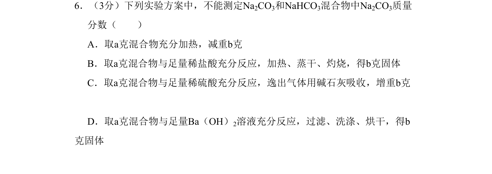
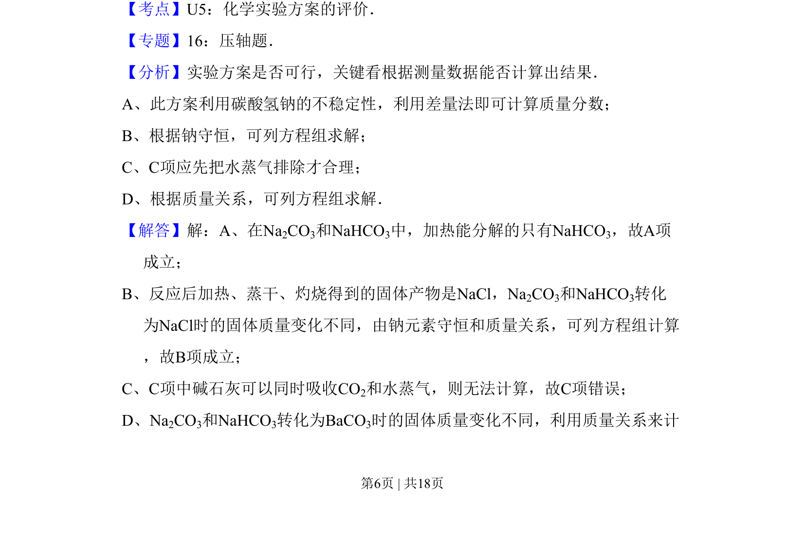
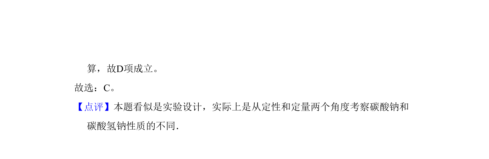

## 题面

## 摘要

通过不同实验方案测定Na₂CO₃和NaHCO₃混合物中Na₂CO₃质量分数的可行性评价

## 关联考点

- [[613-化学实验方案评价|化学实验方案评价]]
- [[碳酸钠与碳酸氢钠的性质]]
- [[681-差量法|差量法]]
- [[839-质量分数计算|质量分数计算]]

## 答案与解析

> 📄 原 PDF 第 6 页：`素材/真题/北京/2008-2024·（北京）化学高考真题/2011年高考化学试卷（北京）（解析卷）.pdf`
