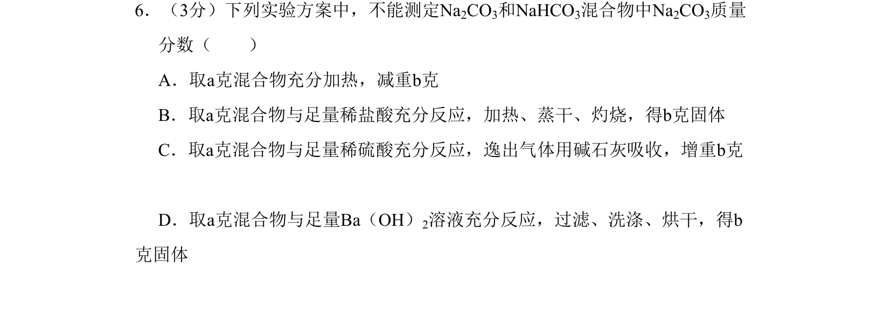
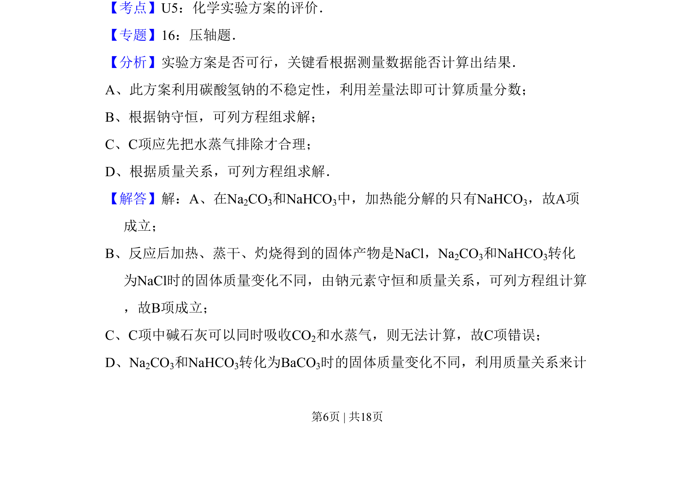
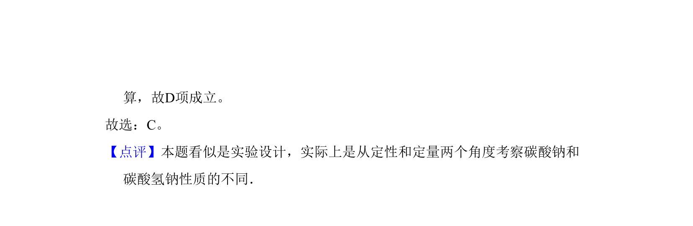

## 题面

## 摘要

通过不同实验方案测定Na₂CO₃和NaHCO₃混合物中Na₂CO₃质量分数的可行性评价

## 关联考点

- [[613-化学实验方案评价|化学实验方案评价]]
- [[碳酸钠与碳酸氢钠的性质]]
- [[681-差量法|差量法]]
- [[839-质量分数计算|质量分数计算]]

## 答案与解析

> 📄 原 PDF 第 6 页：`素材/真题/北京/2008-2024·（北京）化学高考真题/2011年高考化学试卷（北京）（解析卷）.pdf`

<!-- 题干文本-start -->
## 题干文本
6．（3分）下列实验方案中，不能测定Na2CO3和NaHCO3混合物中Na2CO3质量
分数（　　）
A．取a克混合物充分加热，减重b克
B．取a克混合物与足量稀盐酸充分反应，加热、蒸干、灼烧，得b克固体
C．取a克混合物与足量稀硫酸充分反应，逸出气体用碱石灰吸收，增重b克
D．取a克混合物与足量Ba（OH）2溶液充分反应，过滤、洗涤、烘干，得b
克固体
<!-- 题干文本-end -->

<!-- 解析文本-start -->
## 解析文本
【考点】U5：化学实验方案的评价．菁优网版权所有
【专题】16：压轴题．
【分析】实验方案是否可行，关键看根据测量数据能否计算出结果．
A、此方案利用碳酸氢钠的不稳定性，利用差量法即可计算质量分数；
B、根据钠守恒，可列方程组求解；
C、C项应先把水蒸气排除才合理；
D、根据质量关系，可列方程组求解．
【解答】解：A、在Na2CO3和NaHCO3中，加热能分解的只有NaHCO3，故A项
成立；
B、反应后加热、蒸干、灼烧得到的固体产物是NaCl，Na2CO3和NaHCO3转化
为NaCl时的固体质量变化不同，由钠元素守恒和质量关系，可列方程组计算
，故B项成立；
C、C项中碱石灰可以同时吸收CO2和水蒸气，则无法计算，故C项错误；
D、Na2CO3和NaHCO3转化为BaCO3时的固体质量变化不同，利用质量关系来计
<!-- 解析文本-end -->
