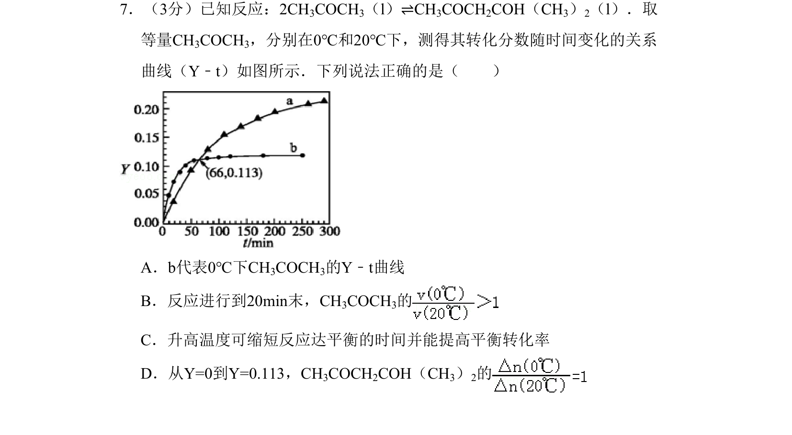
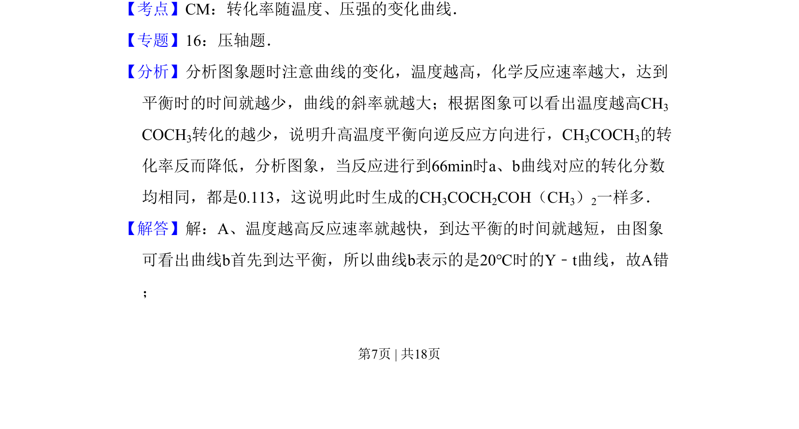
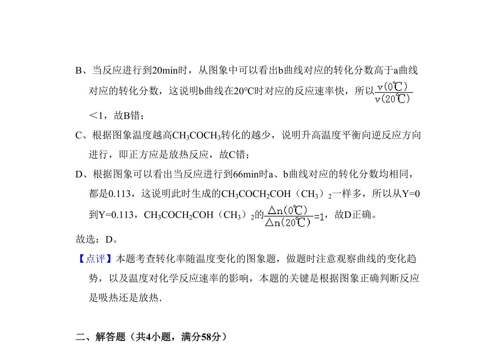

## 题面

## 摘要

考查温度对反应速率和化学平衡转化率的影响，结合Y-t图像分析判断。

## 关联考点

- [[转化率随温度变化曲线]]
- [[温度对反应速率影响]]
- [[温度对化学平衡影响]]

## 答案与解析

> 📄 原 PDF 第 7 页：`素材/真题/北京/2008-2024·（北京）化学高考真题/2011年高考化学试卷（北京）（解析卷）.pdf`

<!-- 题干文本-start -->
## 题干文本
7．（3分）已知反应：2CH3COCH3（l）⇌CH3COCH2COH（CH3）2（l）．取
等量CH3COCH3，分别在0℃和20℃下，测得其转化分数随时间变化的关系
曲线（Y﹣t）如图所示．下列说法正确的是（　　）
A．b代表0℃下CH3COCH3的Y﹣t曲线
B．反应进行到20min末，CH3COCH3的
C．升高温度可缩短反应达平衡的时间并能提高平衡转化率
D．从Y=0到Y=0.113，CH3COCH2COH（CH3）2的
<!-- 题干文本-end -->

<!-- 解析文本-start -->
## 解析文本
【考点】CM：转化率随温度、压强的变化曲线．菁优网版权所有
【专题】16：压轴题．
【分析】分析图象题时注意曲线的变化，温度越高，化学反应速率越大，达到
平衡时的时间就越少，曲线的斜率就越大；根据图象可以看出温度越高CH3
COCH3转化的越少，说明升高温度平衡向逆反应方向进行，CH3COCH3的转
化率反而降低，分析图象，当反应进行到66min时a、b曲线对应的转化分数
均相同，都是0.113，这说明此时生成的CH3COCH2COH（CH3）2一样多．
【解答】解：A、温度越高反应速率就越快，到达平衡的时间就越短，由图象
可看出曲线b首先到达平衡，所以曲线b表示的是20℃时的Y﹣t曲线，故A错
；
<!-- 解析文本-end -->
