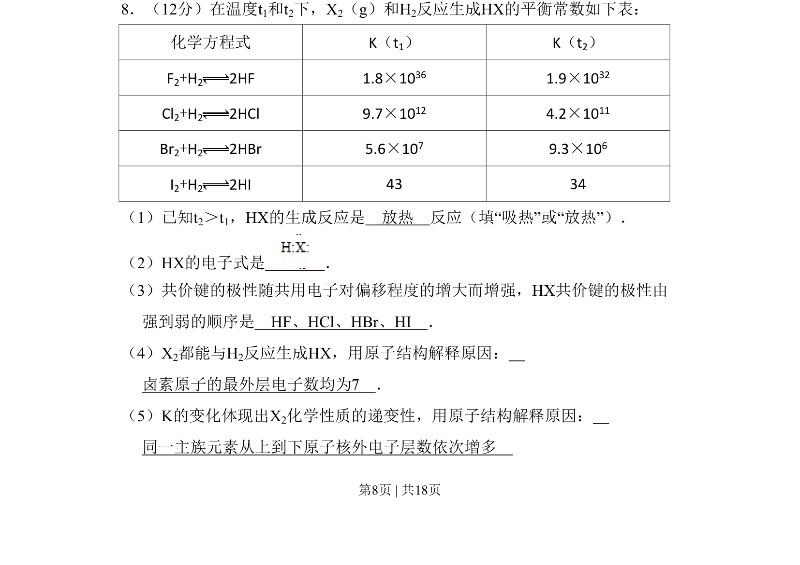
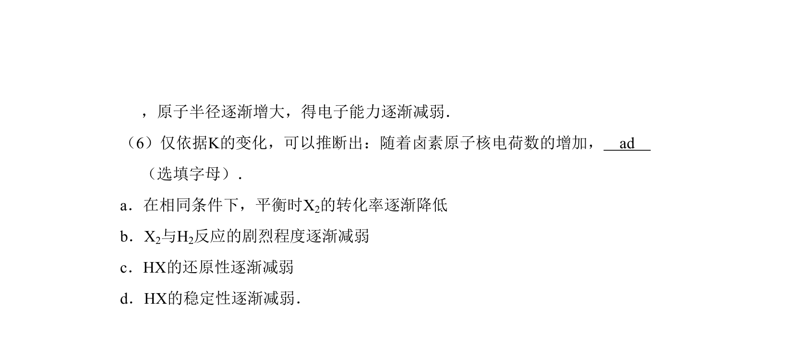
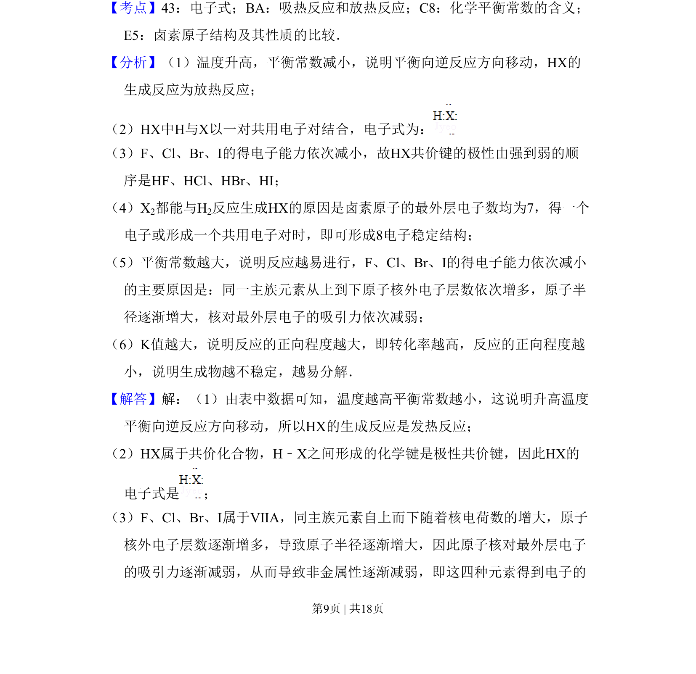
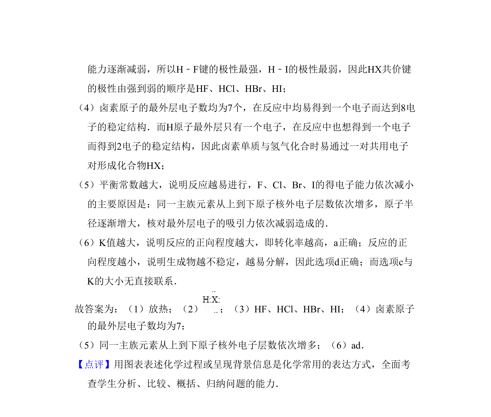

## 题面

## 摘要

该题利用卤族元素与氢气反应的平衡常数数据，考查反应热判断、电子式书写、共价键极性比较及原子结构对性质递变性的解释。

## 关联考点

- [[342-化学平衡常数|化学平衡常数]]
- [[288-反应热|反应热]]
- [[共价键极性]]
- [[530-原子结构与元素周期律|原子结构与元素周期律]]

## 答案与解析

> 📄 原 PDF 第 8 页：`素材/真题/北京/2008-2024·（北京）化学高考真题/2011年高考化学试卷（北京）（解析卷）.pdf`
