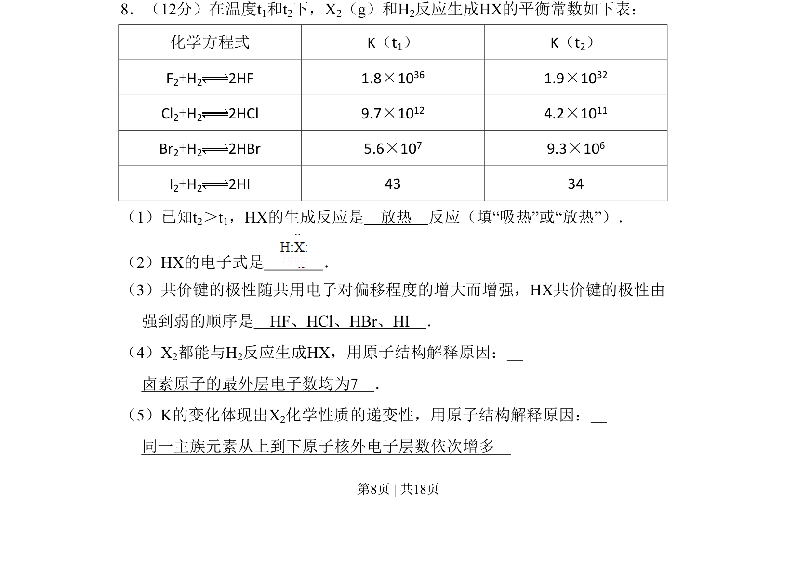
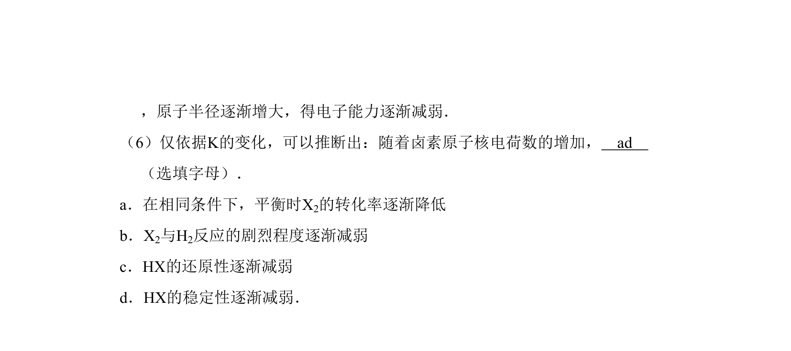
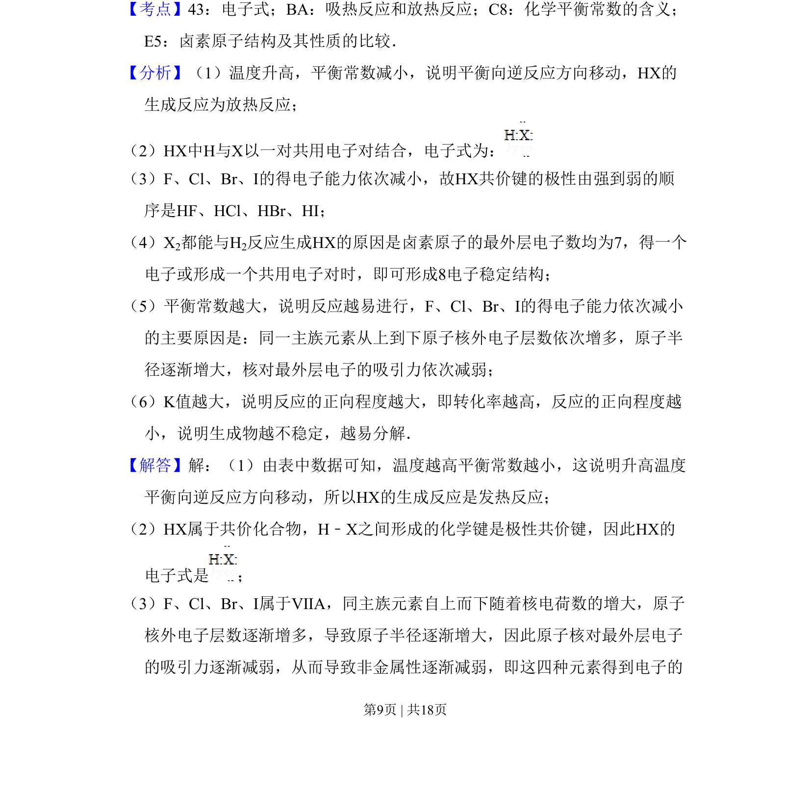
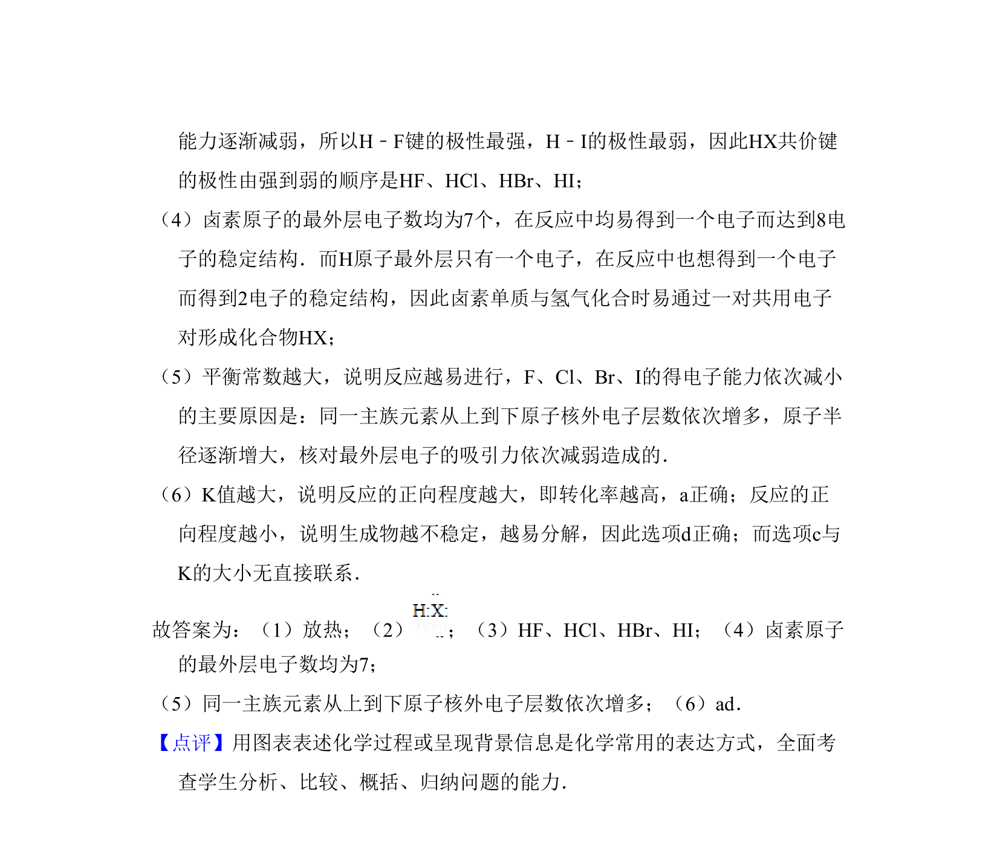

## 题面

## 摘要

该题利用卤族元素与氢气反应的平衡常数数据，考查反应热判断、电子式书写、共价键极性比较及原子结构对性质递变性的解释。

## 关联考点

- [[342-化学平衡常数|化学平衡常数]]
- [[288-反应热|反应热]]
- [[共价键极性]]
- [[530-原子结构与元素周期律|原子结构与元素周期律]]

## 答案与解析

> 📄 原 PDF 第 8 页：`素材/真题/北京/2008-2024·（北京）化学高考真题/2011年高考化学试卷（北京）（解析卷）.pdf`

<!-- 题干文本-start -->
## 题干文本
8．（12分）在温度t1和t2下，X2（g）和H2反应生成HX的平衡常数如下表：
化学方程式 K（t1） K（t2）
F2+H2
 2HF 1.8×1036 1.9×1032
Cl2+H2
 2HCl 9.7×1012 4.2×1011
Br2+H2
 2HBr 5.6×107 9.3×106
I2+H2
 2HI 43 34
（1）已知t2＞t1，HX的生成反应是　放热　反应（填“吸热”或“放热”）．
（2）HX的电子式是　 　．
（3）共价键的极性随共用电子对偏移程度的增大而增强，HX共价键的极性由
强到弱的顺序是　HF、HCl、HBr、HI　．
（4）X2都能与H2反应生成HX，用原子结构解释原因：　
卤素原子的最外层电子数均为7　．
（5）K的变化体现出X2化学性质的递变性，用原子结构解释原因：　
同一主族元素从上到下原子核外电子层数依次增多
<!-- 题干文本-end -->

<!-- 解析文本-start -->
## 解析文本

<!-- 解析文本-end -->
