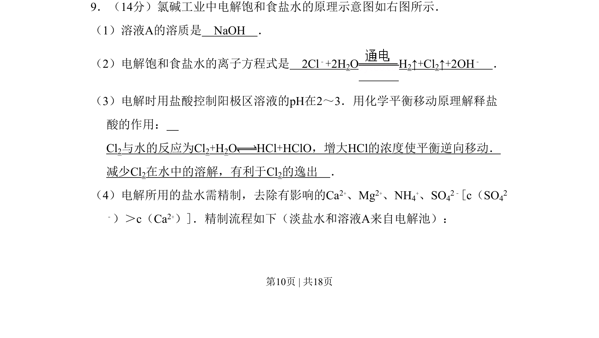
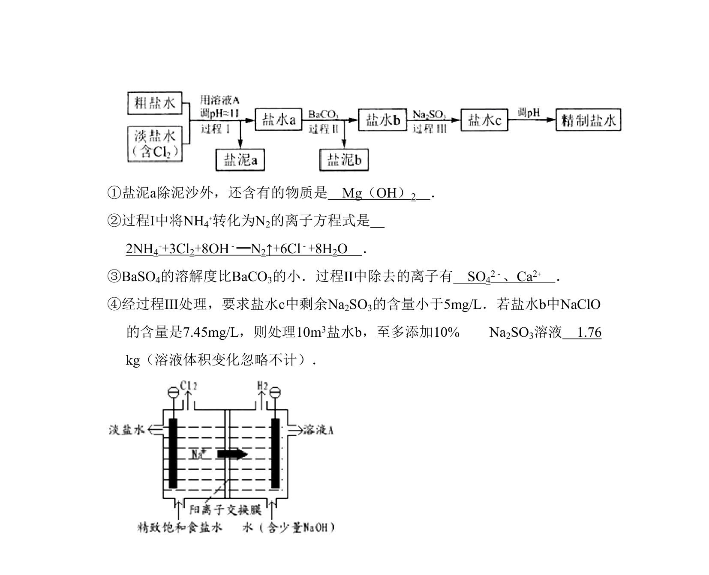
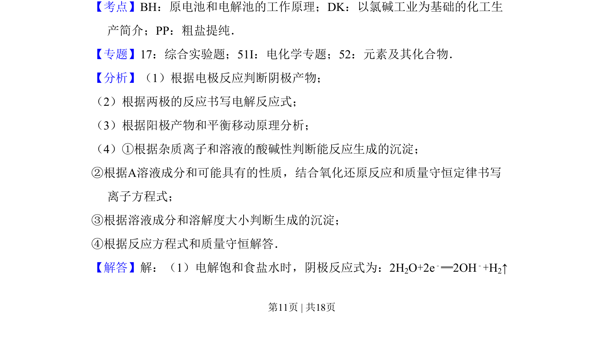
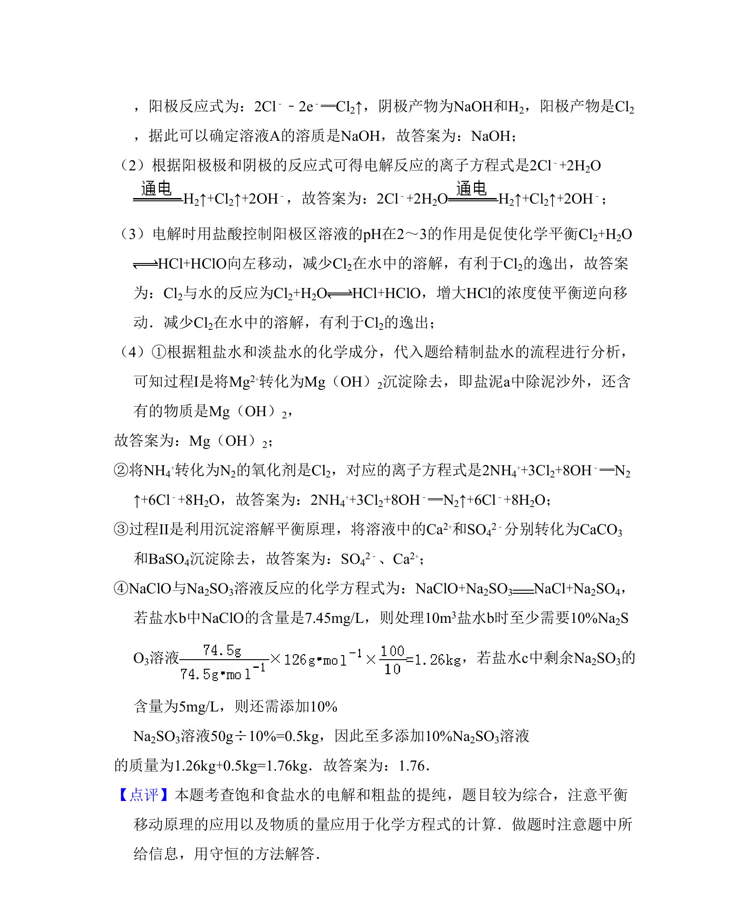

## 题面

## 摘要

氯碱工业电解饱和食盐水的原理、离子方程式、平衡移动解释及粗盐水精制流程

## 关联考点

- [[367-电解原理|电解原理]]
- [[170-离子方程式|离子方程式]]
- [[620-化学平衡移动|化学平衡移动]]
- [[粗盐精制]]

## 答案与解析

> 📄 原 PDF 第 10 页：`素材/真题/北京/2008-2024·（北京）化学高考真题/2011年高考化学试卷（北京）（解析卷）.pdf`
