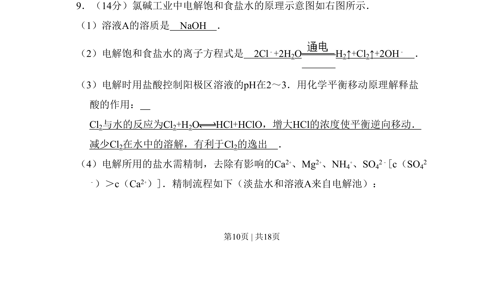
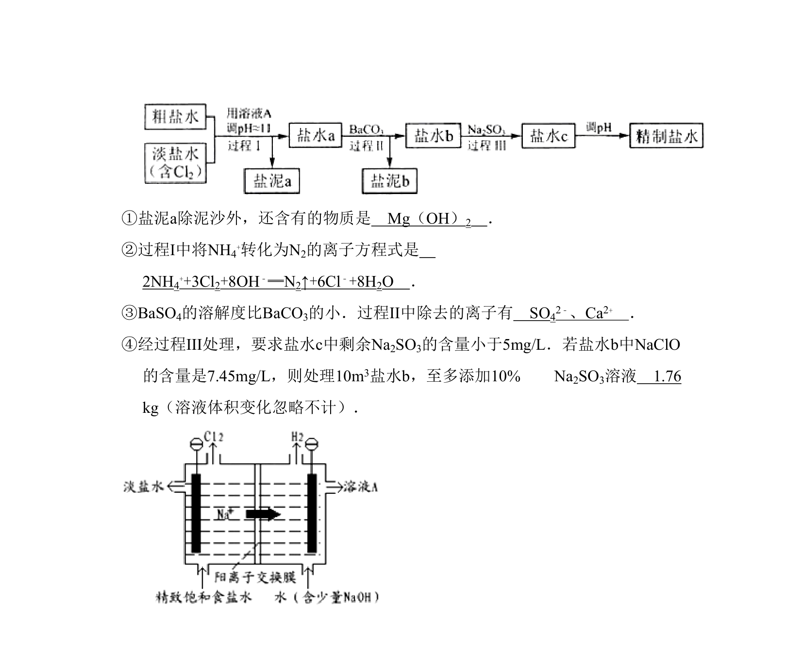
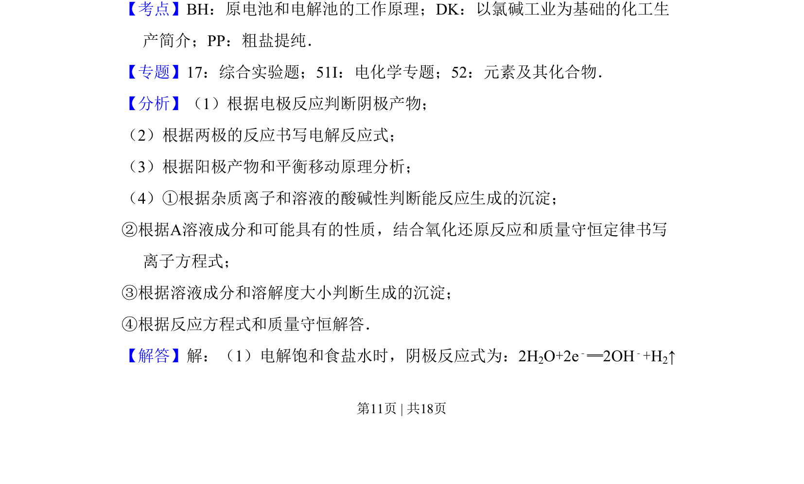
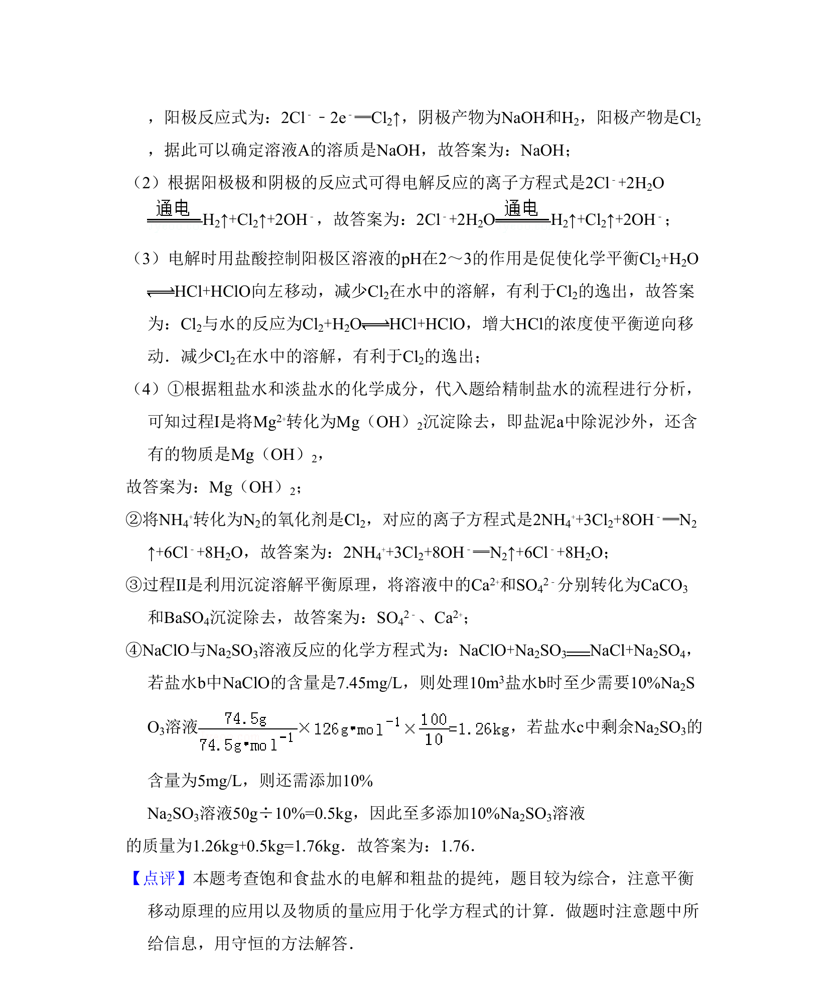

## 题面

## 摘要

氯碱工业电解饱和食盐水的原理、离子方程式、平衡移动解释及粗盐水精制流程

## 关联考点

- [[367-电解原理|电解原理]]
- [[170-离子方程式|离子方程式]]
- [[620-化学平衡移动|化学平衡移动]]
- [[粗盐精制]]

## 答案与解析

> 📄 原 PDF 第 10 页：`素材/真题/北京/2008-2024·（北京）化学高考真题/2011年高考化学试卷（北京）（解析卷）.pdf`

<!-- 题干文本-start -->
## 题干文本
9．（14分）氯碱工业中电解饱和食盐水的原理示意图如右图所示．
（1）溶液A的溶质是　NaOH　．
（2）电解饱和食盐水的离子方程式是　2Cl﹣+2H2O H2↑+Cl2↑+2OH﹣　．
（3）电解时用盐酸控制阳极区溶液的pH在2～3．用化学平衡移动原理解释盐
酸的作用：　
Cl2与水的反应为Cl2+H2O HCl+HClO，增大HCl的浓度使平衡逆向移动．
减少Cl2在水中的溶解，有利于Cl2的逸出　．
（4）电解所用的盐水需精制，去除有影响的Ca2+、Mg2+、NH4
+、SO42﹣[c（SO42
﹣）＞c（Ca2+）]．精制流程如下（淡盐水和溶液A来自电解池）：
<!-- 题干文本-end -->

<!-- 解析文本-start -->
## 解析文本

<!-- 解析文本-end -->
