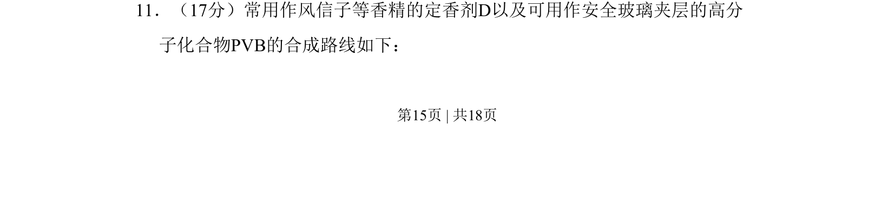
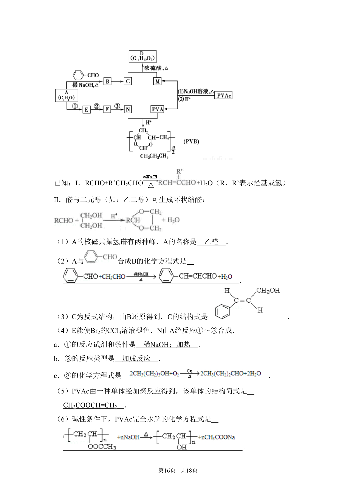
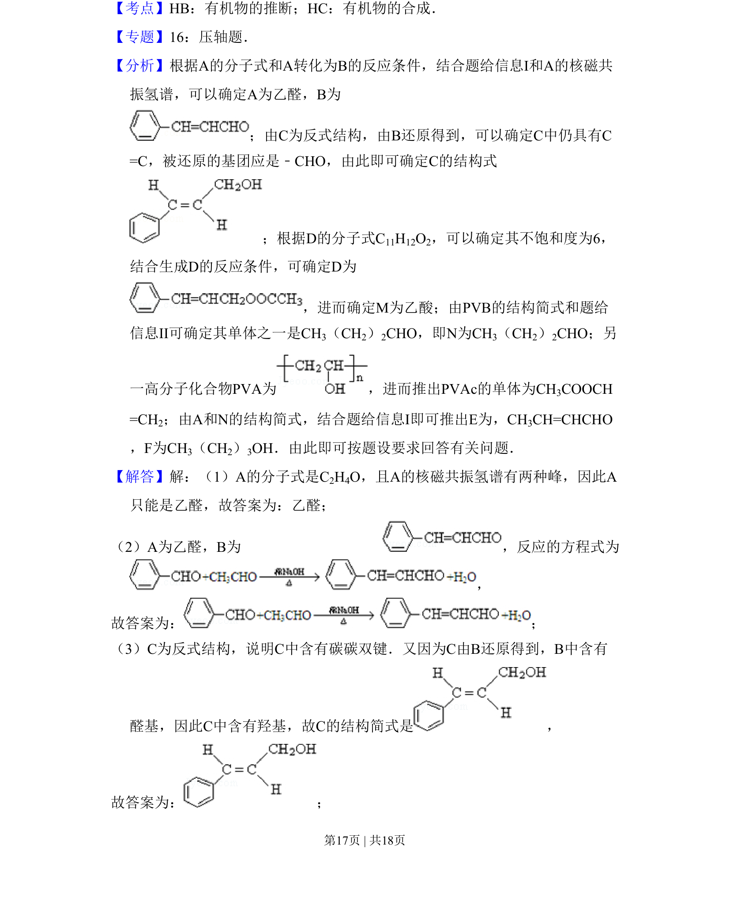
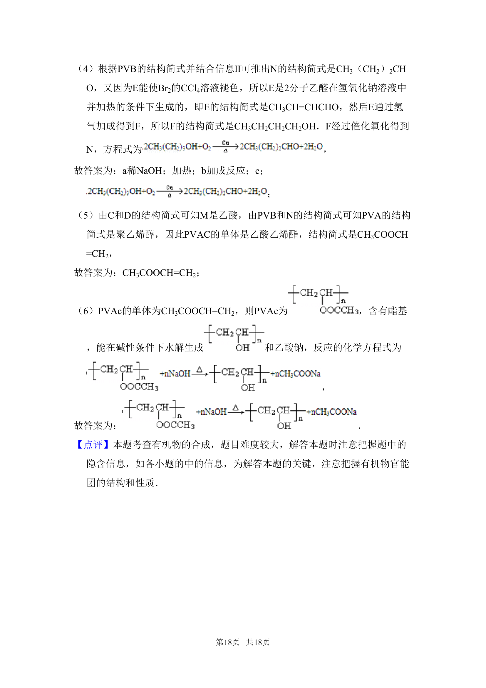

## 题面

## 摘要

有机合成路线推断，涉及香精定香剂D与安全玻璃夹层高分子PVB的合成。

## 关联考点

- [[271-化学合成|有机合成]]
- [[886-官能团转化|官能团转化]]
- [[646-反应类型|反应类型]]
- [[505-高分子化合物|高分子化合物]]

## 答案与解析

> 📄 原 PDF 第 15 页：`素材/真题/北京/2008-2024·（北京）化学高考真题/2011年高考化学试卷（北京）（解析卷）.pdf`
