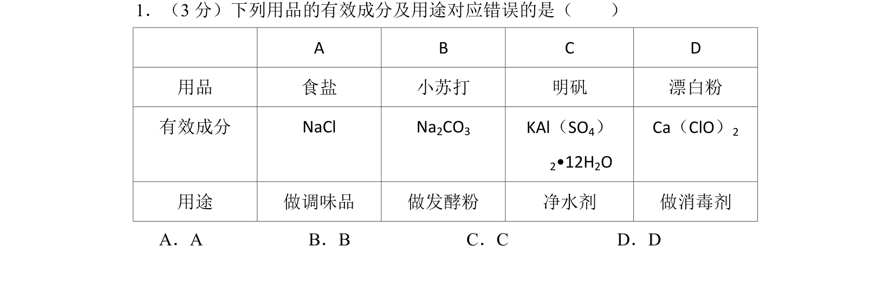
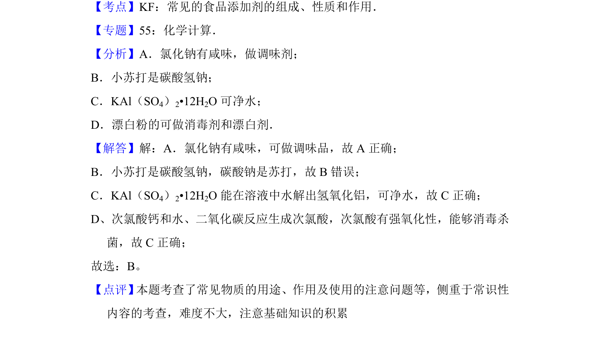

## 题面

## 摘要

该题考查常见日用品有效成分与用途的对应关系，涉及小苏打成分为碳酸氢钠而非碳酸钠。

## 关联考点

- [[常见物质的成分与用途]]
- [[115-碳酸氢钠|碳酸氢钠]]
- [[明矾净水]]
- [[次氯酸钙消毒]]

## 答案与解析

> 📄 原 PDF 第 1 页：`素材/真题/北京/2008-2024·（北京）化学高考真题/2012年高考化学试卷（北京）（解析卷）.pdf`
