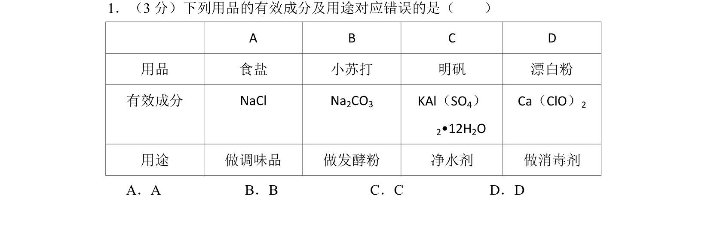
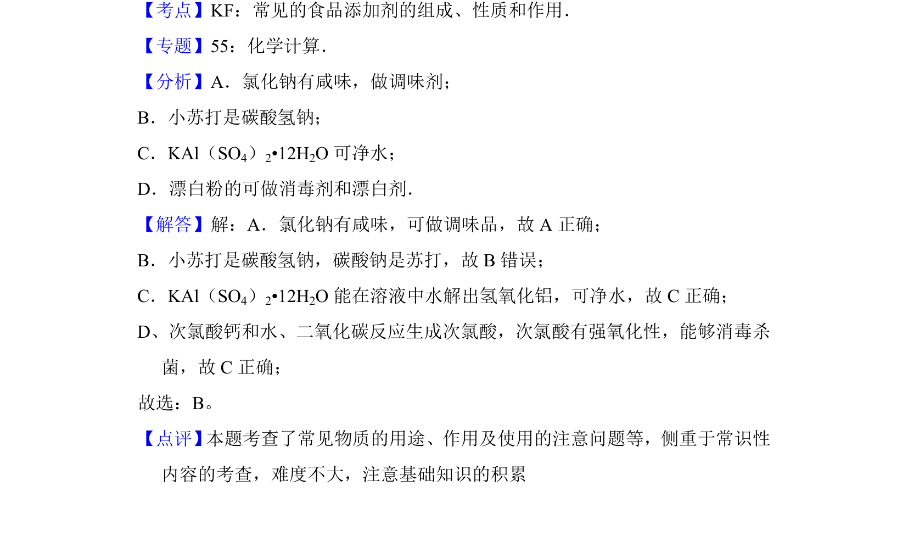

## 题面

## 摘要

该题考查常见日用品有效成分与用途的对应关系，涉及小苏打成分为碳酸氢钠而非碳酸钠。

## 关联考点

- [[常见物质的成分与用途]]
- [[115-碳酸氢钠|碳酸氢钠]]
- [[明矾净水]]
- [[次氯酸钙消毒]]

## 答案与解析

> 📄 原 PDF 第 1 页：`素材/真题/北京/2008-2024·（北京）化学高考真题/2012年高考化学试卷（北京）（解析卷）.pdf`

<!-- 题干文本-start -->
## 题干文本
1．（3分）下列用品的有效成分及用途对应错误的是（　　）
A B C D
用品 食盐 小苏打 明矾 漂白粉
有效成分 NaCl Na2CO3 KAl（SO4）
2•12H2O
Ca（ClO）2
用途 做调味品 做发酵粉 净水剂 做消毒剂
A．A B．B C．C D．D
<!-- 题干文本-end -->

<!-- 解析文本-start -->
## 解析文本
【考点】KF：常见的食品添加剂的组成、性质和作用．菁优网版权所有
【专题】55：化学计算．
【分析】A．氯化钠有咸味，做调味剂；
B．小苏打是碳酸氢钠；
C．KAl（SO4）2•12H2O可净水；
D．漂白粉的可做消毒剂和漂白剂．
【解答】解：A．氯化钠有咸味，可做调味品，故A正确； 
B．小苏打是碳酸氢钠，碳酸钠是苏打，故B错误；
C．KAl（SO4）2•12H2O能在溶液中水解出氢氧化铝，可净水，故C正确；
D、次氯酸钙和水、二氧化碳反应生成次氯酸，次氯酸有强氧化性，能够消毒杀
菌，故C正确；
故选：B。
【点评】 本题考查了常见物质的用途、作用及使用的注意问题等，侧重于常识性
内容的考查，难度不大，注意基础知识的积累
<!-- 解析文本-end -->
