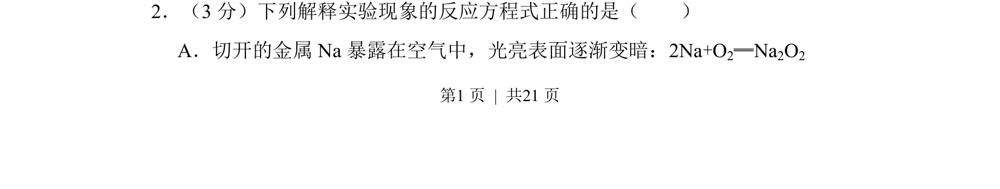
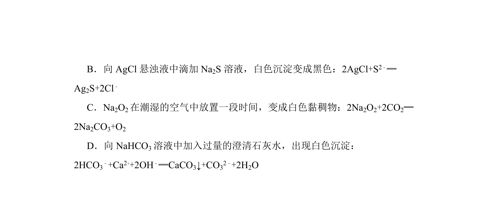
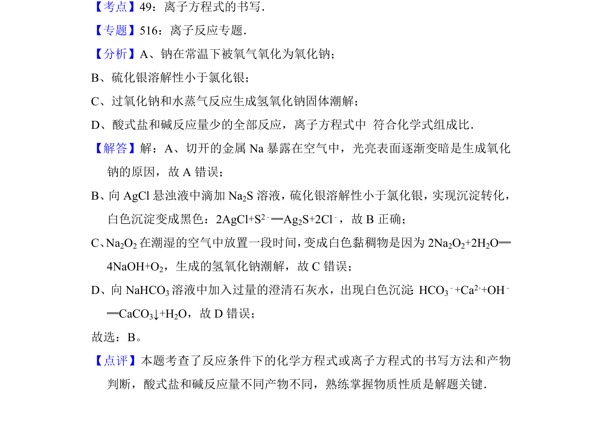

## 题面

## 摘要

考查钠暴露在空气中的反应方程式正误判断

## 关联考点

- [[212-钠的化学性质|钠的化学性质]]
- [[反应方程式书写]]

## 答案与解析

> 📄 原 PDF 第 1 页：`素材/真题/北京/2008-2024·（北京）化学高考真题/2012年高考化学试卷（北京）（解析卷）.pdf`

<!-- 题干文本-start -->
## 题干文本
2．（3分）下列解释实验现象的反应方程式正确的是（　　）
A．切开的金属Na暴露在空气中，光亮表面逐渐变暗：2Na+O 2═Na2O2
<!-- 题干文本-end -->

<!-- 解析文本-start -->
## 解析文本

<!-- 解析文本-end -->
