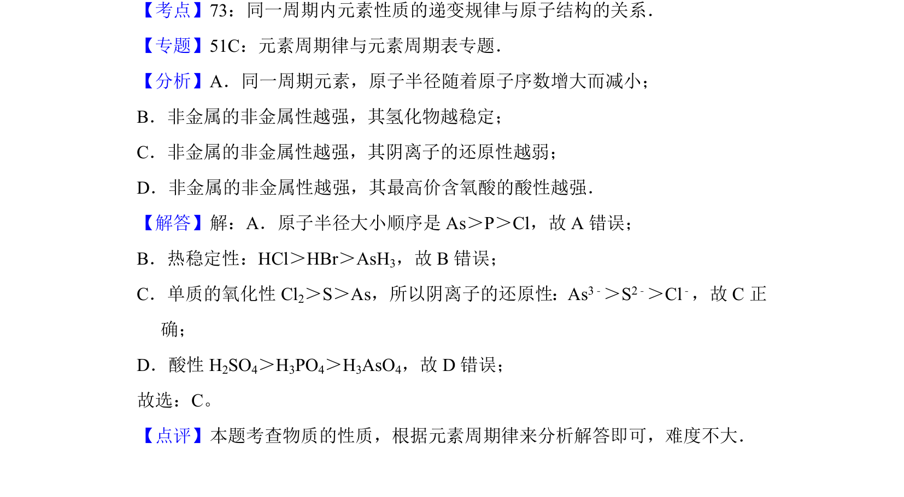

## 题面

## 摘要

同一周期内原子半径、气态氢化物稳定性、阴离子还原性及最高价含氧酸酸性的递变规律比较。

## 关联考点

- [[原子半径递变]]
- [[977-氢化物稳定性|氢化物稳定性]]
- [[968-阴离子还原性|阴离子还原性]]
- [[最高价含氧酸酸性]]

## 答案与解析

> 📄 原 PDF 第 4 页：`素材/真题/北京/2008-2024·（北京）化学高考真题/2012年高考化学试卷（北京）（解析卷）.pdf`
