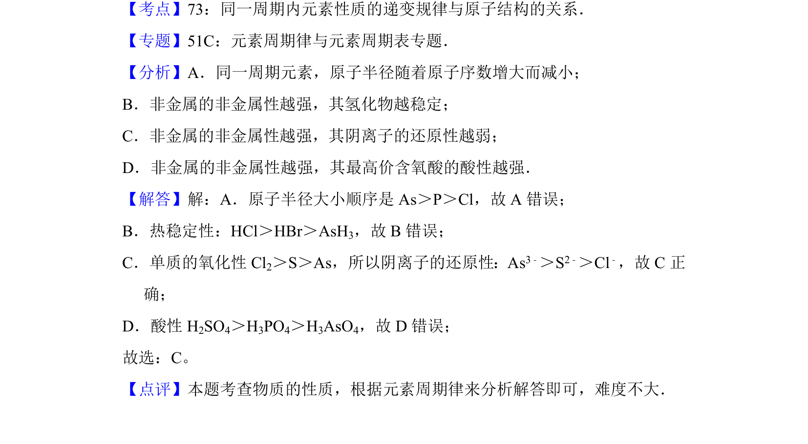

## 题面

## 摘要

同一周期内原子半径、气态氢化物稳定性、阴离子还原性及最高价含氧酸酸性的递变规律比较。

## 关联考点

- [[原子半径递变]]
- [[977-氢化物稳定性|氢化物稳定性]]
- [[968-阴离子还原性|阴离子还原性]]
- [[最高价含氧酸酸性]]

## 答案与解析

> 📄 原 PDF 第 4 页：`素材/真题/北京/2008-2024·（北京）化学高考真题/2012年高考化学试卷（北京）（解析卷）.pdf`

<!-- 题干文本-start -->
## 题干文本
4．（3分）已知 33As、35Br位于同一周期．下列关系正确的是（　　）
A．原子半径：As＞Cl＞P B．热稳定性：HCl＞AsH 3＞HBr
C．还原性：As3﹣＞S2﹣＞Cl﹣ D．酸性：H3AsO4＞H2SO4＞H3PO4
<!-- 题干文本-end -->

<!-- 解析文本-start -->
## 解析文本
【考点】73：同一周期内元素性质的递变规律与原子结构的关系．菁优网版权所有
【专题】51C：元素周期律与元素周期表专题．
【分析】A．同一周期元素，原子半径随着原子序数增大而减小；
B．非金属的非金属性越强，其氢化物越稳定；
C．非金属的非金属性越强，其阴离子的还原性越弱；
D．非金属的非金属性越强，其最高价含氧酸的酸性越强．
【解答】解：A．原子半径大小顺序是As＞P＞Cl，故A错误；
B．热稳定性：HCl＞HBr＞AsH3，故B错误；
C．单质的氧化性Cl 2＞S＞As，所以阴离子的还原性：As3﹣＞S2﹣＞Cl﹣，故C正
确；
D．酸性H 2SO4＞H3PO4＞H3AsO4，故D错误；
故选：C。
【点评】本题考查物质的性质，根据元素周期律来分析解答即可，难度不大．
<!-- 解析文本-end -->
