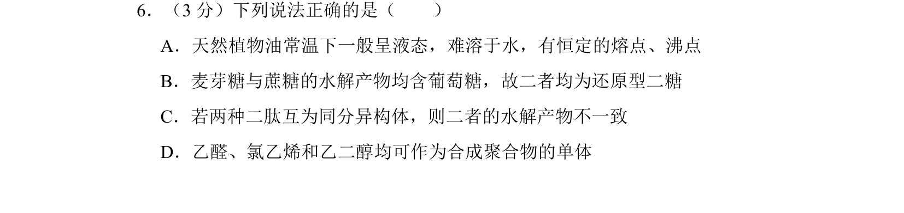
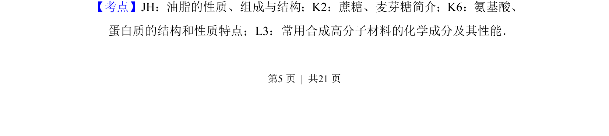
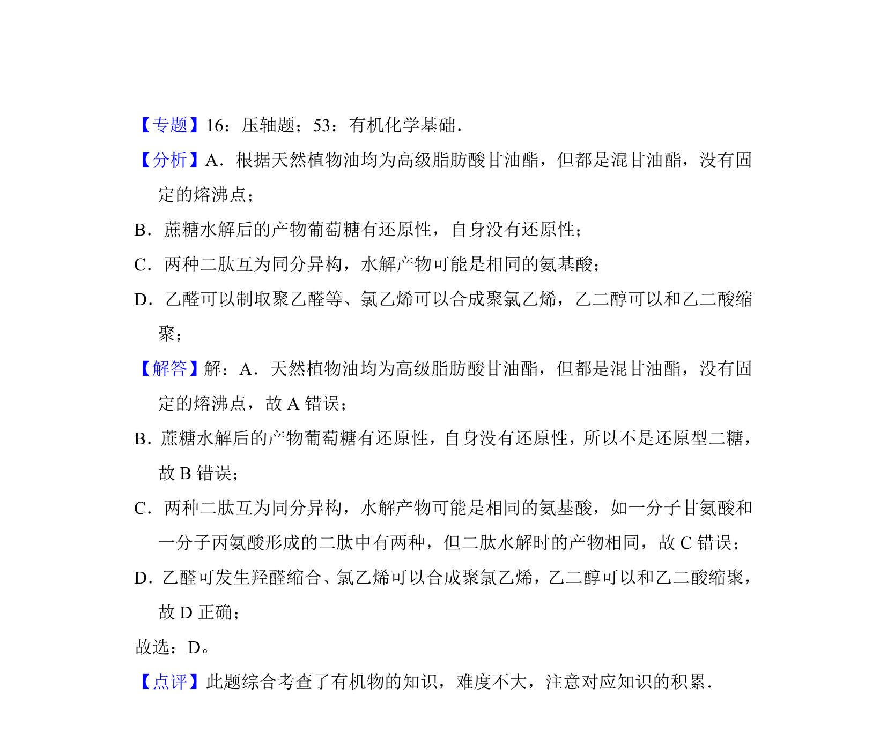

## 题面

## 摘要

该题考查常见有机物的性质、糖类水解及还原性、同分异构体水解产物、聚合物单体等知识。

## 关联考点

- [[749-油脂的性质|油脂的性质]]
- [[蔗糖与麦芽糖]]
- [[二肽同分异构体]]
- [[合成高分子单体]]

## 答案与解析

> 📄 原 PDF 第 5 页：`素材/真题/北京/2008-2024·（北京）化学高考真题/2012年高考化学试卷（北京）（解析卷）.pdf`
