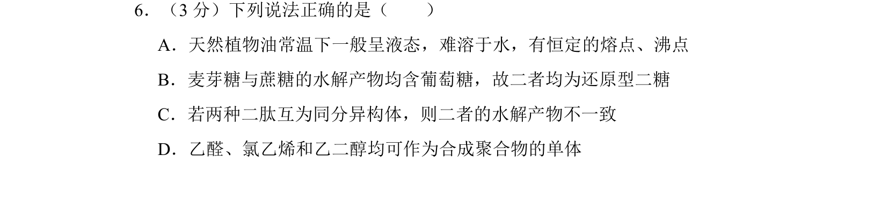
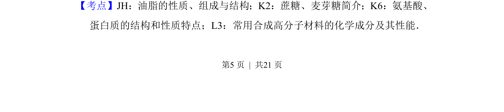
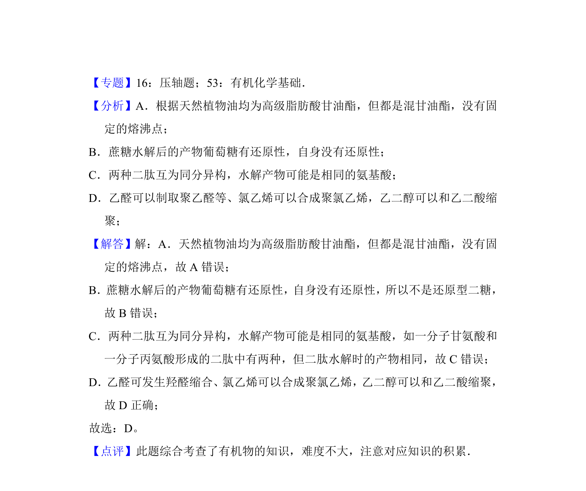

## 题面

## 摘要

该题考查常见有机物的性质、糖类水解及还原性、同分异构体水解产物、聚合物单体等知识。

## 关联考点

- [[749-油脂的性质|油脂的性质]]
- [[蔗糖与麦芽糖]]
- [[二肽同分异构体]]
- [[合成高分子单体]]

## 答案与解析

> 📄 原 PDF 第 5 页：`素材/真题/北京/2008-2024·（北京）化学高考真题/2012年高考化学试卷（北京）（解析卷）.pdf`

<!-- 题干文本-start -->
## 题干文本
6．（3分）下列说法正确的是（　　）
A．天然植物油常温下一般呈液态，难溶于水，有恒定的熔点、沸点
B．麦芽糖与蔗糖的水解产物均含葡萄糖，故二者均为还原型二糖
C．若两种二肽互为同分异构体，则二者的水解产物不一致
D．乙醛、氯乙烯和乙二醇均可作为合成聚合物的单体
<!-- 题干文本-end -->

<!-- 解析文本-start -->
## 解析文本
【考点】JH：油脂的性质、组成与结构；K2：蔗糖、麦芽糖简介；K6：氨基酸、
蛋白质的结构和性质特点；L3：常用合成高分子材料的化学成分及其性能．菁优网版权
所有
<!-- 解析文本-end -->
