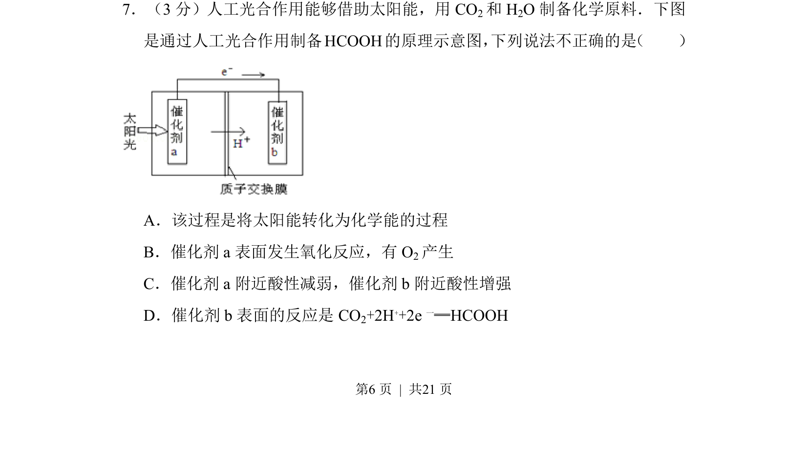
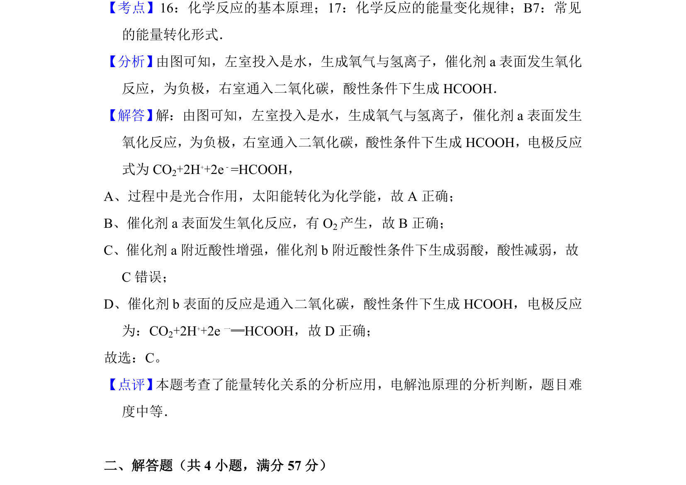

## 题面

## 摘要

该题通过人工光合作用制备HCOOH的原理图，考查太阳能转化、电极反应及溶液酸碱性变化判断。

## 关联考点

- [[287-原电池|原电池]]
- [[793-电极反应|电极反应]]
- [[162-氧化还原反应|氧化还原反应]]
- [[溶液酸碱性]]

## 答案与解析

> 📄 原 PDF 第 6 页：`素材/真题/北京/2008-2024·（北京）化学高考真题/2012年高考化学试卷（北京）（解析卷）.pdf`

<!-- 题干文本-start -->
## 题干文本
7．（3分）人工光合作用能够借助太阳能，用CO 2和H 2O制备化学原料．下图
是通过人工光合作用制备HCOOH的原理示意图， 下列说法不正确的是 （　　）
A．该过程是将太阳能转化为化学能的过程
B．催化剂a表面发生氧化反应，有O 2产生
C．催化剂a附近酸性减弱，催化剂b附近酸性增强
D．催化剂b表面的反应是CO 2+2H++2e 一═HCOOH
<!-- 题干文本-end -->

<!-- 解析文本-start -->
## 解析文本

<!-- 解析文本-end -->
