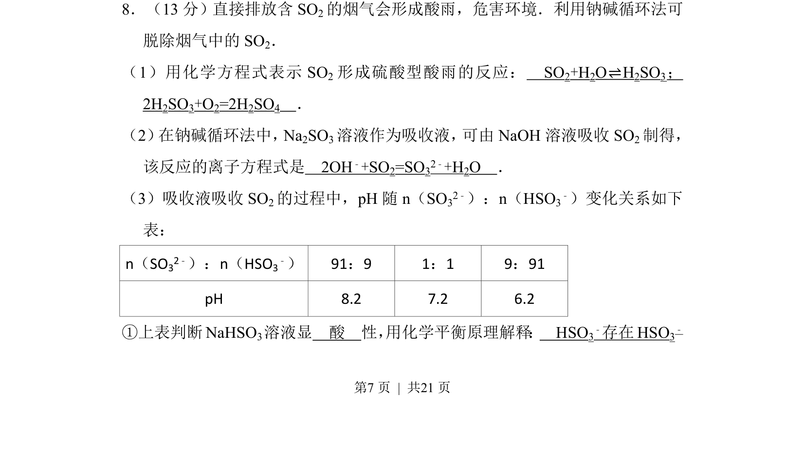
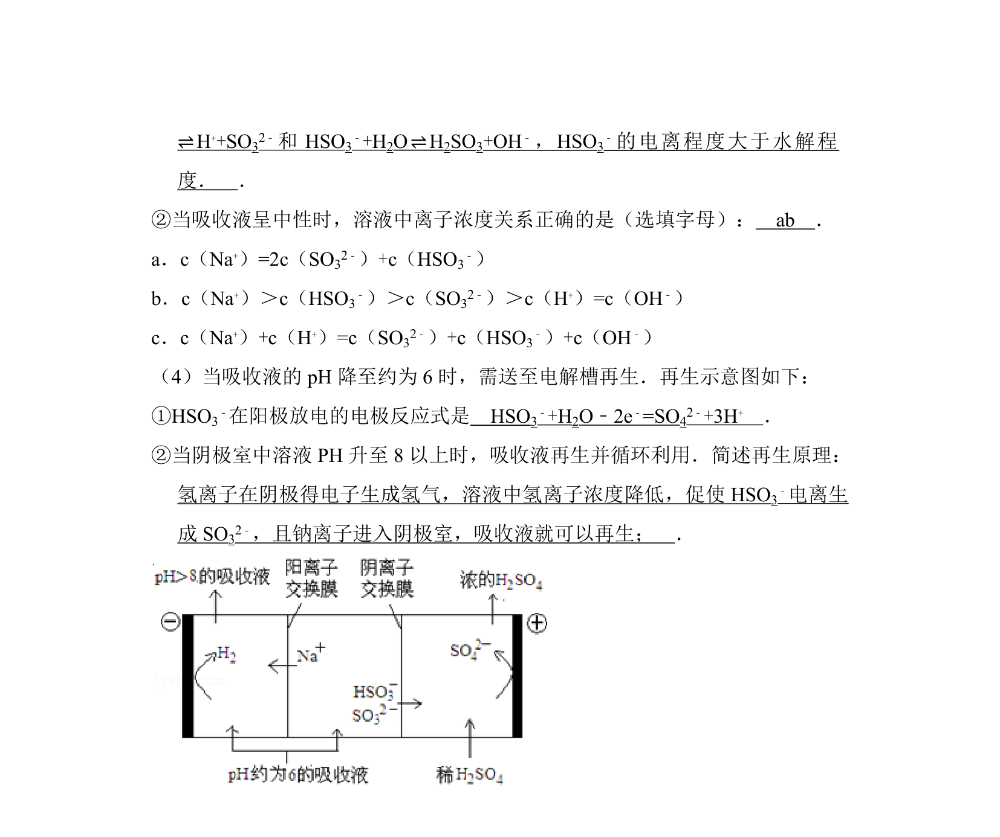
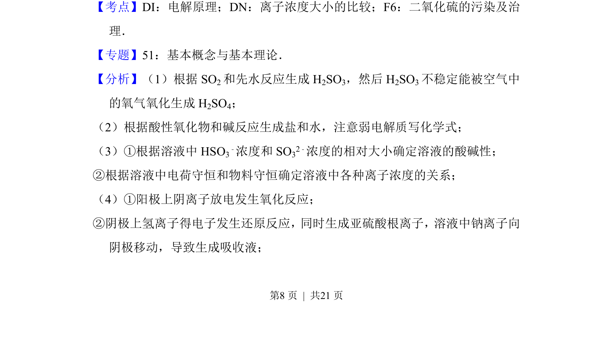
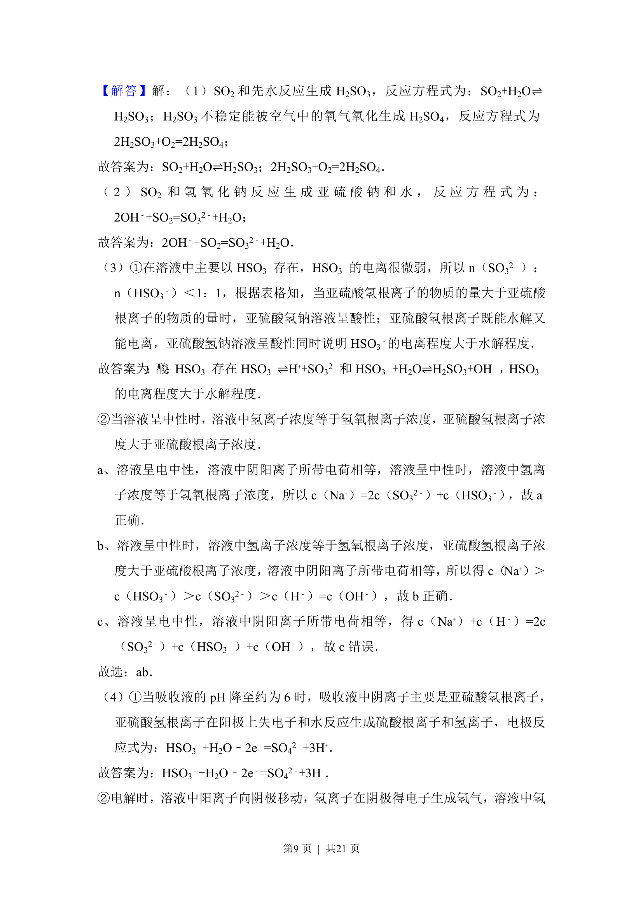
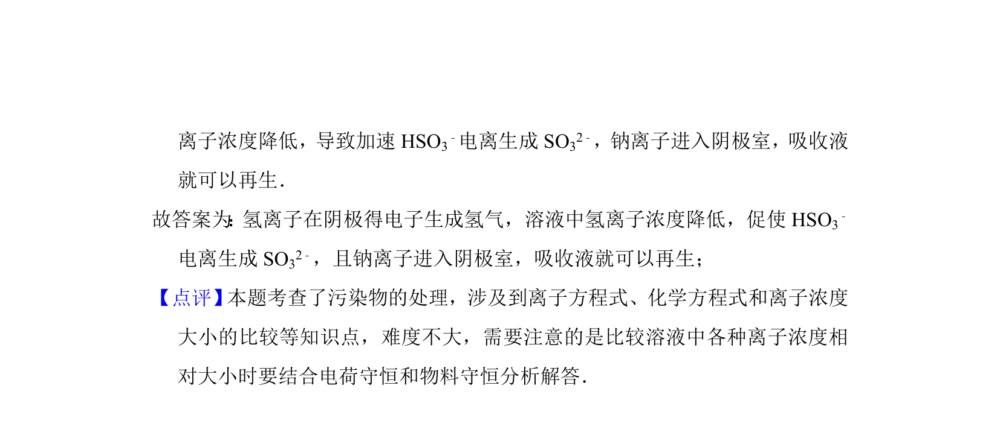

## 题面

## 摘要

考查SO2形成酸雨原理、钠碱循环法吸收SO2的反应及NaHSO3溶液酸碱性判断。

## 关联考点

- [[硫的氧化物污染治理]]
- [[806-离子方程式书写|离子方程式书写]]
- [[620-化学平衡移动|化学平衡移动]]
- [[溶液酸碱性判断]]

## 答案与解析

> 📄 原 PDF 第 7 页：`素材/真题/北京/2008-2024·（北京）化学高考真题/2012年高考化学试卷（北京）（解析卷）.pdf`
