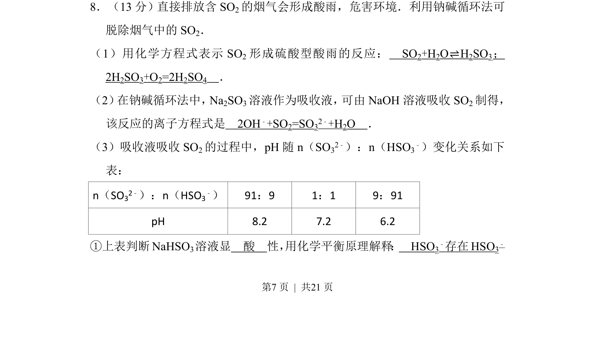
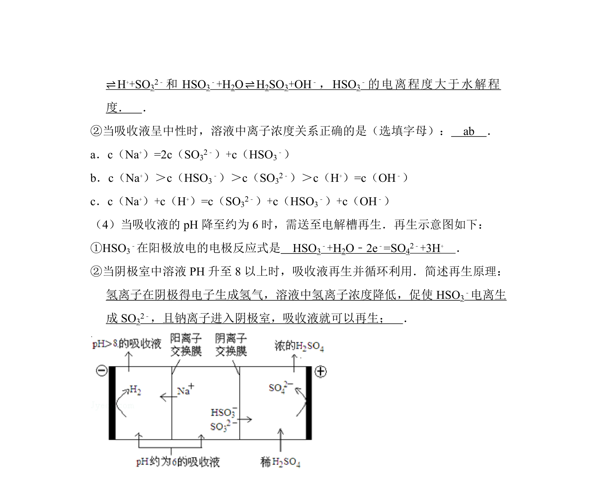
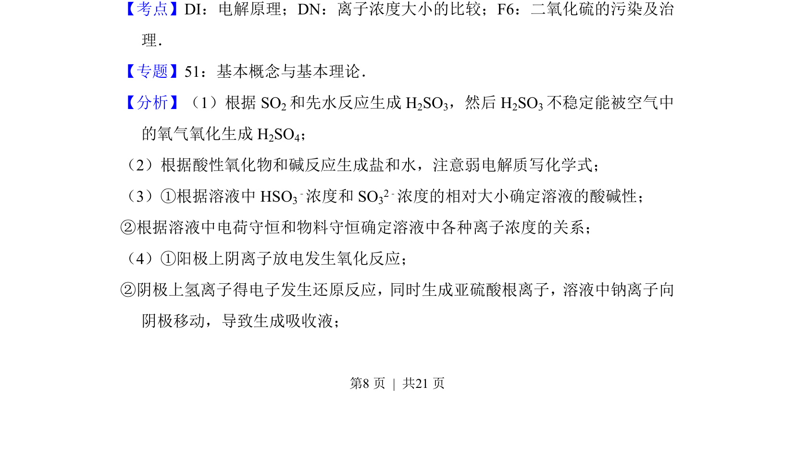
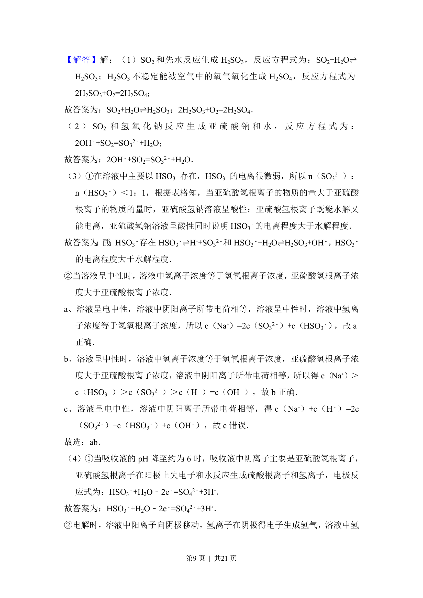
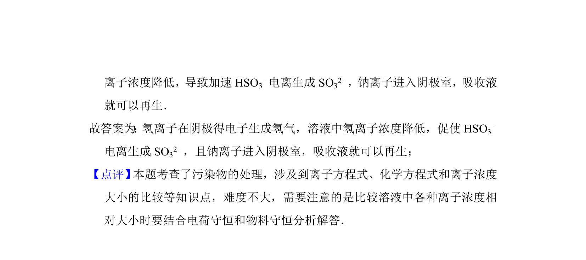

## 题面

## 摘要

考查SO2形成酸雨原理、钠碱循环法吸收SO2的反应及NaHSO3溶液酸碱性判断。

## 关联考点

- [[硫的氧化物污染治理]]
- [[807-离子方程式的书写|离子方程式书写]]
- [[620-化学平衡移动|化学平衡移动]]
- [[溶液酸碱性判断]]

## 答案与解析

> 📄 原 PDF 第 7 页：`素材/真题/北京/2008-2024·（北京）化学高考真题/2012年高考化学试卷（北京）（解析卷）.pdf`

<!-- 题干文本-start -->
## 题干文本
8．（13分）直接排放含SO 2的烟气会形成酸雨，危害环境．利用钠碱循环法可
脱除烟气中的SO 2．
（1）用化学方程式表示SO 2形成硫酸型酸雨的反应：　SO 2+H2O⇌H 2SO3；
2H2SO3+O2=2H2SO4　．
（2） 在钠碱循环法中，Na2SO3溶液作为吸收液， 可由NaOH溶液吸收SO2制得，
该反应的离子方程式是　2OH﹣+SO2=SO32﹣+H2O　．
（3）吸收液吸收SO 2的过程中，pH随n（SO 32﹣）：n（HSO3
﹣）变化关系如下
表：
n（SO32﹣）：n（HSO3
﹣） 91：9 1：1 9：91
pH 8.2 7.2 6.2
①上表判断NaHSO 3溶液显　酸　性， 用化学平衡原理解释 ： 　HSO3
﹣存在HSO 3
﹣
<!-- 题干文本-end -->

<!-- 解析文本-start -->
## 解析文本

<!-- 解析文本-end -->
