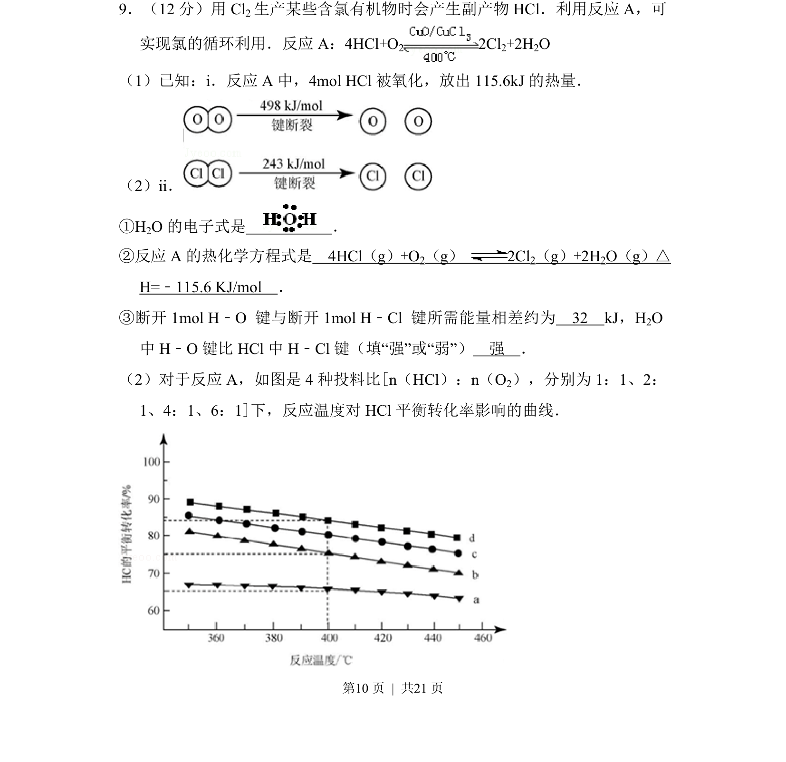
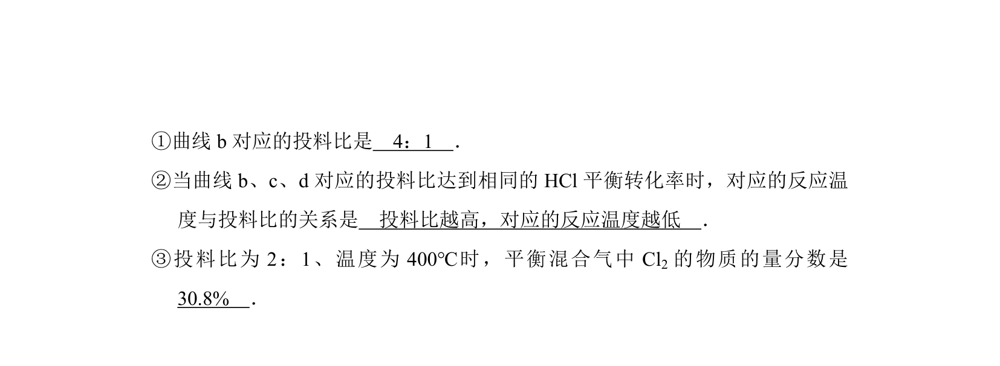
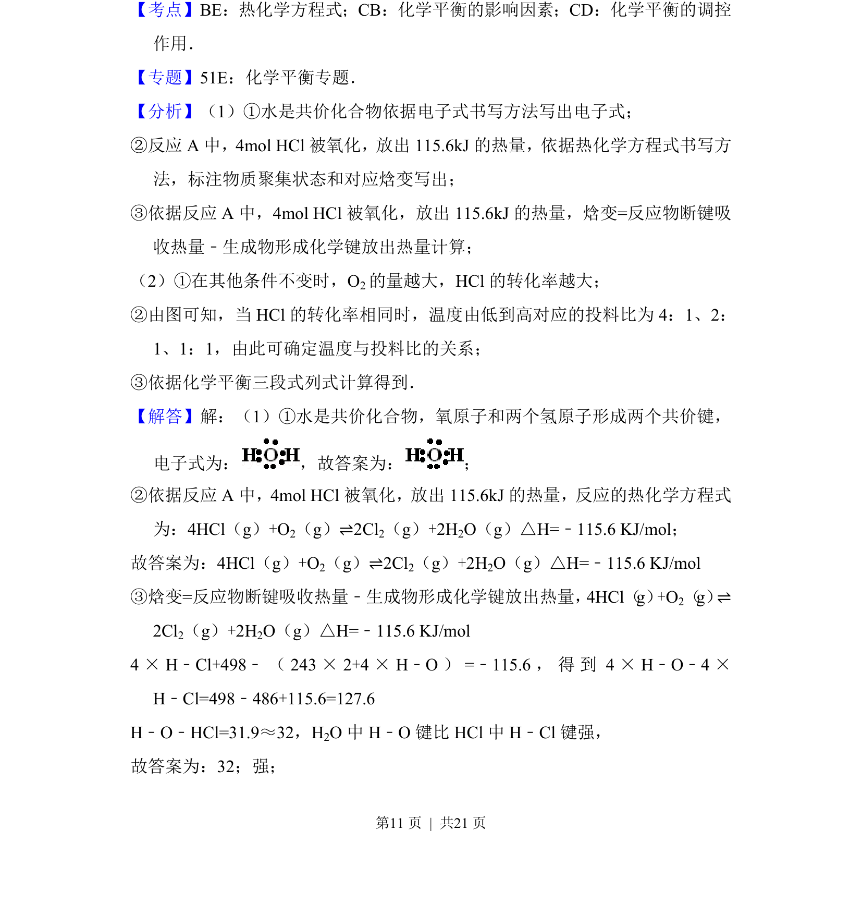
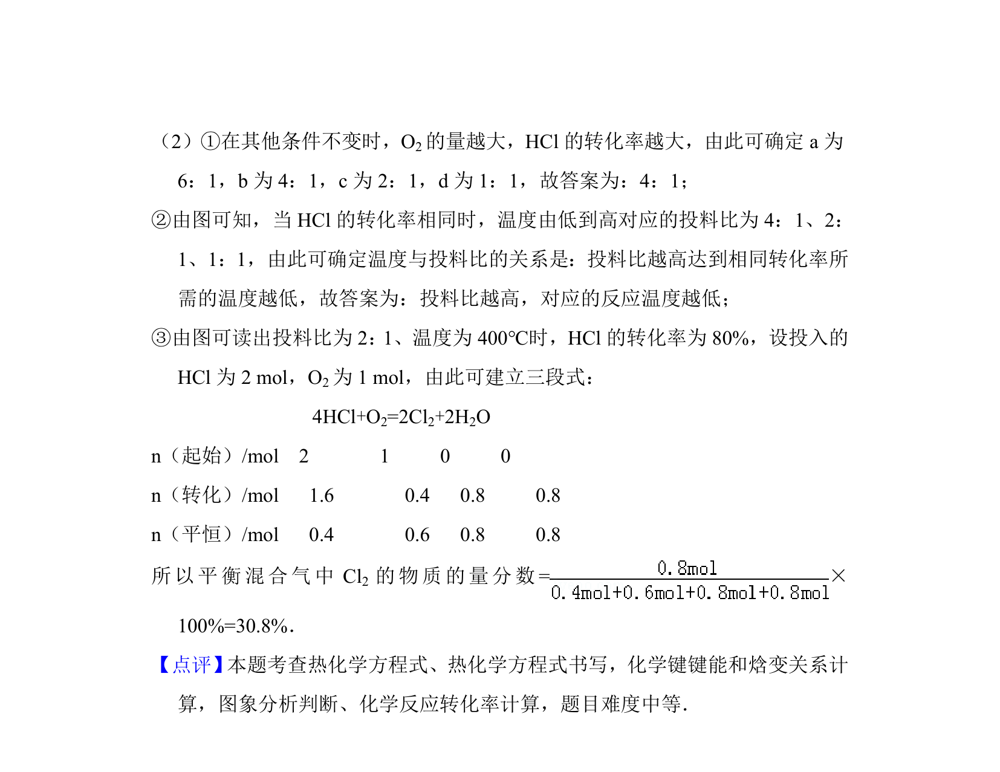

## 题面

## 摘要

反应A的热化学方程式、键能计算及平衡转化率曲线分析

## 关联考点

- [[309-热化学方程式|热化学方程式]]
- [[键能与反应热]]
- [[化学平衡转化率]]
- [[266-电子式|电子式]]

## 答案与解析

> 📄 原 PDF 第 10 页：`素材/真题/北京/2008-2024·（北京）化学高考真题/2012年高考化学试卷（北京）（解析卷）.pdf`
