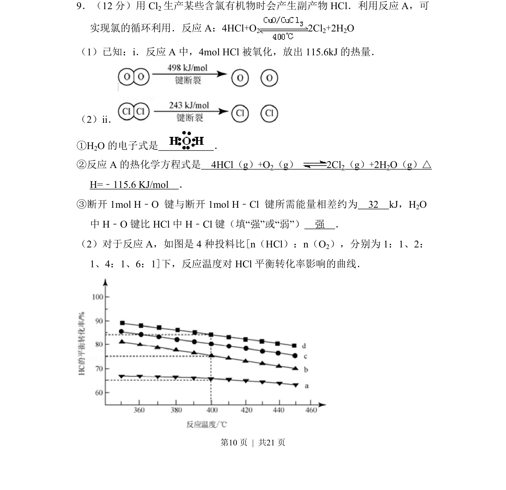
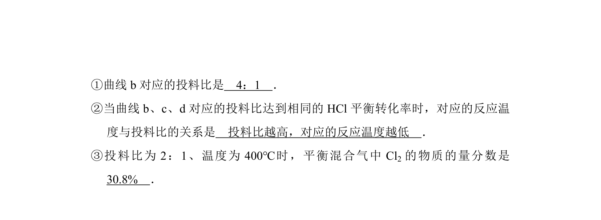
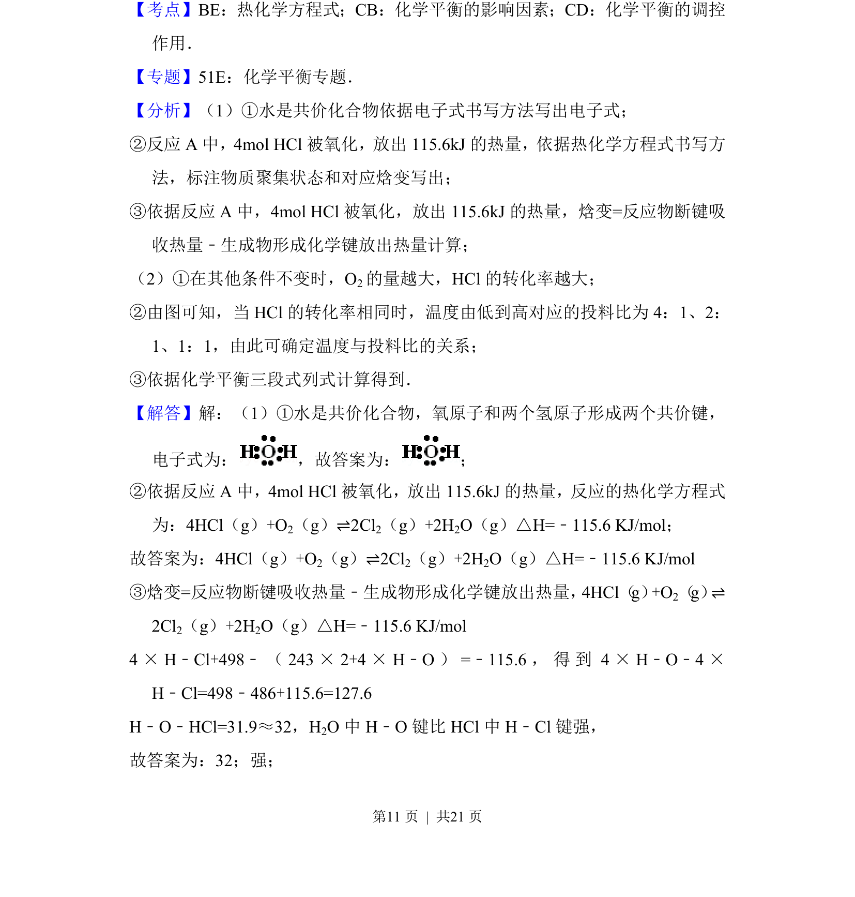
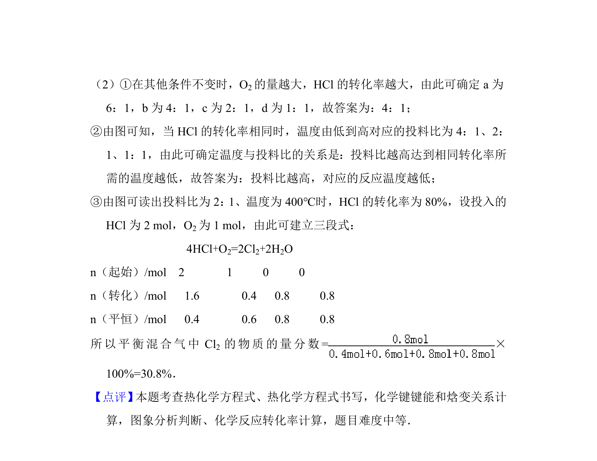

## 题面

## 摘要

反应A的热化学方程式、键能计算及平衡转化率曲线分析

## 关联考点

- [[309-热化学方程式|热化学方程式]]
- [[键能与反应热]]
- [[化学平衡转化率]]
- [[266-电子式|电子式]]

## 答案与解析

> 📄 原 PDF 第 10 页：`素材/真题/北京/2008-2024·（北京）化学高考真题/2012年高考化学试卷（北京）（解析卷）.pdf`

<!-- 题干文本-start -->
## 题干文本
9．（12分）用Cl 2生产某些含氯有机物时会产生副产物HCl．利用反应A，可
实现氯的循环利用．反应A：4HCl+O 2 2Cl2+2H2O
（1）已知：i．反应A中，4mol HCl被氧化，放出115.6kJ的热量．
（2）ii．
①H2O的电子式是　 　．
②反应A的热化学方程式是　4HCl（g）+O 2（g） 2Cl2（g）+2H2O（g）△
H=﹣115.6 KJ/mol　．
③断开1mol H﹣O 键与断开1mol H﹣Cl 键所需能量相差约为　32　kJ，H 2O
中H﹣O键比HCl中H﹣Cl键（填“强”或“弱”）　强　．
（2）对于反应A，如图是4种投料比[n（HCl）：n（O 2），分别为1：1、2：
1、4：1、6：1]下，反应温度对HCl平衡转化率影响的曲线．
<!-- 题干文本-end -->

<!-- 解析文本-start -->
## 解析文本

<!-- 解析文本-end -->
