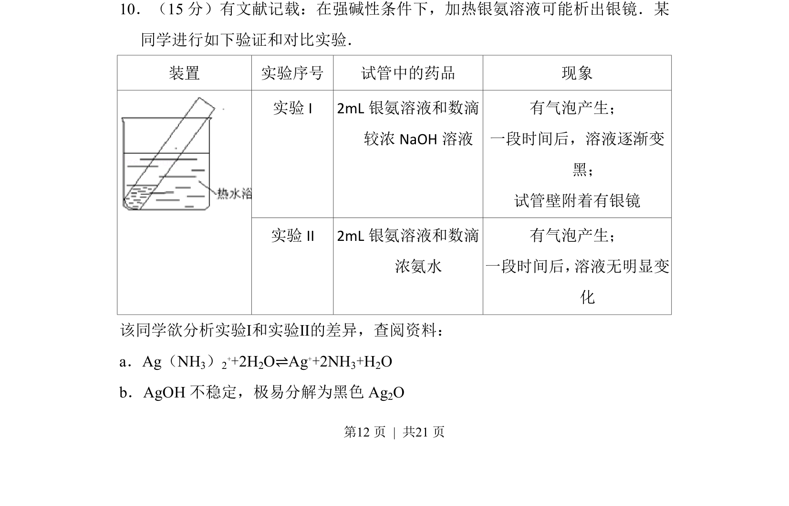
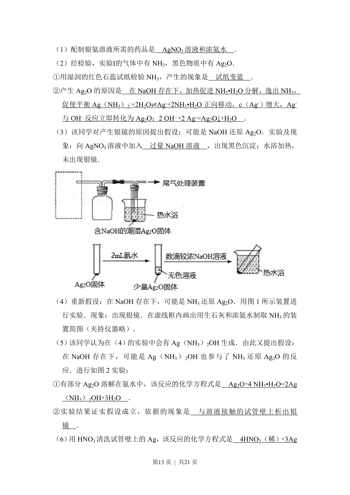
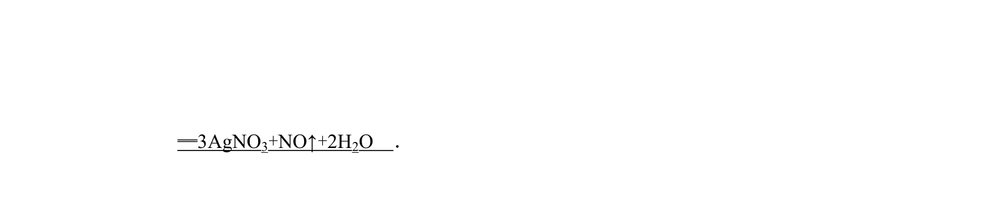
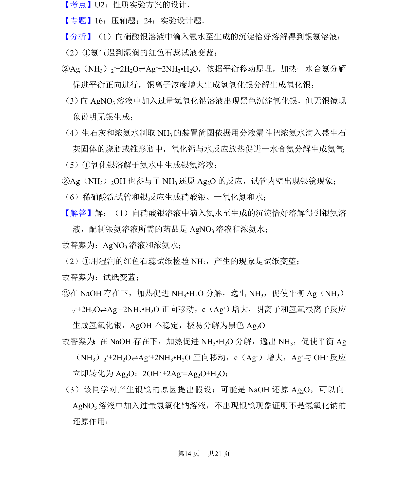
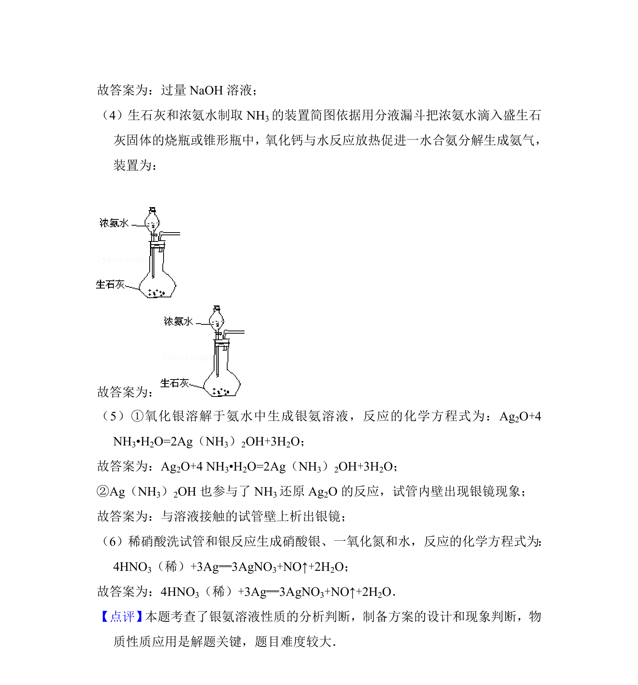

## 题面

## 摘要

探究强碱性条件下银氨溶液析出银镜的对比实验及反应机理

## 关联考点

- [[480-银镜反应|银镜反应]]
- [[984-配合物平衡|配合物平衡]]
- [[AgOH分解]]
- [[实验条件控制]]

## 答案与解析

> 📄 原 PDF 第 12 页：`素材/真题/北京/2008-2024·（北京）化学高考真题/2012年高考化学试卷（北京）（解析卷）.pdf`
