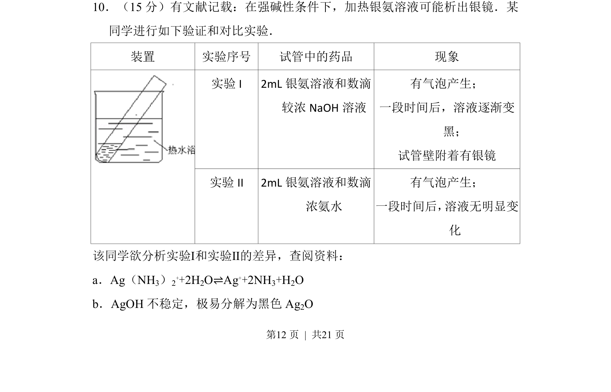
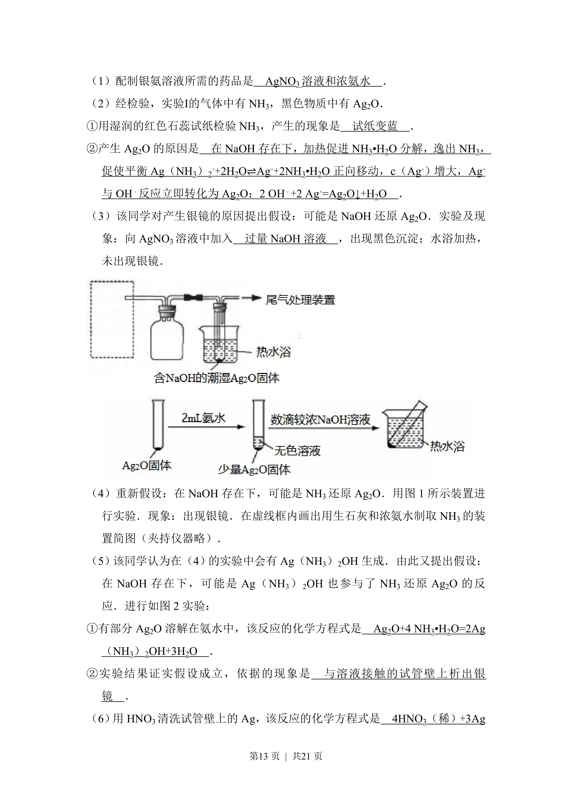
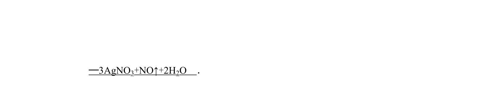
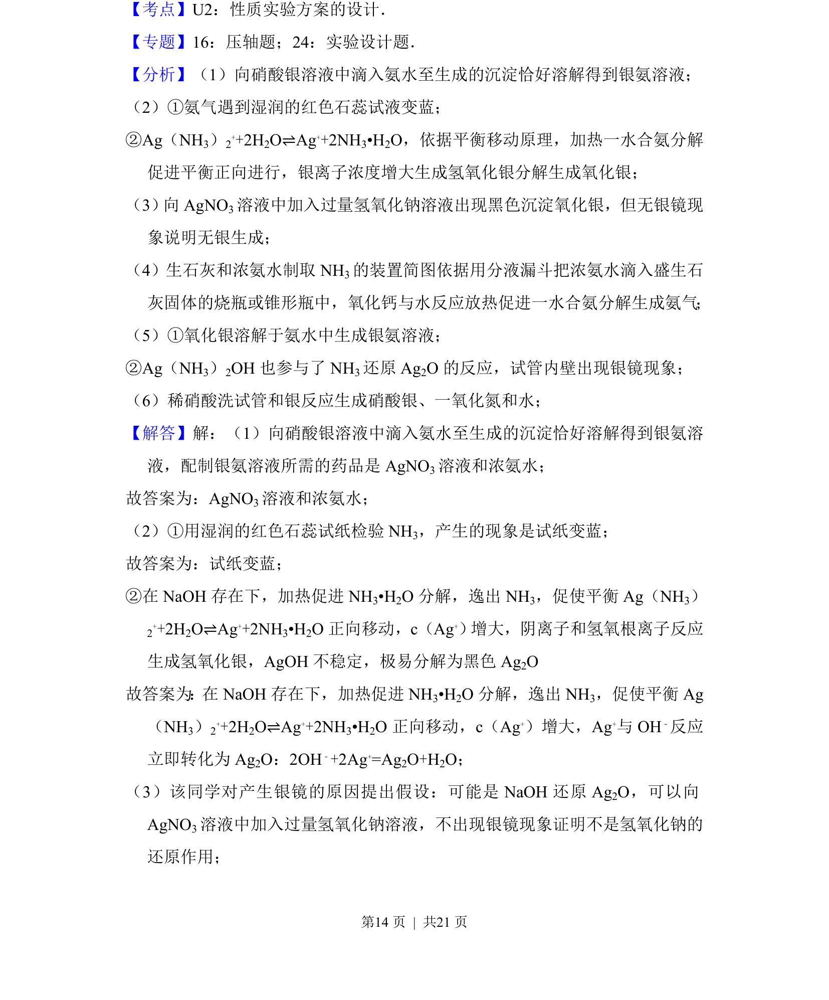
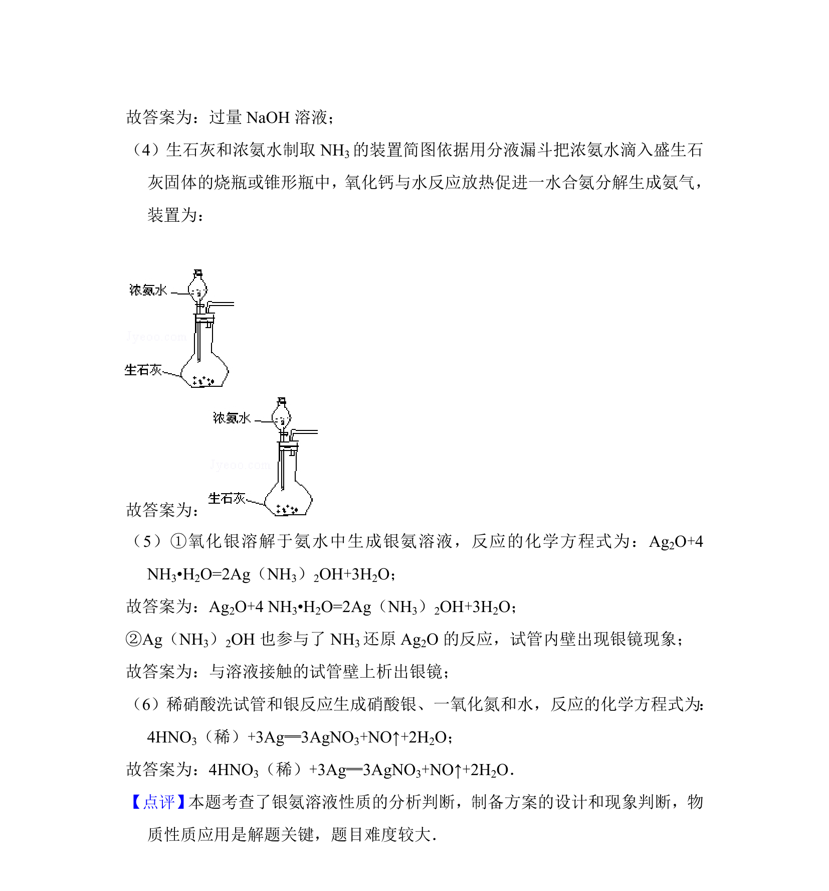

## 题面

## 摘要

探究强碱性条件下银氨溶液析出银镜的对比实验及反应机理

## 关联考点

- [[480-银镜反应|银镜反应]]
- [[984-配合物平衡|配合物平衡]]
- [[AgOH分解]]
- [[实验条件控制]]

## 答案与解析

> 📄 原 PDF 第 12 页：`素材/真题/北京/2008-2024·（北京）化学高考真题/2012年高考化学试卷（北京）（解析卷）.pdf`

<!-- 题干文本-start -->
## 题干文本
10．（15分）有文献记载：在强碱性条件下，加热银氨溶液可能析出银镜．某
同学进行如下验证和对比实验．
装置 实验序号 试管中的药品 现象
实验I 2mL银氨溶液和数滴
较浓NaOH溶液
有气泡产生；
一段时间后，溶液逐渐变
黑；
试管壁附着有银镜
实验II 2mL银氨溶液和数滴
浓氨水
有气泡产生；
一段时间后， 溶液无明显变
化
该同学欲分析实验Ⅰ和实验Ⅱ的差异，查阅资料：
a．Ag（NH3）2
++2H2O⇌Ag++2NH3+H2O
b．AgOH不稳定，极易分解为黑色Ag 2O
<!-- 题干文本-end -->

<!-- 解析文本-start -->
## 解析文本

<!-- 解析文本-end -->
