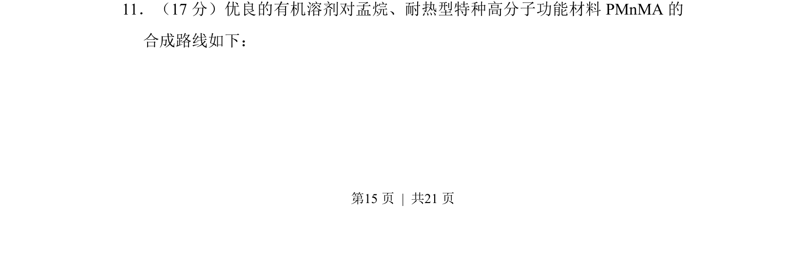
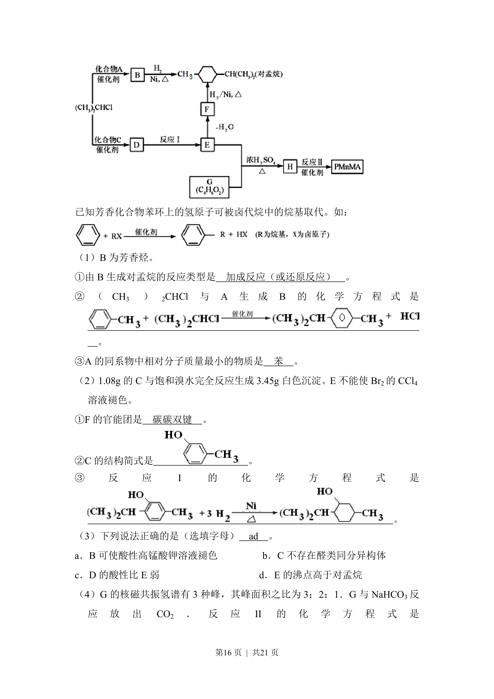
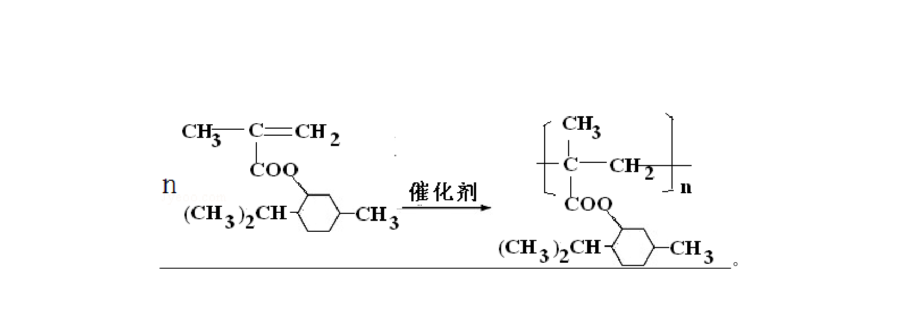
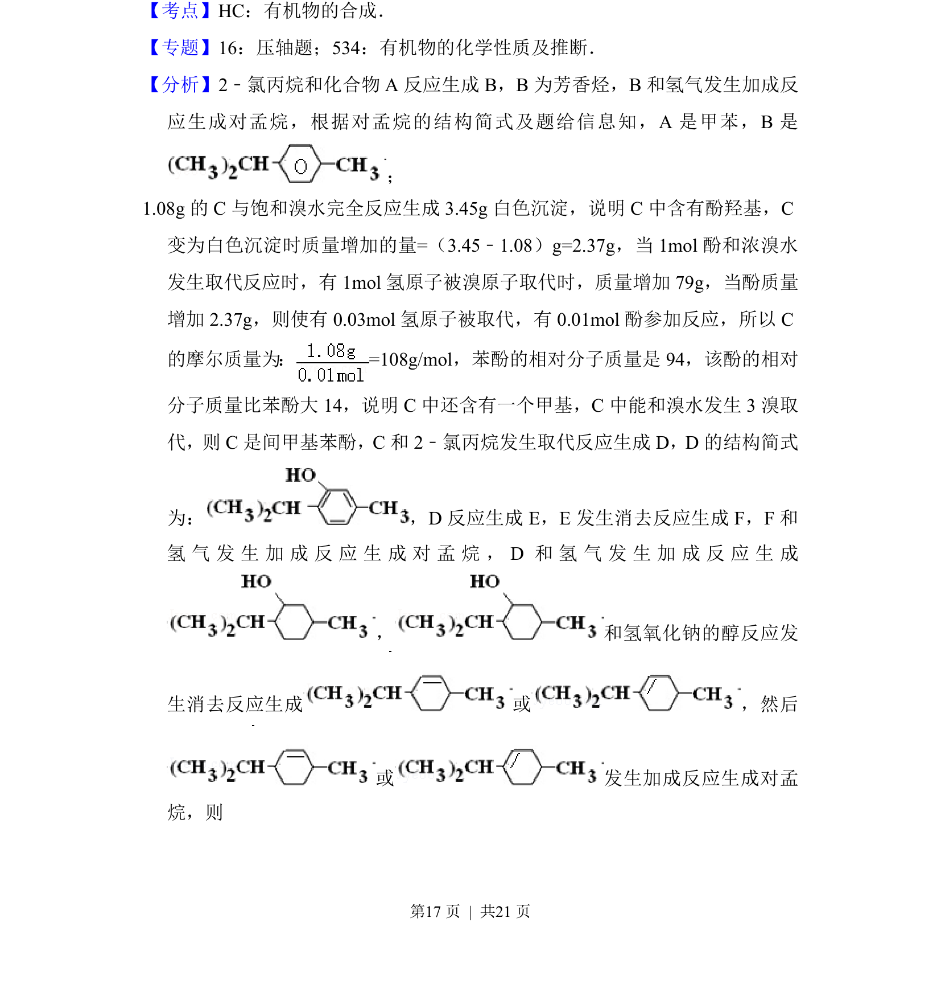
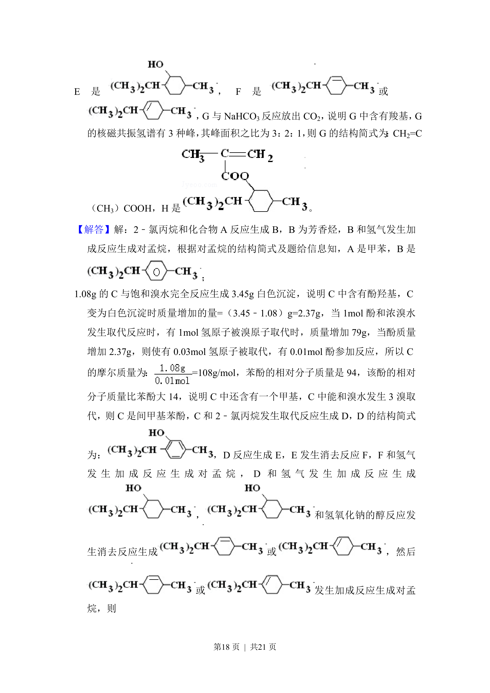
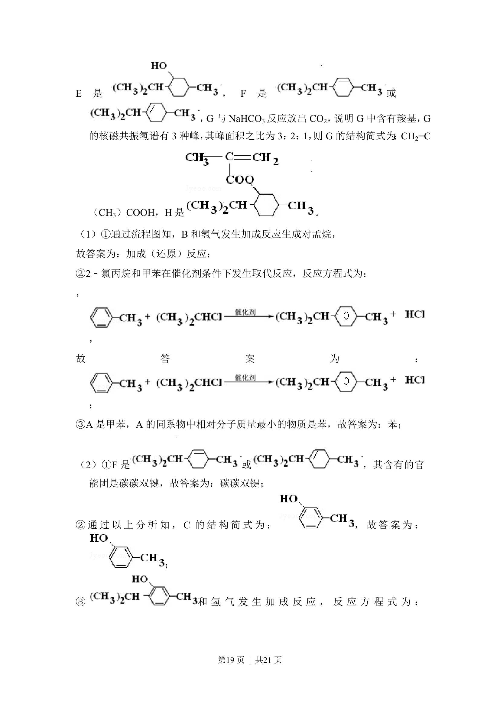
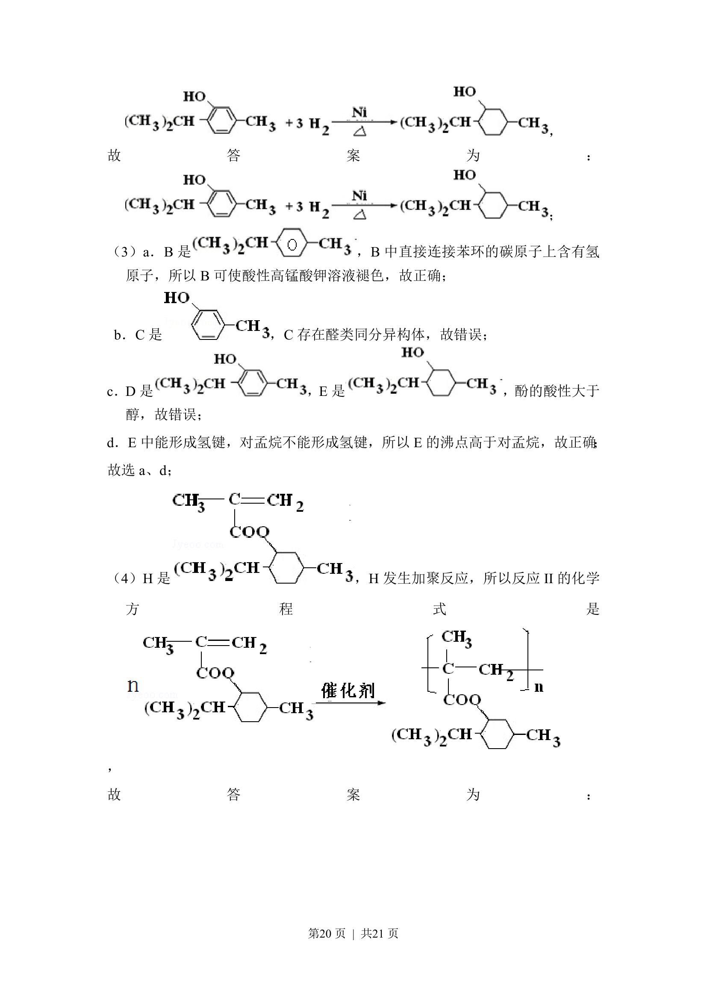
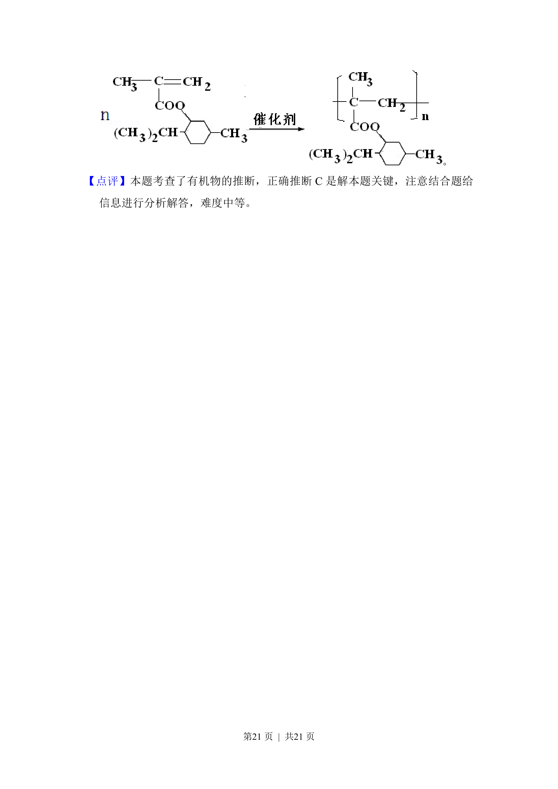

## 题面

## 摘要

该题考查有机溶剂对孟烷和耐热型高分子材料PMnMA的合成路线推断及反应分析

## 关联考点

- [[271-化学合成|有机合成]]
- [[886-官能团转化|官能团转化]]
- [[反应条件]]
- [[866-高分子材料|高分子材料]]

## 答案与解析

> 📄 原 PDF 第 15 页：`素材/真题/北京/2008-2024·（北京）化学高考真题/2012年高考化学试卷（北京）（解析卷）.pdf`
