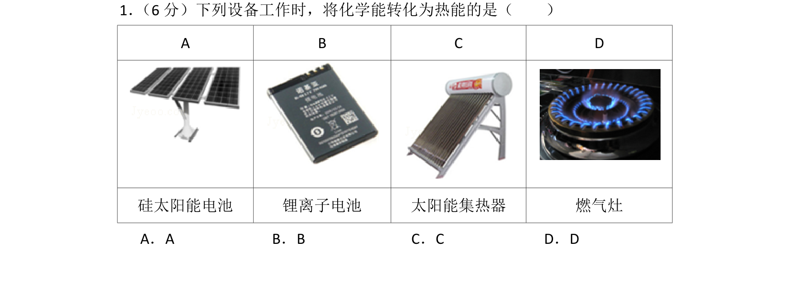
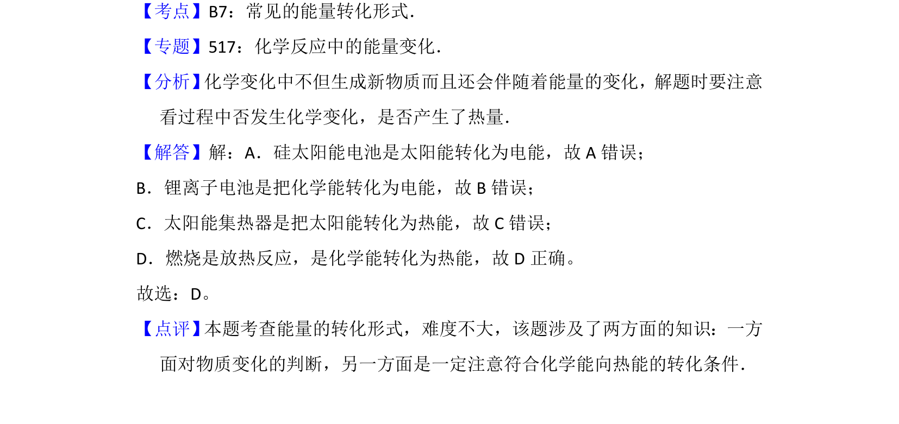

## 题面

## 摘要

考查常见设备工作中的能量转化形式，区分化学能、电能、热能之间的转化关系。

## 关联考点

- [[常见的能量转化形式]]
- [[化学能与热能]]
- [[化学反应中的能量变化]]

## 答案与解析

> 📄 原 PDF 第 1 页：`素材/真题/北京/2008-2024·（北京）化学高考真题/2013年高考化学试卷（北京）（解析卷）.pdf`

<!-- 题干文本-start -->
## 题干文本
1． （6分）下列设备工作时，将化学能转化为热能的是（　　）
A B C D
硅太阳能电池 锂离子电池 太阳能集热器 燃气灶
A．A B．B C．C D．D
<!-- 题干文本-end -->

<!-- 解析文本-start -->
## 解析文本
【考点】B7：常见的能量转化形式．菁优网版权所有
【专题】517：化学反应中的能量变化．
【分析】 化学变化中不但生成新物质而且还会伴随着能量的变化，解题时要注意
看过程中否发生化学变化，是否产生了热量．
【解答】解：A．硅太阳能电池是太阳能转化为电能，故A错误； 
B．锂离子电池是把化学能转化为电能，故B错误；
C．太阳能集热器是把太阳能转化为热能，故C错误；
D．燃烧是放热反应，是化学能转化为热能，故D正确。
故选：D。
【点评】 本题考查能量的转化形式，难度不大，该题涉及了两方面的知识：一方
面对物质变化的判断，另一方面是一定注意符合化学能向热能的转化条件．
<!-- 解析文本-end -->
