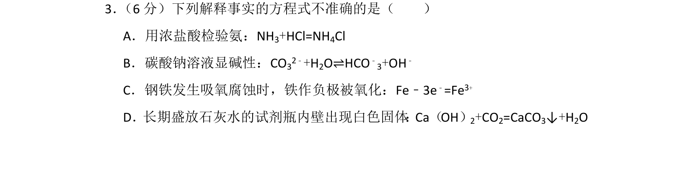
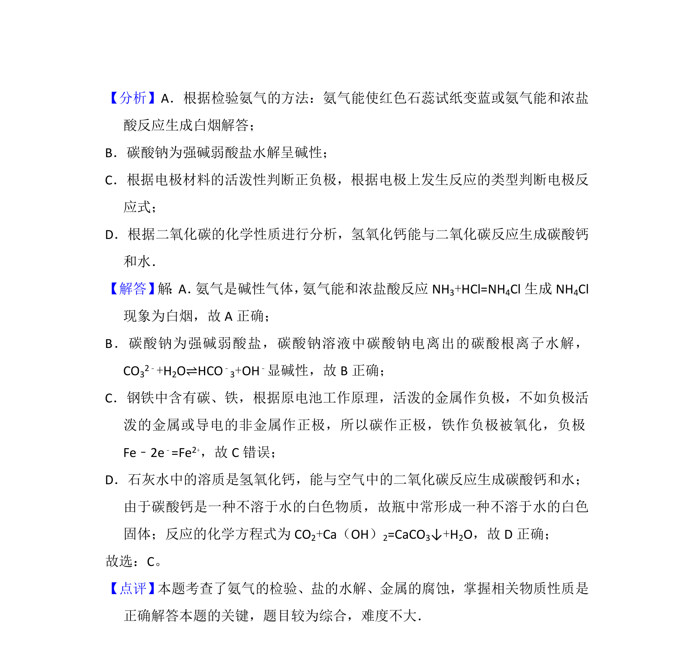

## 题面

## 摘要

考查化学方程式、离子方程式及电极反应的正误判断

## 关联考点

- [[976-化学方程式的书写|化学方程式的书写]]
- [[807-离子方程式的书写|离子方程式的书写]]
- [[电极反应和电池反应方程式]]

## 答案与解析

> 📄 原 PDF 第 2 页：`素材/真题/北京/2008-2024·（北京）化学高考真题/2013年高考化学试卷（北京）（解析卷）.pdf`
