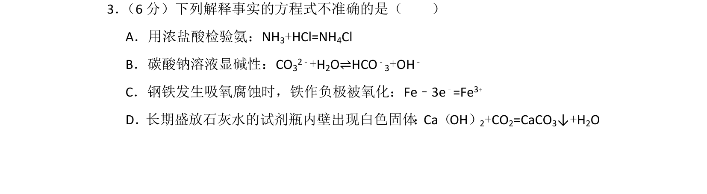
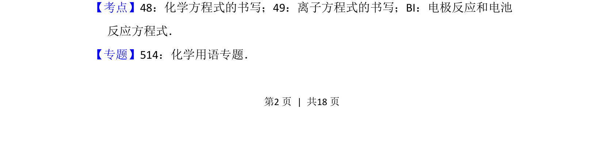
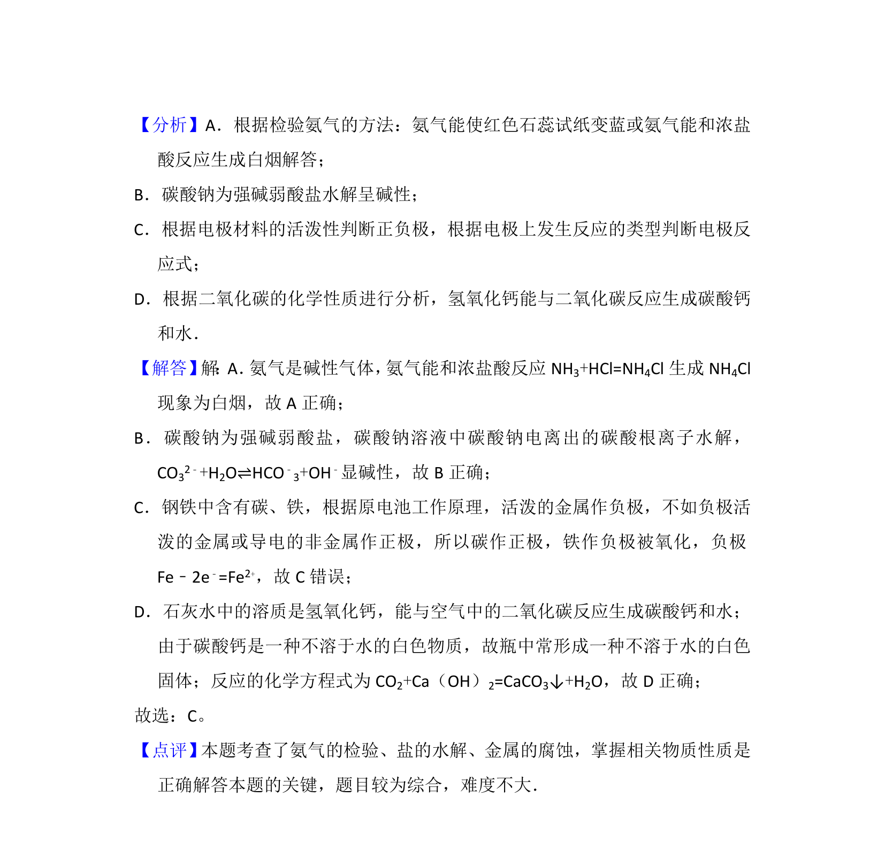

## 题面

## 摘要

考查化学方程式、离子方程式及电极反应的正误判断

## 关联考点

- [[976-化学方程式的书写|化学方程式的书写]]
- [[807-离子方程式的书写|离子方程式的书写]]
- [[电极反应和电池反应方程式]]

## 答案与解析

> 📄 原 PDF 第 2 页：`素材/真题/北京/2008-2024·（北京）化学高考真题/2013年高考化学试卷（北京）（解析卷）.pdf`

<!-- 题干文本-start -->
## 题干文本
3． （6分）下列解释事实的方程式不准确的是（　　）
A．用浓盐酸检验氨：NH3+HCl=NH4Cl
B．碳酸钠溶液显碱性：CO32﹣+H2O⇌HCO﹣
3+OH﹣
C．钢铁发生吸氧腐蚀时，铁作负极被氧化：Fe﹣3e﹣=Fe3+
D．长期盛放石灰水的试剂瓶内壁出现白色固体 ：Ca（OH）2+CO2=CaCO3↓+H2O
<!-- 题干文本-end -->

<!-- 解析文本-start -->
## 解析文本
【考点】48：化学方程式的书写；49：离子方程式的书写；BI：电极反应和电池
反应方程式．菁优网版权所有
【专题】514：化学用语专题．
<!-- 解析文本-end -->
