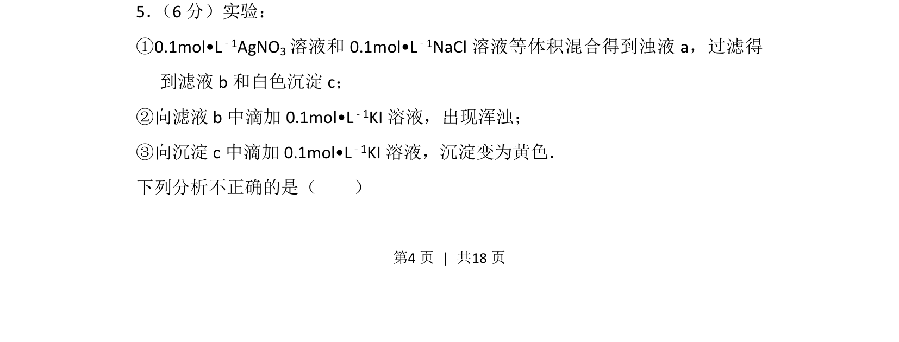
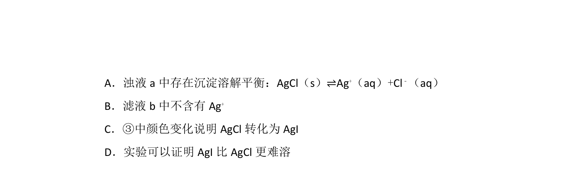
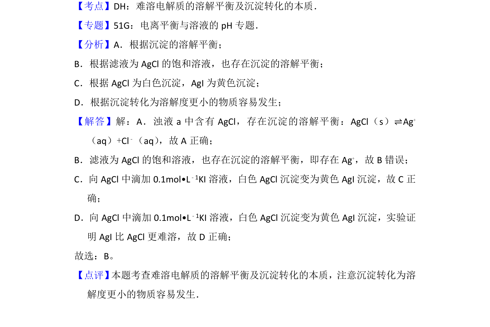

## 题面

## 摘要

通过 AgCl 与 KI 反应探究沉淀转化的实验分析

## 关联考点

- [[330-沉淀转化|沉淀转化]]
- [[762-溶度积|溶度积]]
- [[666-实验分析|实验分析]]

## 答案与解析

> 📄 原 PDF 第 4 页：`素材/真题/北京/2008-2024·（北京）化学高考真题/2013年高考化学试卷（北京）（解析卷）.pdf`

<!-- 题干文本-start -->
## 题干文本
5． （6分）实验：
①0.1mol•L﹣1AgNO3溶液和0.1mol•L ﹣1NaCl溶液等体积混合得到浊液a，过滤得
到滤液b和白色沉淀c；
②向滤液b中滴加0.1mol•L ﹣1KI溶液，出现浑浊；
③向沉淀c中滴加0.1mol•L ﹣1KI溶液，沉淀变为黄色．
下列分析不正确的是（　　）
<!-- 题干文本-end -->

<!-- 解析文本-start -->
## 解析文本

<!-- 解析文本-end -->
