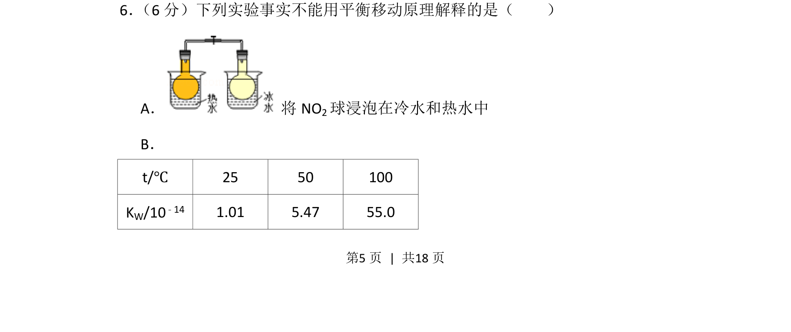
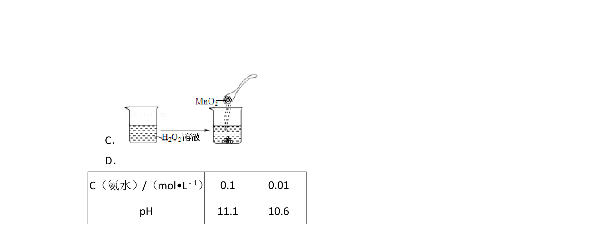
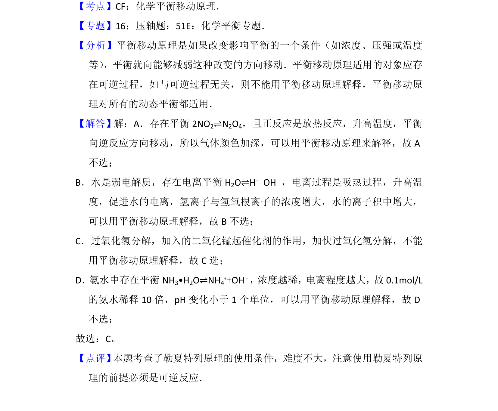

## 题面

## 摘要

考查勒夏特列原理的适用范围，通过温度对NO2平衡及水的离子积影响判断能否用平衡移动原理解释。

## 关联考点

- [[282-勒夏特列原理|平衡移动原理]]
- [[温度对化学平衡的影响]]
- [[741-水的离子积常数|水的离子积常数]]

## 答案与解析

> 📄 原 PDF 第 5 页：`素材/真题/北京/2008-2024·（北京）化学高考真题/2013年高考化学试卷（北京）（解析卷）.pdf`
