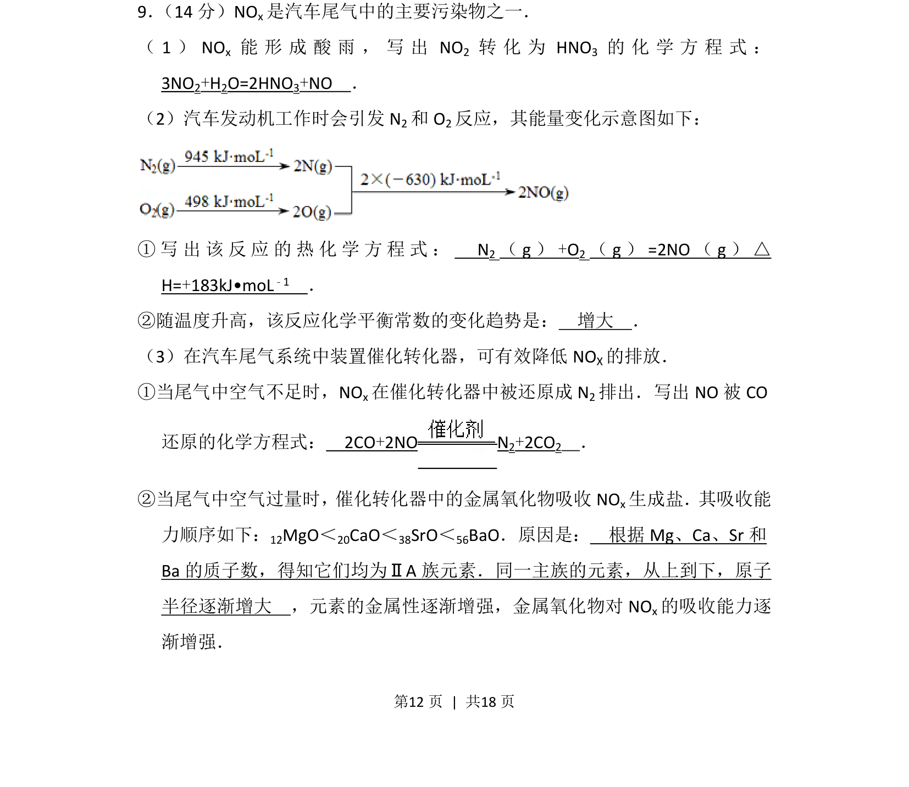
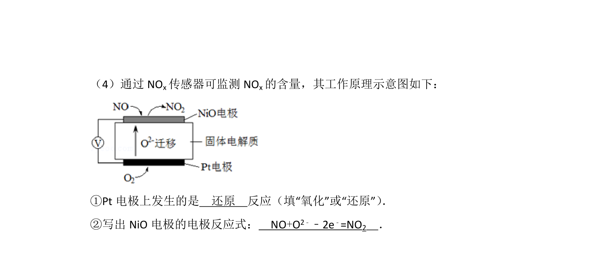
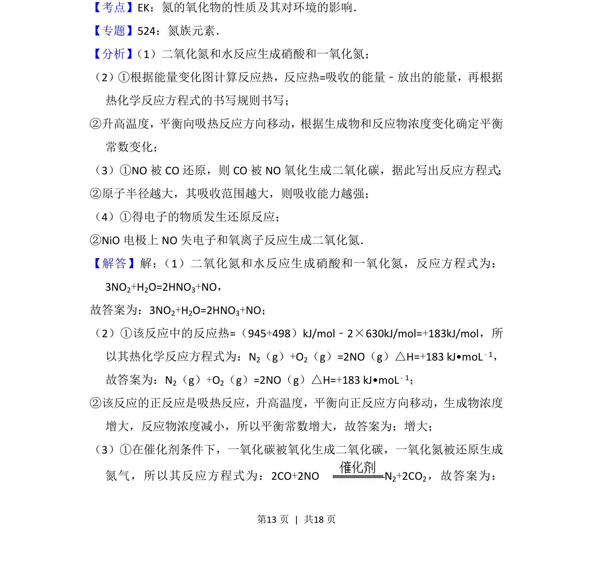
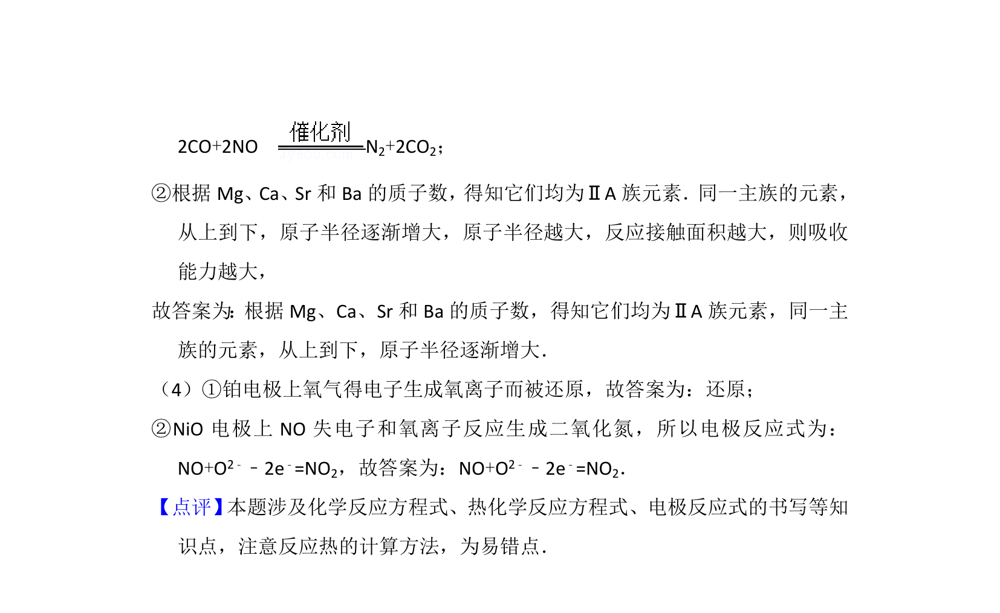

## 题面

## 摘要

NOx 污染及治理，包含方程式书写、热化学、平衡常数和催化还原

## 关联考点

- [[978-氮氧化物|氮氧化物]]
- [[135-酸雨|酸雨]]
- [[309-热化学方程式|热化学方程式]]
- [[284-化学平衡|化学平衡]]

## 答案与解析

> 📄 原 PDF 第 12 页：`素材/真题/北京/2008-2024·（北京）化学高考真题/2013年高考化学试卷（北京）（解析卷）.pdf`
