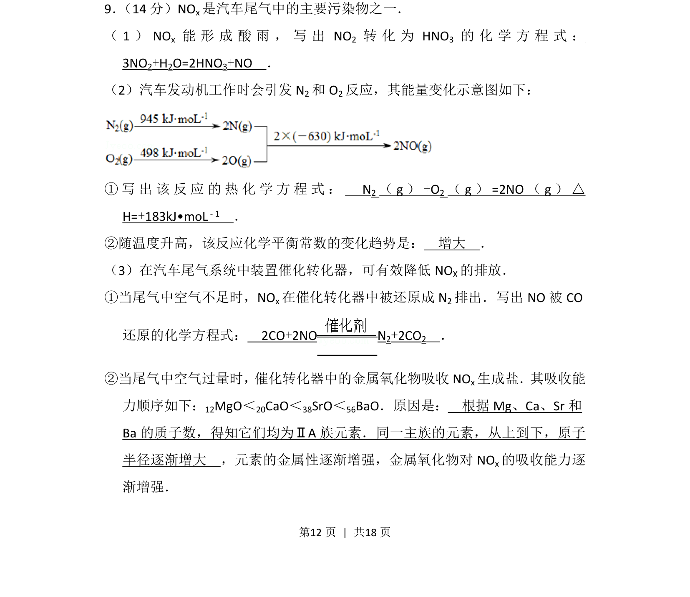
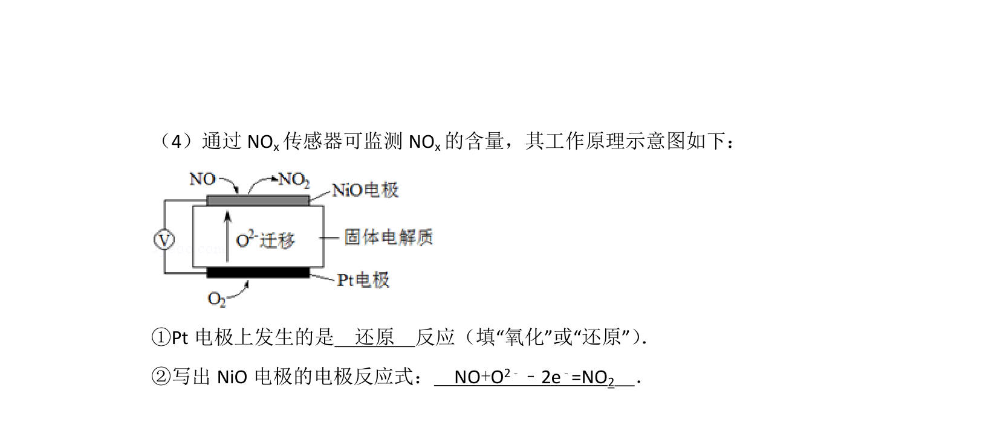
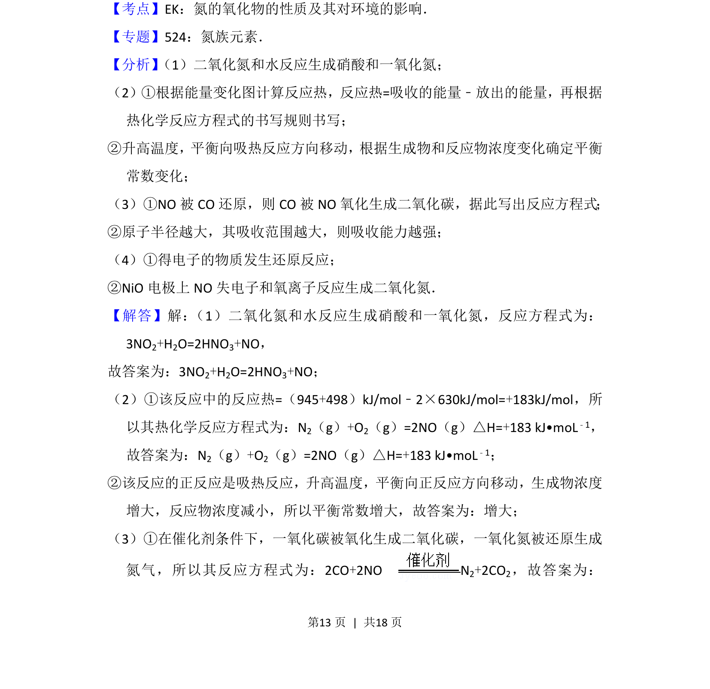
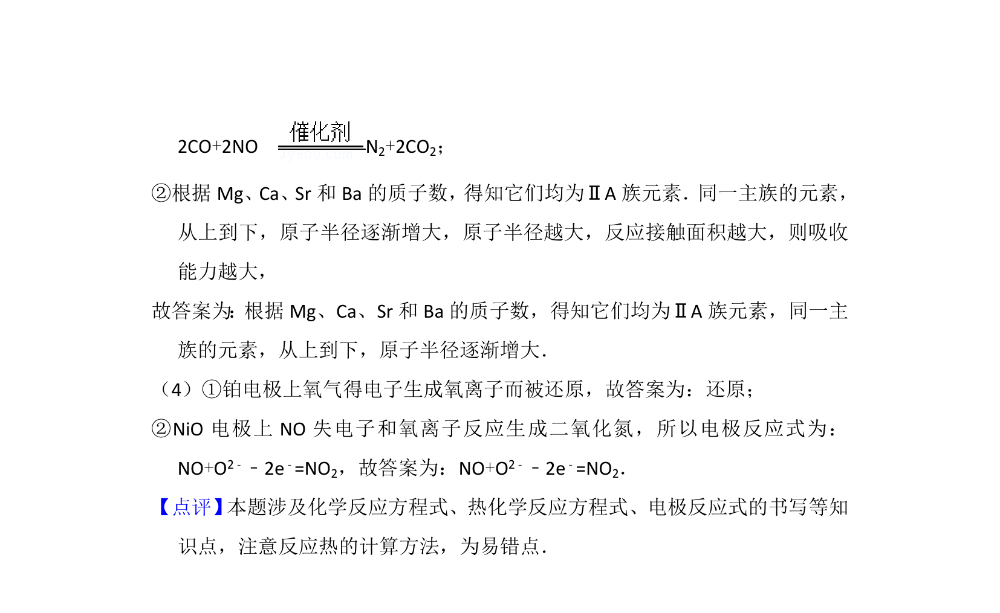

## 题面

## 摘要

NOx 污染及治理，包含方程式书写、热化学、平衡常数和催化还原

## 关联考点

- [[978-氮氧化物|氮氧化物]]
- [[135-酸雨|酸雨]]
- [[309-热化学方程式|热化学方程式]]
- [[284-化学平衡|化学平衡]]

## 答案与解析

> 📄 原 PDF 第 12 页：`素材/真题/北京/2008-2024·（北京）化学高考真题/2013年高考化学试卷（北京）（解析卷）.pdf`

<!-- 题干文本-start -->
## 题干文本
9． （14分）NOx是汽车尾气中的主要污染物之一．
（1）NO x 能 形 成 酸 雨 ， 写 出NO2 转 化 为HNO 3 的 化 学 方 程 式 ：　
3NO2+H2O=2HNO3+NO　．
（2）汽车发动机工作时会引发N 2和O 2反应，其能量变化示意图如下：
①写出该反应的热化学方程式：　N 2（g）+O 2（g）=2NO（g）△
H=+183kJ•moL﹣1　．
②随温度升高，该反应化学平衡常数的变化趋势是：　增大　．
（3）在汽车尾气系统中装置催化转化器，可有效降低NO X的排放．
①当尾气中空气不足时，NOx在催化转化器中被还原成N 2排出．写出NO被CO
还原的化学方程式：　2CO+2NO N2+2CO2　．
②当尾气中空气过量时，催化转化器中的金属氧化物吸收NOx生成盐．其吸收能
力顺序如下：12MgO＜20CaO＜38SrO＜56BaO．原因是：　根据Mg、Ca、Sr和
Ba的质子数，得知它们均为ⅡA族元素．同一主族的元素，从上到下，原子
半径逐渐增大　，元素的金属性逐渐增强，金属氧化物对NO x的吸收能力逐
渐增强．
<!-- 题干文本-end -->

<!-- 解析文本-start -->
## 解析文本

<!-- 解析文本-end -->
