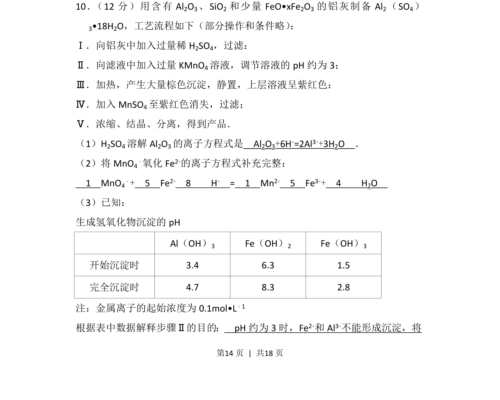
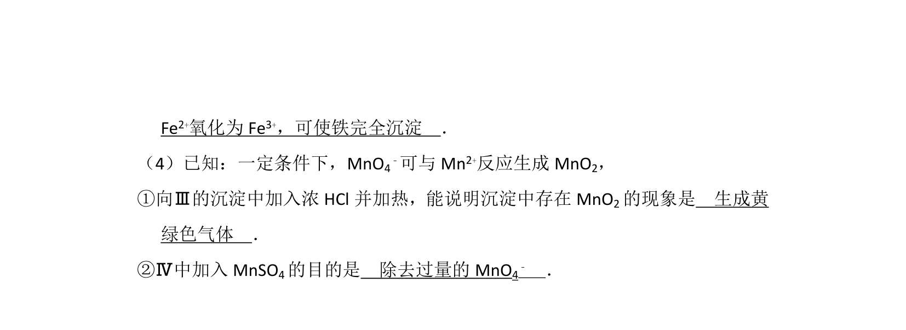
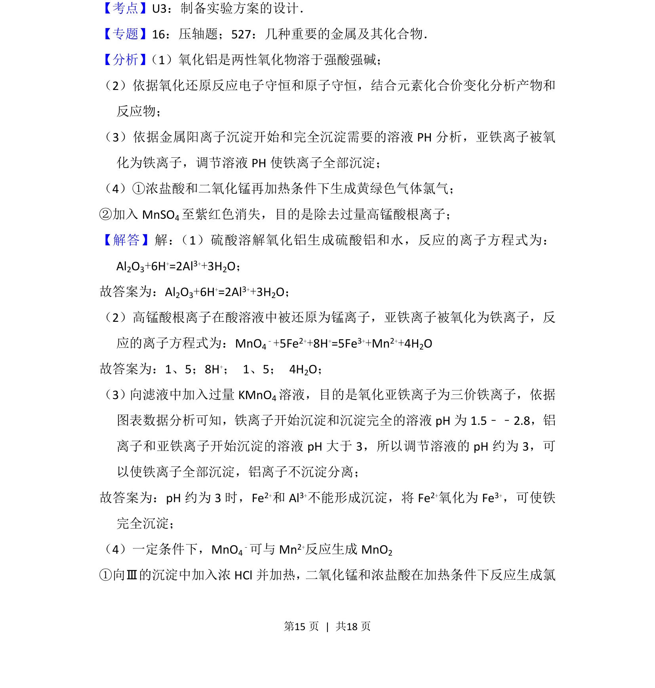
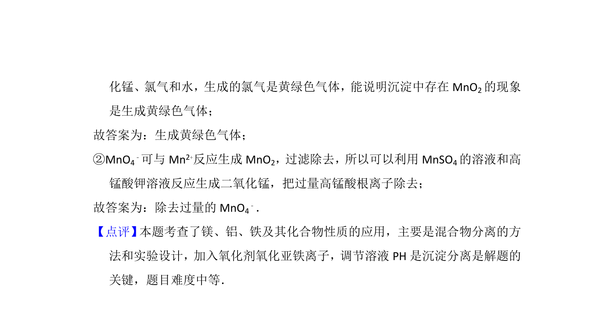

## 题面

## 摘要

铝灰酸溶后氧化除铁制备硫酸铝的工艺流程分析，涉及方程式书写与沉淀pH控制

## 关联考点

- [[679-工艺流程|化学工艺流程]]
- [[170-离子方程式|离子方程式]]
- [[939-氧化还原反应配平|氧化还原反应配平]]
- [[沉淀pH]]

## 答案与解析

> 📄 原 PDF 第 14 页：`素材/真题/北京/2008-2024·（北京）化学高考真题/2013年高考化学试卷（北京）（解析卷）.pdf`
