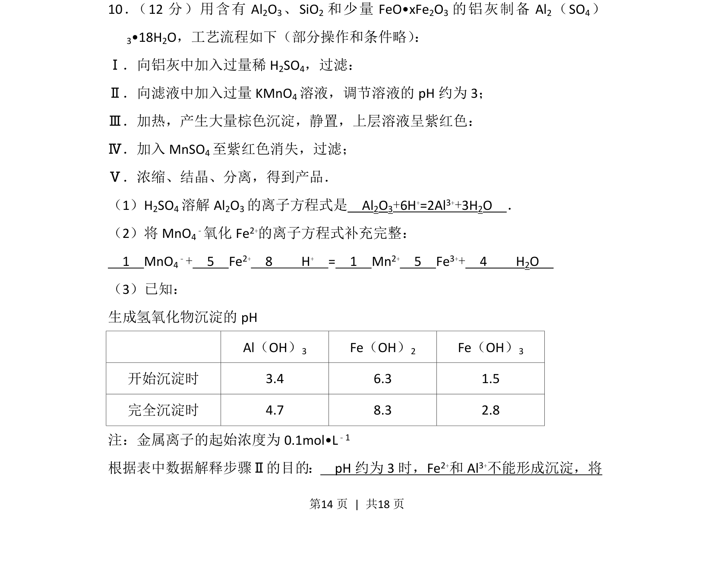
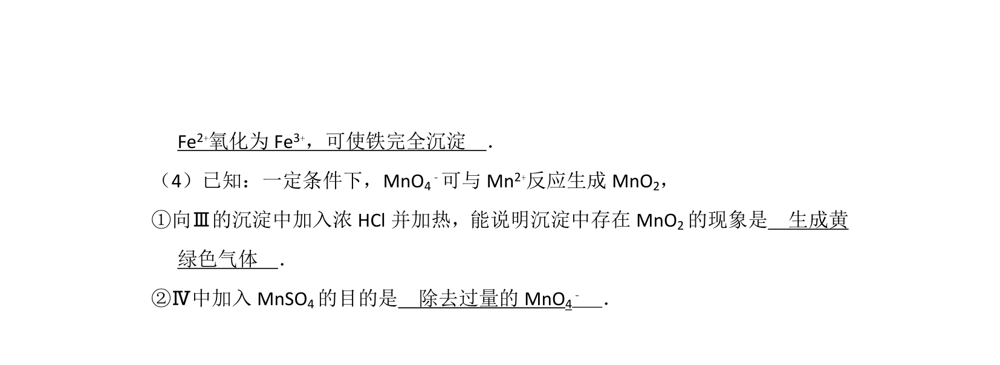
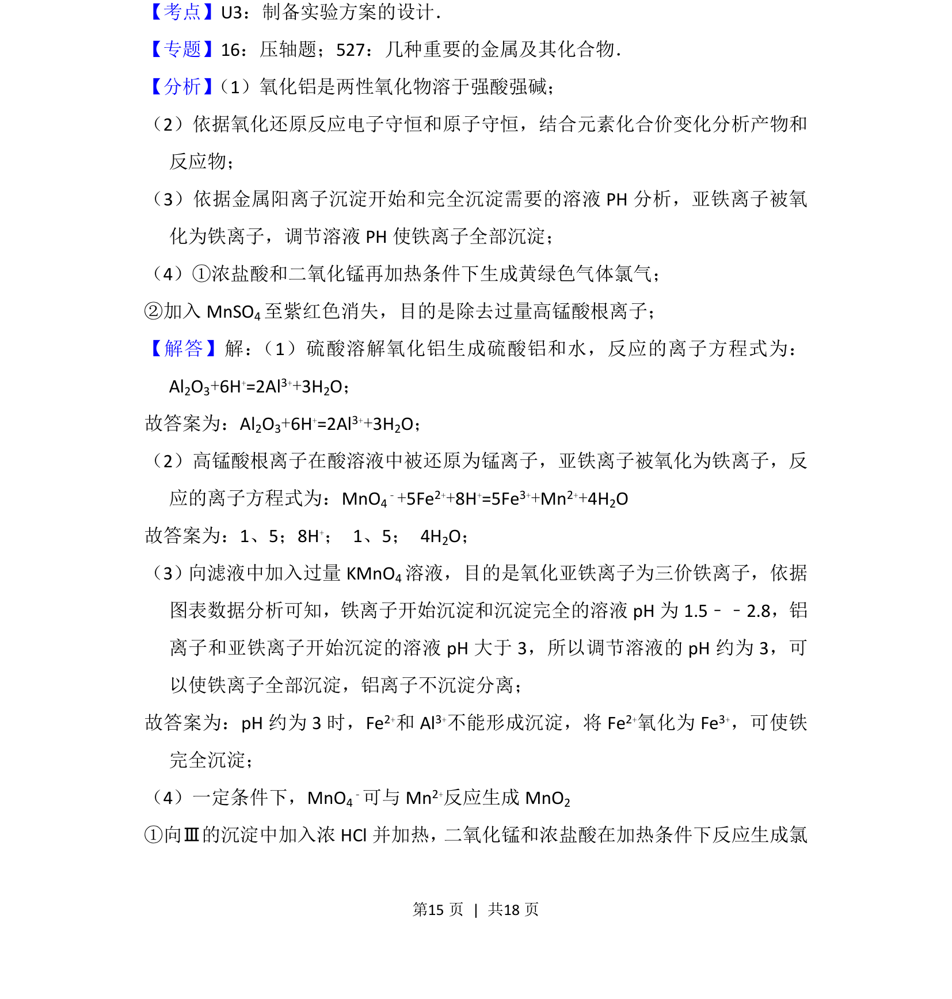
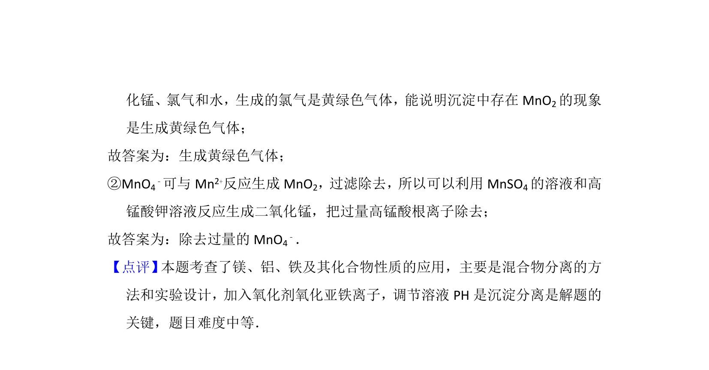

## 题面

## 摘要

铝灰酸溶后氧化除铁制备硫酸铝的工艺流程分析，涉及方程式书写与沉淀pH控制

## 关联考点

- [[679-工艺流程|化学工艺流程]]
- [[170-离子方程式|离子方程式]]
- [[939-氧化还原反应配平|氧化还原反应配平]]
- [[沉淀pH]]

## 答案与解析

> 📄 原 PDF 第 14 页：`素材/真题/北京/2008-2024·（北京）化学高考真题/2013年高考化学试卷（北京）（解析卷）.pdf`

<!-- 题干文本-start -->
## 题干文本
10． （12分）用含有Al 2O3、SiO 2 和少量FeO•xFe 2O3 的铝灰制备Al 2（SO 4）
3•18H2O，工艺流程如下（部分操作和条件略） ：
Ⅰ．向铝灰中加入过量稀H 2SO4，过滤：
Ⅱ．向滤液中加入过量KMnO 4溶液，调节溶液的pH约为3；
Ⅲ．加热，产生大量棕色沉淀，静置，上层溶液呈紫红色：
Ⅳ．加入MnSO 4至紫红色消失，过滤；
Ⅴ．浓缩、结晶、分离，得到产品．
（1）H2SO4溶解Al 2O3的离子方程式是　Al2O3+6H+=2Al3++3H2O　．
（2）将MnO 4
﹣氧化Fe 2+的离子方程式补充完整：
　1　MnO4
﹣+　5　Fe2+　8　　H+　=　1　Mn2+　5　Fe3++　4　　H2O　 
（3）已知：
生成氢氧化物沉淀的pH
Al（OH）3 Fe（OH）2 Fe（OH）3
开始沉淀时 3.4 6.3 1.5
完全沉淀时 4.7 8.3 2.8
注：金属离子的起始浓度为0.1mol•L ﹣1
根据表中数据解释步骤Ⅱ的目的：　pH约为3时，Fe 2+和Al 3+不能形成沉淀，将
<!-- 题干文本-end -->

<!-- 解析文本-start -->
## 解析文本

<!-- 解析文本-end -->
