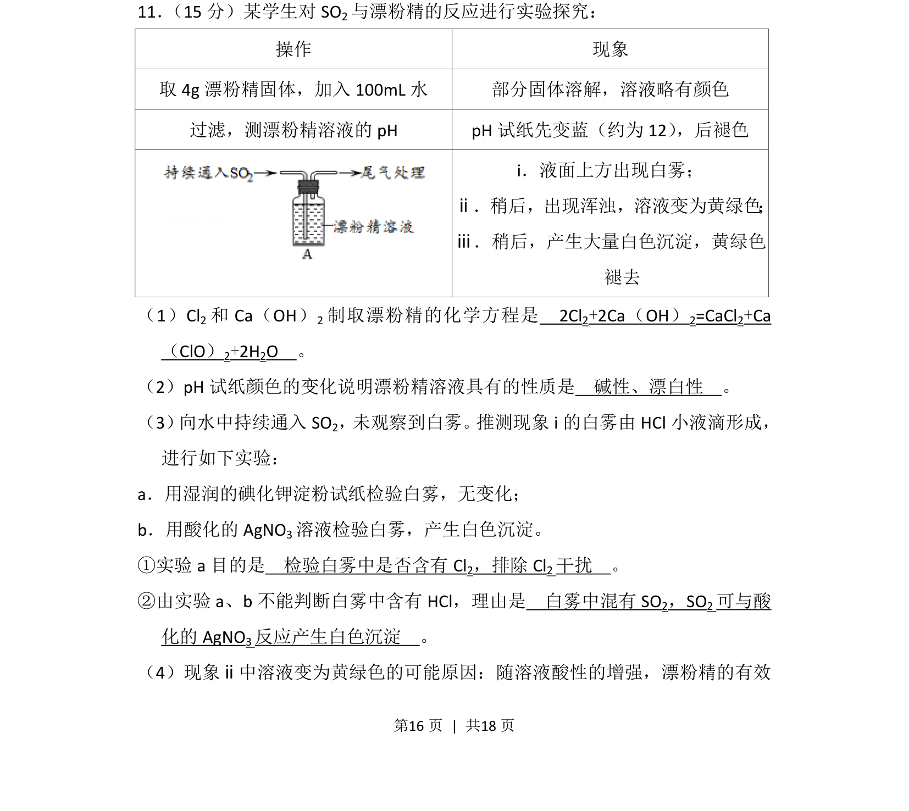
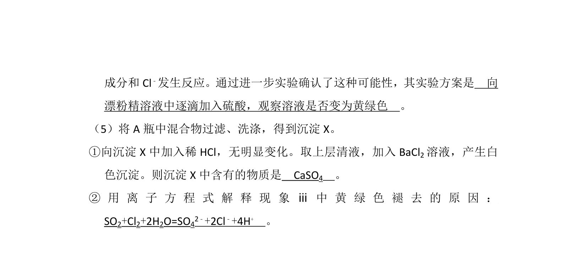
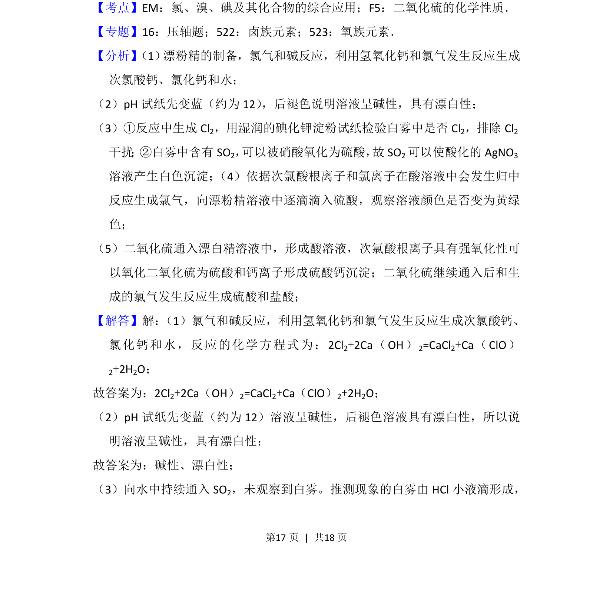
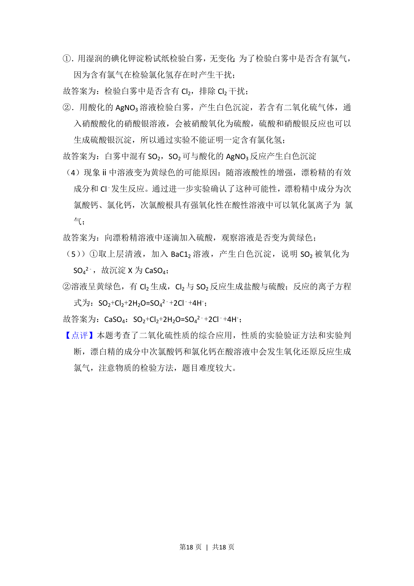

## 题面

## 摘要

探究SO2与漂粉精反应的现象及原理，涵盖漂粉精制备、性质及气体检验

## 关联考点

- [[氯气与碱反应]]
- [[漂白性]]
- [[次氯酸盐性质]]
- [[二氧化硫还原性]]

## 答案与解析

> 📄 原 PDF 第 16 页：`素材/真题/北京/2008-2024·（北京）化学高考真题/2013年高考化学试卷（北京）（解析卷）.pdf`

<!-- 题干文本-start -->
## 题干文本
11． （15分）某学生对SO2与漂粉精的反应进行实验探究：
操作 现象
取4g漂粉精固体，加入100mL水 部分固体溶解，溶液略有颜色
过滤，测漂粉精溶液的pH pH试纸先变蓝（约为12） ，后褪色
i．液面上方出现白雾；
ⅱ．稍后，出现浑浊，溶液变为黄绿色 ；
ⅲ．稍后，产生大量白色沉淀，黄绿色
褪去
（1）Cl 2和Ca（OH） 2制取漂粉精的化学方程是　2Cl 2+2Ca（OH） 2=CaCl2+Ca
（ClO）2+2H2O　。
（2）pH试纸颜色的变化说明漂粉精溶液具有的性质是　碱性、漂白性　。
（3） 向水中持续通入SO2，未观察到白雾。推测现象i的白雾由HCl小液滴形成，
进行如下实验：
a．用湿润的碘化钾淀粉试纸检验白雾，无变化；
b．用酸化的AgNO 3溶液检验白雾，产生白色沉淀。
①实验a目的是　检验白雾中是否含有Cl 2，排除Cl 2干扰　。
②由实验a、b不能判断白雾中含有HCl，理由是　白雾中混有SO 2，SO2可与酸
化的AgNO 3反应产生白色沉淀　。
（4）现象ⅱ中溶液变为黄绿色的可能原因：随溶液酸性的增强，漂粉精的有效
<!-- 题干文本-end -->

<!-- 解析文本-start -->
## 解析文本

<!-- 解析文本-end -->
