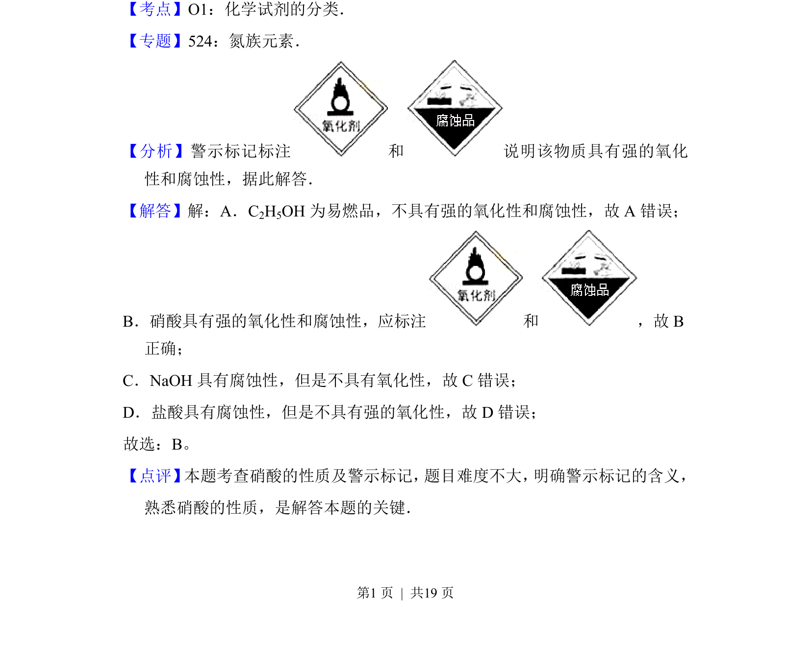

## 题面

## 摘要

该题考查根据警示标记判断化学试剂的性质，主要涉及硝酸的强氧化性和腐蚀性。

## 关联考点

- [[化学试剂的分类]]
- [[硝酸的性质]]
- [[731-氧化性|氧化性]]
- [[腐蚀性]]

## 答案与解析

> 📄 原 PDF 第 1 页：`素材/真题/北京/2008-2024·（北京）化学高考真题/2014年高考化学试卷（北京）（解析卷）.pdf`
