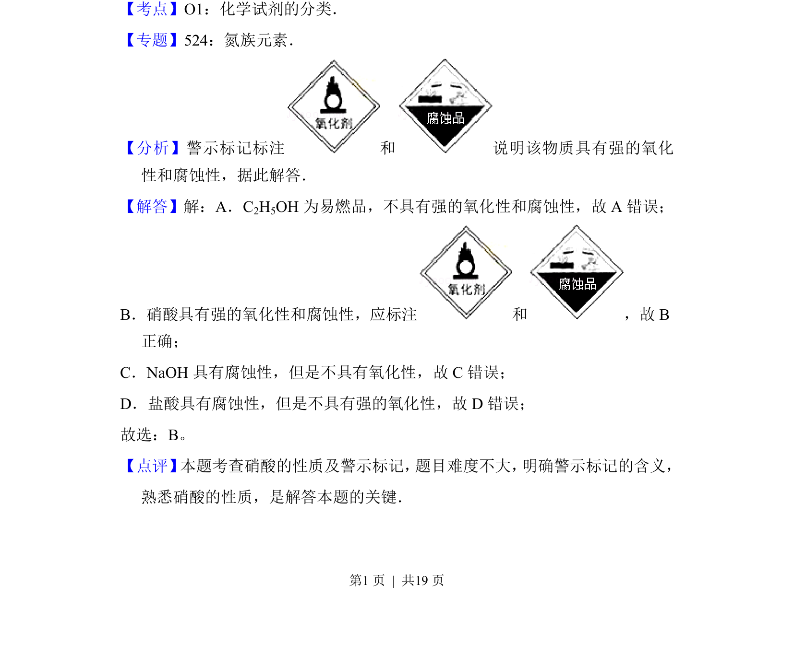

## 题面

## 摘要

该题考查根据警示标记判断化学试剂的性质，主要涉及硝酸的强氧化性和腐蚀性。

## 关联考点

- [[化学试剂的分类]]
- [[硝酸的性质]]
- [[731-氧化性|氧化性]]
- [[腐蚀性]]

## 答案与解析

> 📄 原 PDF 第 1 页：`素材/真题/北京/2008-2024·（北京）化学高考真题/2014年高考化学试卷（北京）（解析卷）.pdf`

<!-- 题干文本-start -->
## 题干文本
1．（6分） 下列试剂中，标签上应标注 和 的是（　　）
A．C2H5OH B．HNO 3 C．NaOH D．HCl
<!-- 题干文本-end -->

<!-- 解析文本-start -->
## 解析文本
【考点】O1：化学试剂的分类．菁优网版权所有
【专题】524：氮族元素．
【分析】警示标记标注 和 说明该物质具有强的氧化
性和腐蚀性，据此解答．
【解答】解：A．C2H5OH为易燃品，不具有强的氧化性和腐蚀性，故A错误；
B．硝酸具有强的氧化性和腐蚀性，应标注 和 ，故B
正确；
C．NaOH具有腐蚀性，但是不具有氧化性，故C错误；
D．盐酸具有腐蚀性，但是不具有强的氧化性，故D错误；
故选：B。
【点评】 本题考查硝酸的性质及警示标记， 题目难度不大， 明确警示标记的含义，
熟悉硝酸的性质，是解答本题的关键．
<!-- 解析文本-end -->
